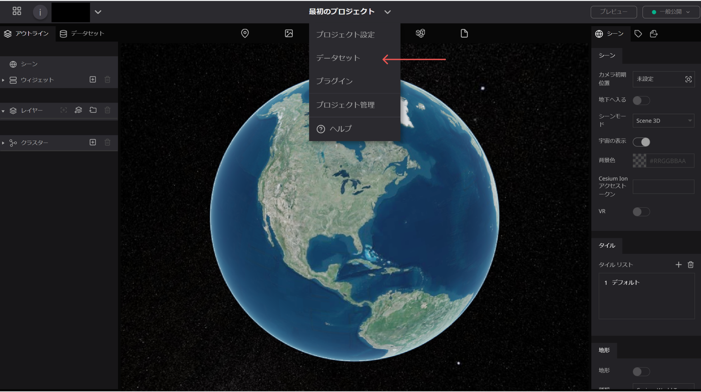
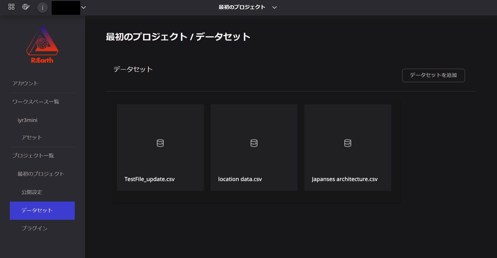
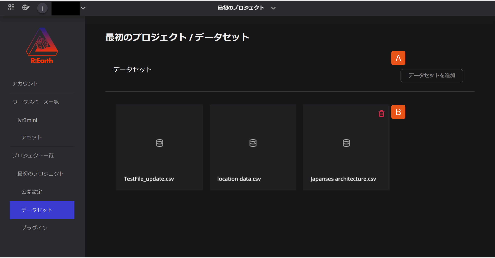

# データセット ライブラリ

インポートしたデータはすべてデータセットとして Re:Earth 内に保存されます。詳しくは[データセット]をご覧ください。

データセットライブラリは以下の場所で見つけることができます。
編集画面 → ヘッダーメニュー → データセット

データセットライブラリーでは現在のプロジェクトにインポートした全てのデータセットを確認・管理することができます。

## データセットの追加と削除

1. **データセットを追加** ：お手元のPCのデータを取り込むことができます。
2. **削除ボタン**：データセットカードにマウスを合わせると表示されます。

現在、データセットの管理はデータセットの追加（インポート）と削除のみとなっています。今後の開発で機能を拡張していく予定です。

<aside>
⚠️ 注意　　　　　　　　　　　　　　　　　　　　　　　　　　　　　　　　　　　　　　データセットを削除する際はそのデータセットがプロジェクトで使用されていないことを確認してください。データセットが接続されている場合、接続されているプロジェクトが欠損する可能性があります。

</aside>