 # プラグインライブラリ

# 概要

プラグインシステムは、Re:Earhの最大の特徴のひとつです。
ユーザーは独自のプラグインを開発したり、コミュニティ内の他のユーザーが開発したプラグインを利用することでRe:Earthの機能を拡張することができます。

例えば、マーカーを選択した際に表示される情報ボックスに新しい項目を表示したり、オリジナル機能のウィジェットを画面上に配置することで、既存のRe.Earthでは実現できない処理を実行することができます
詳しい説明は[プラグイン]をご覧ください。

今後は、シーン編集やデータ処理を効率化するための計算を、プラグインで行えるようにする予定です。

プラグインライブラリのページではプロジェクトへのプラグインのインストール、削除、管理を行います。

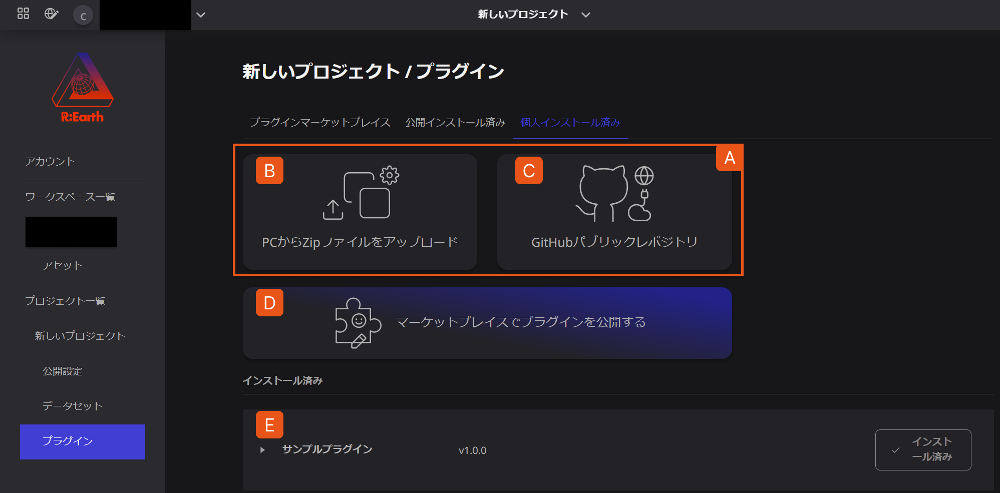

A. プラグインのインストール手段を示しています。

B. **PCからZipファイルをアップロード** ボタンでは、自身のPCからzipファイルを選択してプラグインをインストールします。

C. **GitHubパブリックレポジトリ** ボタンでは、GitHubから直接プラグインをインストールします。

D. **マーケットプレイスでプラグインを公開する** ボタンでは、作成したプラグインをマーケットプレイスで公開することができます。

E **インストール済み** の配下には、現在のプロジェクトにインストールされているすべてのプラグインが表示されます。

# プラグインのインストールと削除

プラグインのインストールと削除の方法について解説します。

## プラグインライブラリへのアクセス

1. ダッシュボード画面の`設定ボタン`から、プロジェクト設定画面を開きます。
    
    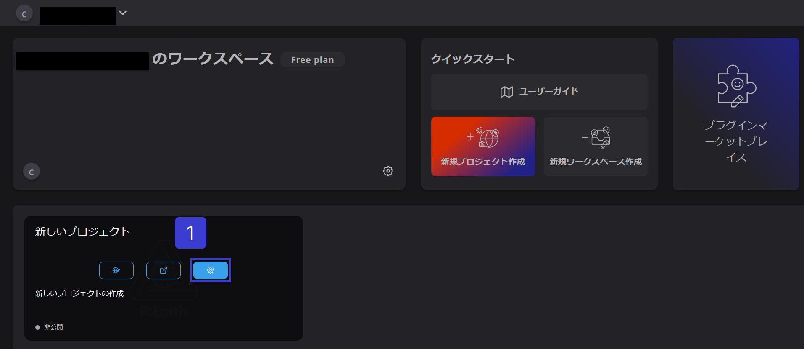
    
2. 左側のメニューから「プラグイン」を選択します。
    
    
    
3. 「個人インストール済み」をクリックすると、プラグインライブラリへアクセスできます。
    
    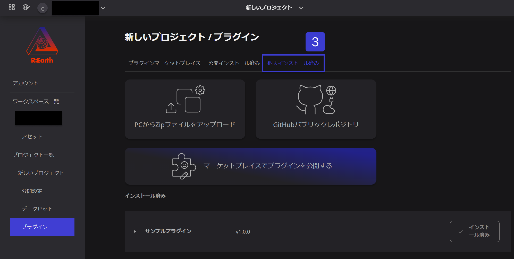
    

## プラグインのインストール

プラグインのインストールには、2つの方法があります。

「PCからZipファイルをアップロード」では、自身のPCからzipファイルを選択してプラグインをインストールします。「GitHubパブリックレポジトリ」では、GitHubから直接プラグインをインストールします。

### PCからZipファイルをアップロード

1. プラグインライブラリにアクセスし、「PCからZipファイルをアップロード」を選択します。
    
    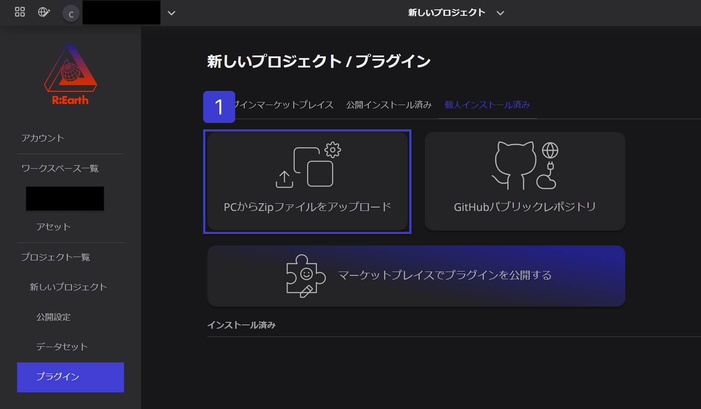
    
2. Zipファイルを選択します。
    
    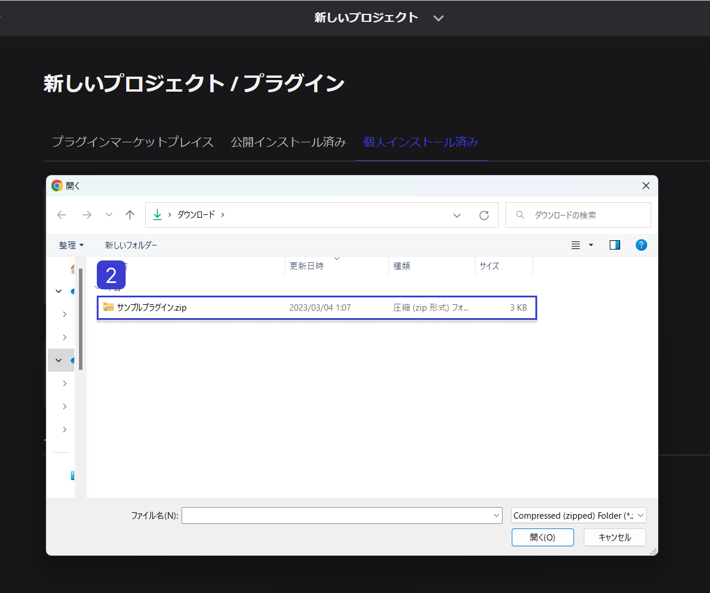
    
3. しばらく待って通知が表示されれば、プラグインは正常にインストールされています。
    
    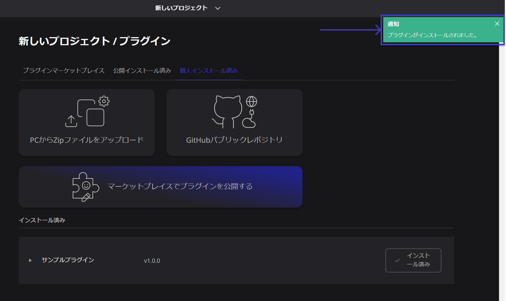
    

ここでエラーが発生した場合、以下のような原因が考えられます。

- reearth.ymlの形式に誤りがあります。
- 同じIDのプラグインが既にインストールされています。既存のプラグインを削除して、再度インストールを実行してください。
- ZIPファイルに reearth.yml が含まれていないか、ルートに複数のディレクトリが存在しています。reearth.yml を含む単一のフォルダ、または reearth.yml を含む複数のファイルを圧縮してください。
- ZIPファイルを生成するアプリケーションによっては、不正なZIPファイルが出力されることがあります。他のアプリケーションを利用して圧縮してください。

### GitHubパブリックレポジトリ

1. プラグインライブラリにアクセスし、「GitHubパブリックレポジトリ」を選択します。
    
    
    
2. GitHubリポジトリのURLを入力します。
    
    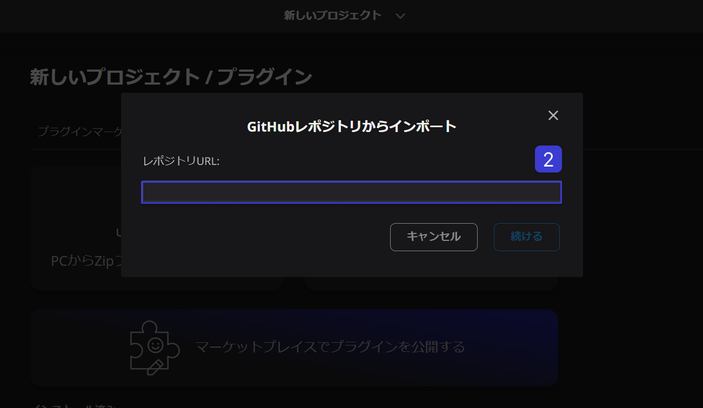
    
3. 「続ける」ボタンをクリックします。
    
    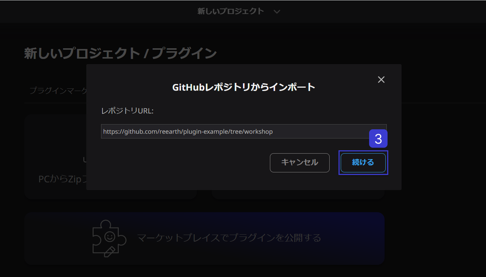
    
4. しばらく待って通知が表示されれば、プラグインは正常にインストールされています。
    
    
    

## プラグインの削除

1. プラグインライブラリにアクセスし、プラグイン名が表示されている列の右側にある`インストール済み`ボタンにカーソルをあてます。
    
    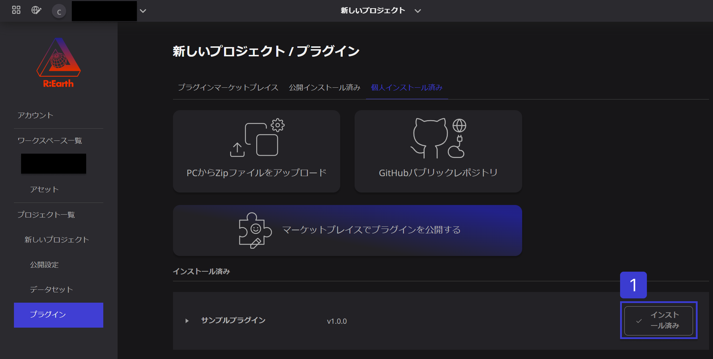
    
2. 「インストール済み」ボタンの表記が「アンインストール」に変わったら、`アンインストール`ボタンをクリックします。
    
    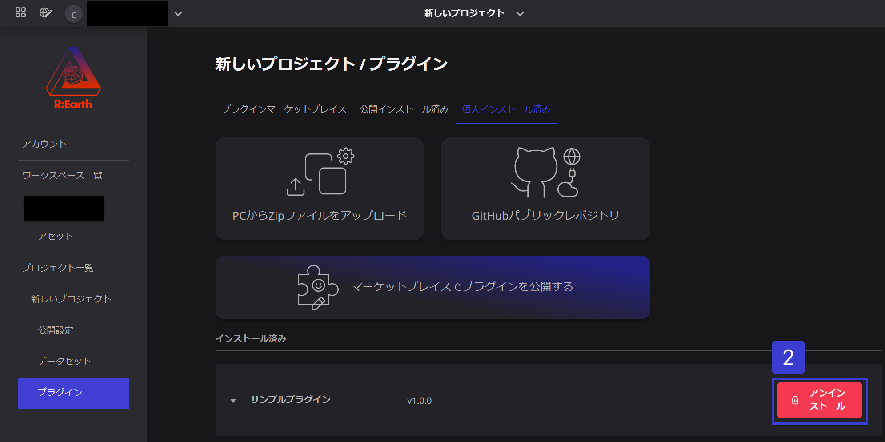
    
3. 表示されたポップアップの`アンインストール`ボタンをクリックします。
    
    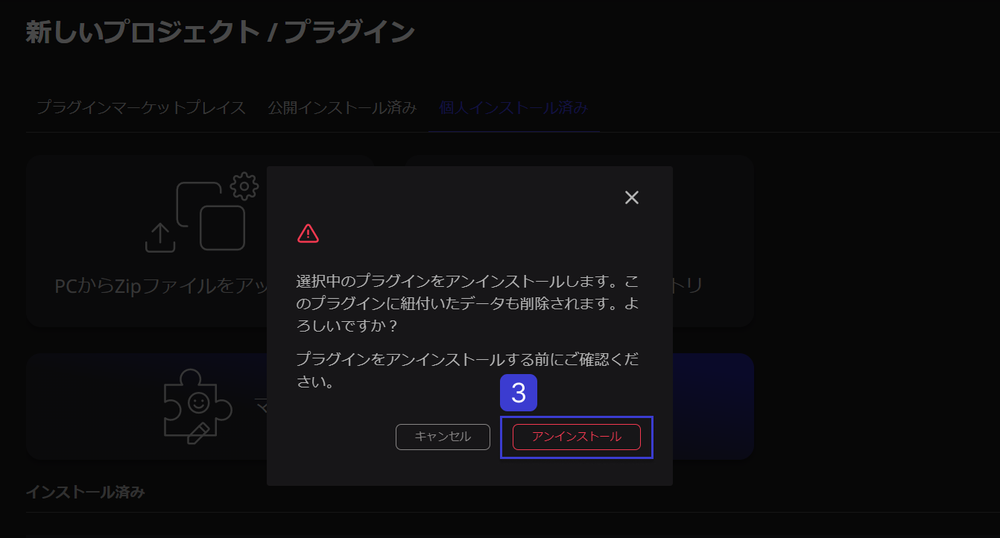
    
4. しばらく待って通知が表示されれば、プラグインは正常に削除されています。
    
    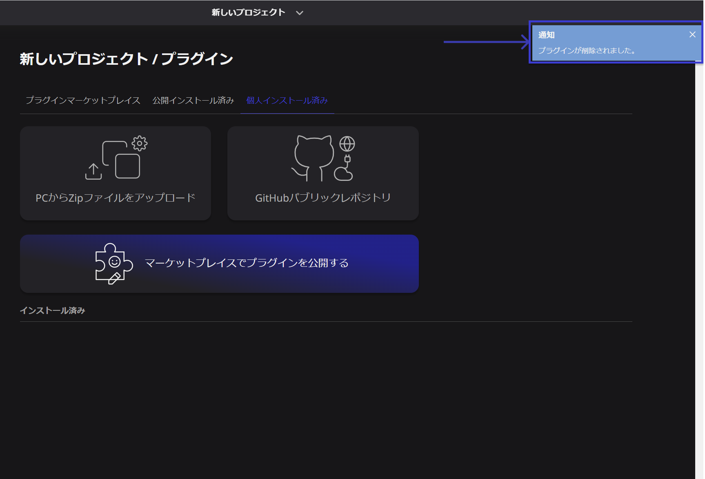
    

なお、プラグインを削除すると、追加されたウィジェットやブロックはシーンから削除されます。削除したプラグインを使ったシーンをすでに公開している場合は、公開したシーンでウィジェットやブロックが動作しなくなります。