# 大気

## 大気

大気グループでは、大気圏や太陽・霧に関する設定を行います。

主に地球儀の見栄えに関する設定を行うことができます。

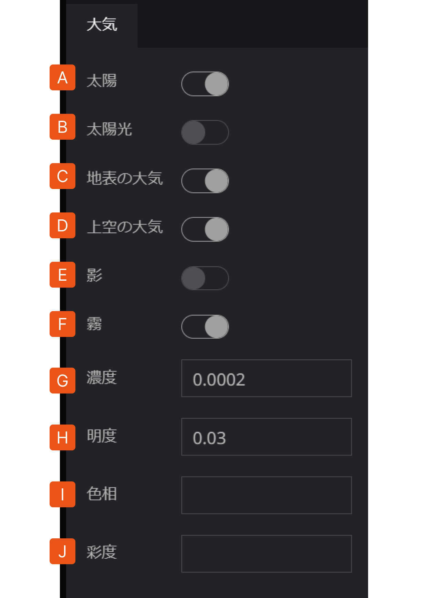

A.   **太陽**：宇宙空間にある太陽の表示/非表示を切り替えます。

B.   **太陽光**：デジタルアースへの太陽光の反映/非反映を切り替えます。これにより、地域による昼夜の表現が可能です。

C.   **地表の大気**：デジタルアース地表の大気圏の表示/非表示を切り替えます。

D.   **上空の大気**：デジタルアース上空の大気圏の表示/非表示を切り替えます。

E.    **影**：影のオンオフを切り替えます。

F.    **霧**：霧のオンオフを切り替えます。

G.   **濃度**：霧の濃度を設定します。0~1の数値が有効です。

H.   **明度**：霧の明るさを設定します。-1~1の数値が有効です。

 I.    **色相**：霧の色を設定します。-1~1の数値が有効です。

 J.   **彩度**：霧の彩やかさを設定します。-1~1の数値が有効です。

### 太陽

オフ　　　　　　　　　　　　　　　　　　　　　　オン

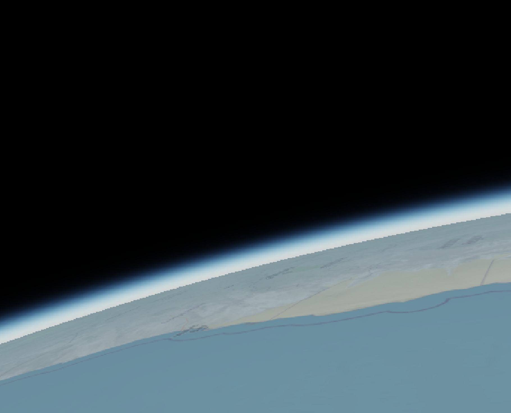

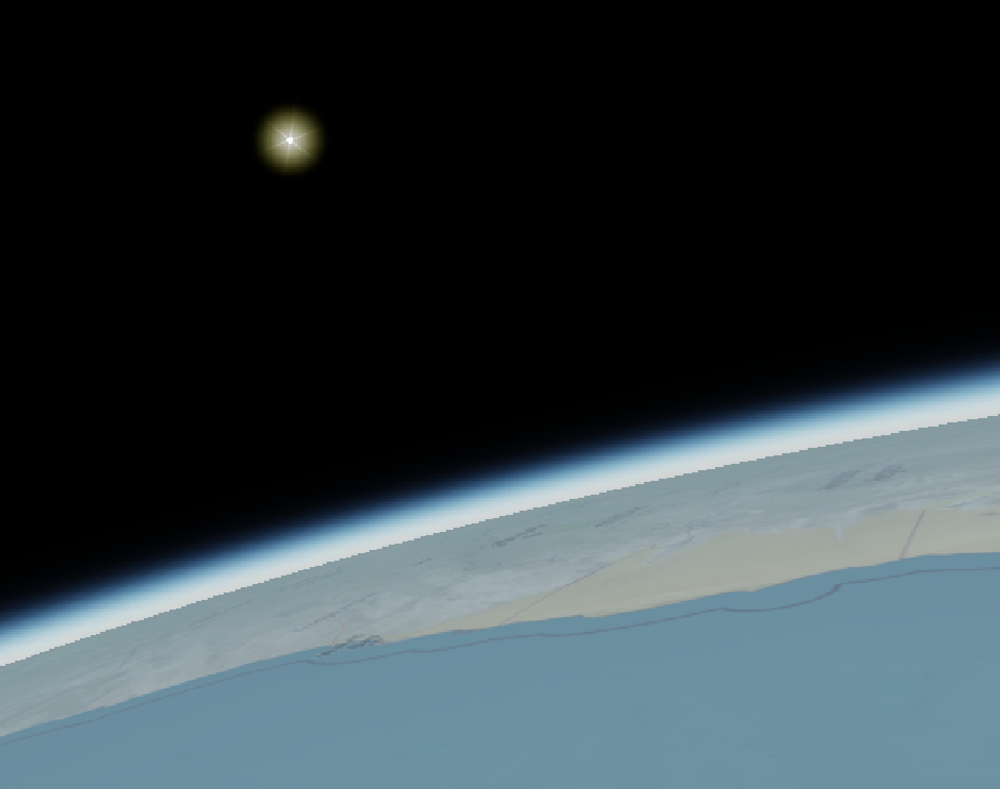

### 太陽光

オフ　　　　　　　　　　　　　　　　　　　　　オン

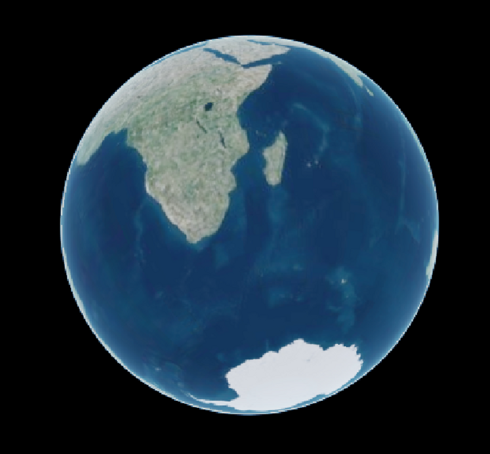

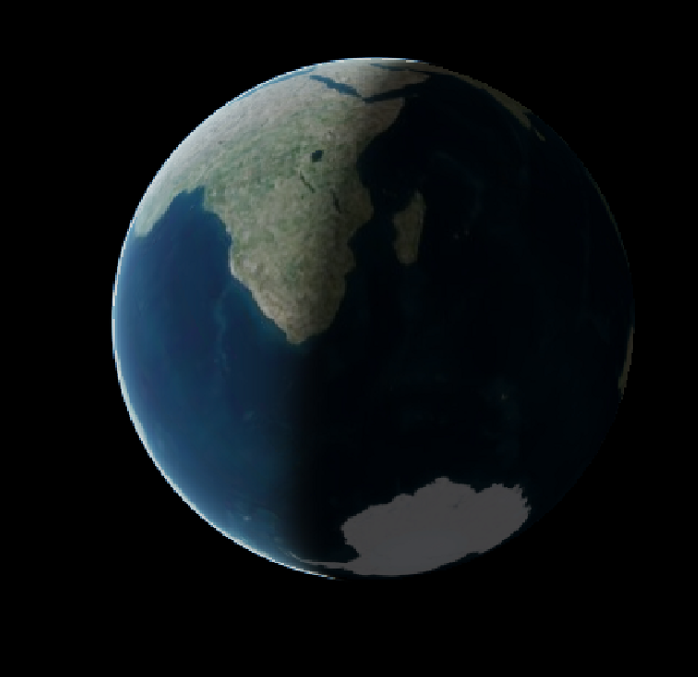

### 地表の大気

オフ　　　　　　　　　　　　　　　　　　　　　オン

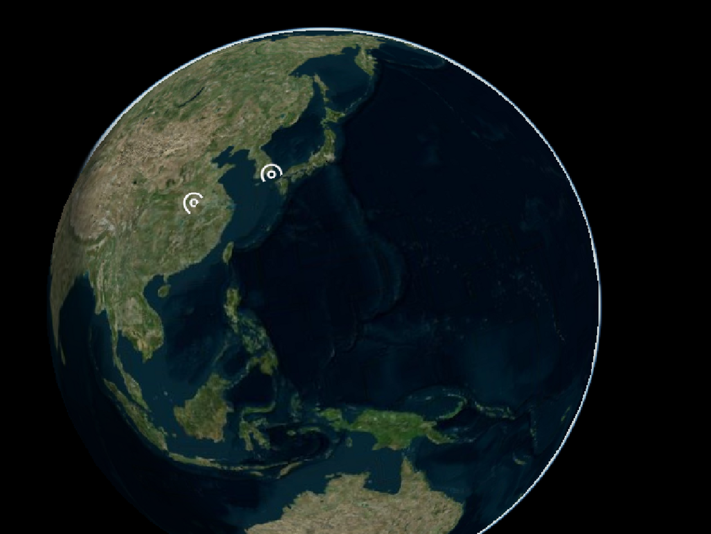

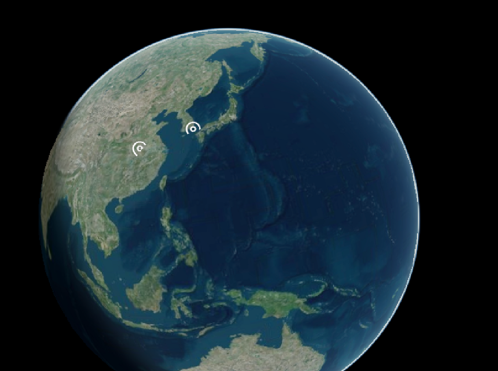

### 影

３Dオブジェクトなどに対して影の表現の有無を設定します。

オフ　　　　　　　　　　　　　　　　　　　　　オン

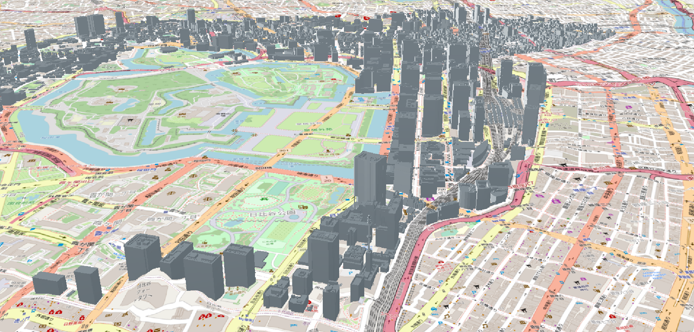

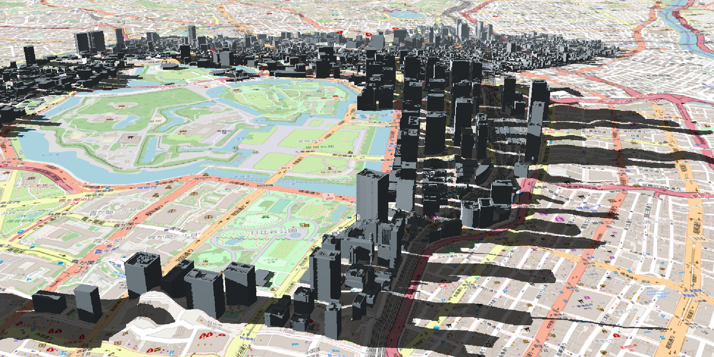

### 霧

地球儀の大気の色を変更することができます。

霧をオンにすると、濃度、明度、色相、彩度を変更できます。

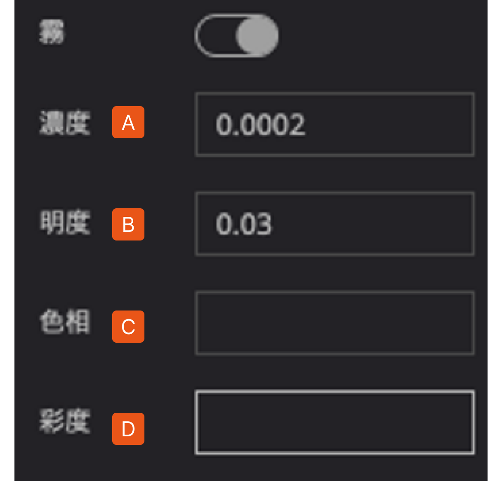

A.   **濃度**：０から1の間の値を入力します。値が大きいほど霧が濃くなります。

B.   **明度**：-1から1の間の値を入力します。値が大きいほど明度が大きくなります。

C.   **色相**：-1から1の間の値を入力します。1青、0.7緑、0.6黄、0.4赤、0.2紫など。

D.   **彩度**：-1から1の間の値を入力します。値が大きいほど彩度が大きくなります。

表現例（霧、夕焼け、世界の終末、水没都市　など）

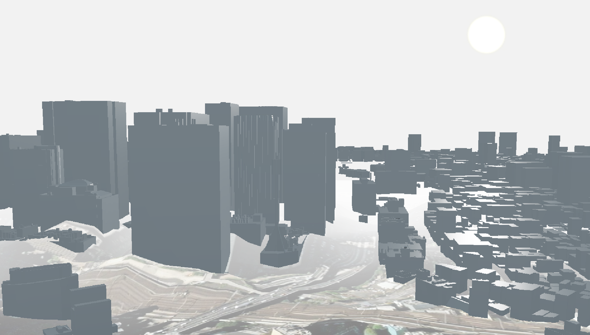

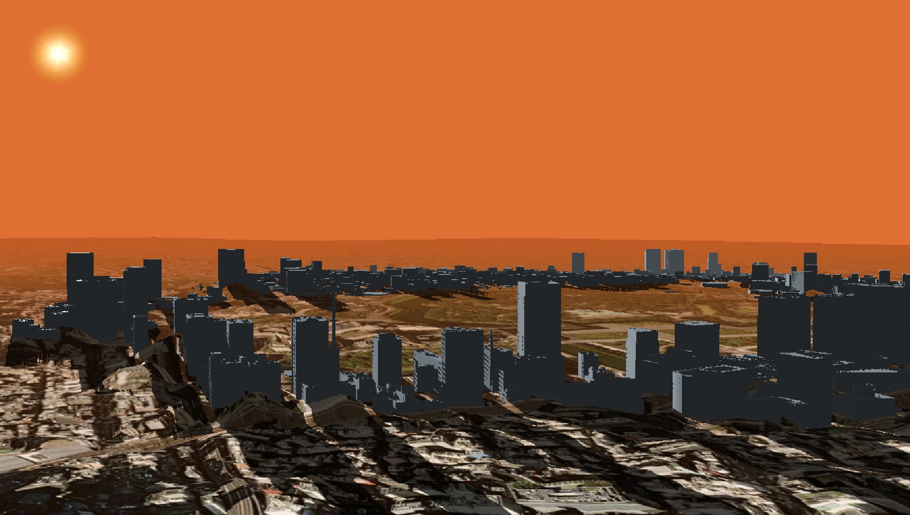

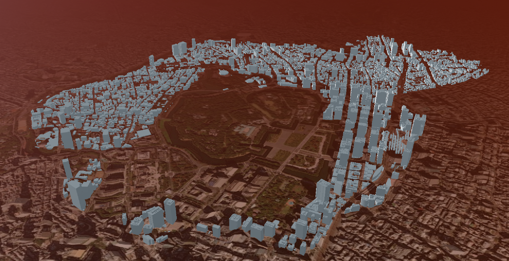

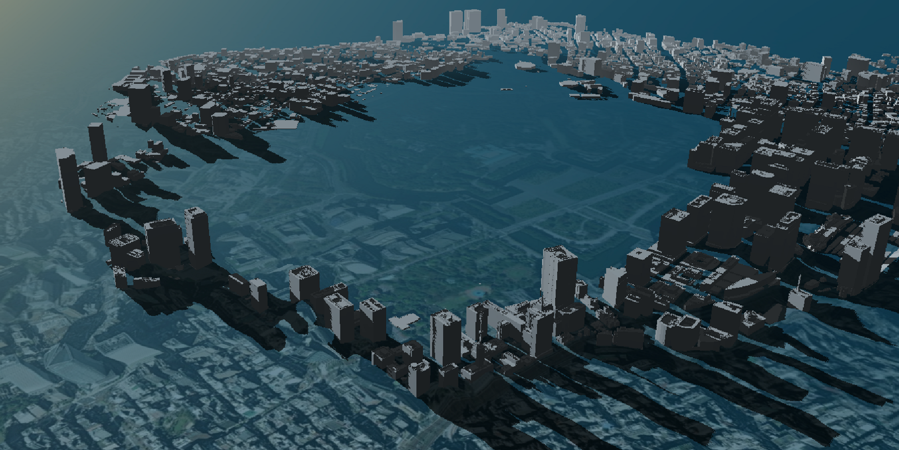