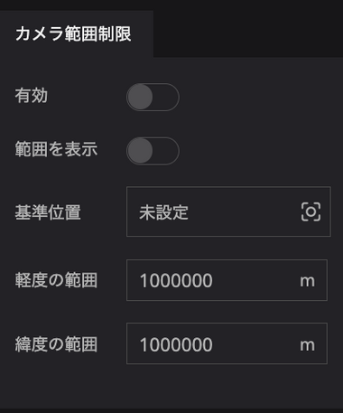
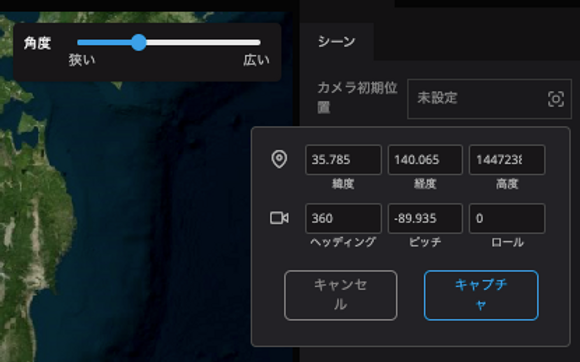
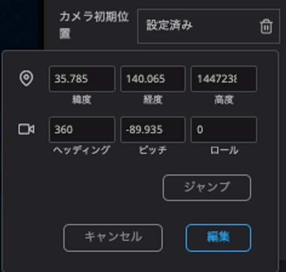
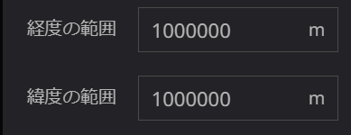
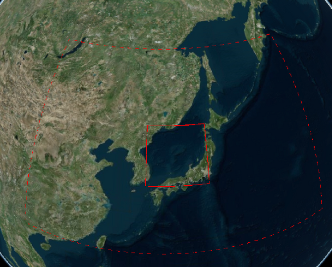

# カメラ範囲制限

カメラ範囲制限では、地図の表示範囲を制限することができます。

範囲を制限すると、マップの移動やズームアウトできる範囲を制限することができます。

　　　　　　　　　　　　　　　　　　　　　　　　　有効をオンにします。

### 基準位置

基準位置をクリックして現在の表示位置をキャプチャします。

- 項目をクリックすると画角の設定項目が表示されます。項目内の数値を直接変更するか、地図を操作すると画角が入力されます。
- キャプチャボタンをクリックすると画角が設定されます。

- ジャンプをクリックすると、設定中の画角に移動します。
- 編集をクリックすると、画角の再設定を行うことができます。
- 再度項目をクリックすると、設定中の画角が確認できます。

### 緯度・経度の範囲

マップの移動が制限されるエリアを基準位置からの距離で指定します。

- 経度の範囲では、東西方向の距離を指定します。
- 緯度の範囲では、南北方向の距離を指定します。

### 範囲を表示

制限範囲を表示することができます。

- 制限範囲を有効にすると、実線と破線で範囲を示されます。
- 実線はマップの移動が可能な範囲を示しています。範囲外に移動しようとすると強制的に実施範囲内にもどされます。
- 破線は、カメラのズームアウト可能な範囲を示しています。破線の範囲を超えてズームアウトができなくなります。