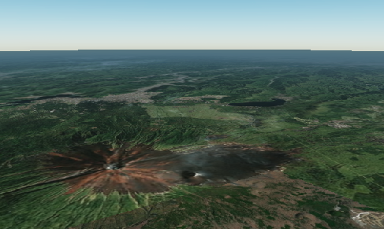

# 地形

## 地形とは

`地形`では、地図タイルが高さ情報を持っている場合に、立体的な地形表現と、平面的な地形表現を切り替えることができます。立体的な地形表現にする場合はオンにしてください。

## 設定方法

地形の立体表現のオン/オフを切り替えます。

地形オフ

地形オン

地形をオンにするとさらに以下の項目を設定できます。

A. **種類**：地形の参照データを[Cesium World Terrain](https://cesium.com/platform/cesium-ion/content/cesium-world-terrain/)と[ArcGIS Terrain](https://elevation3d.arcgis.com/arcgis/rest/services/WorldElevation3D/Terrain3D/ImageServer)から選択することができます。

B. **地形の強調：**起伏の表現倍率を指定します（標準は1x）。

C. **地形の強調の基準**：強調される基準の高さを指定します。この高さより上にある地形は上方に、下にある地形は下方に強調されます。

D. **地形の下を非表示**：地形の下にあるデータを表示するかどうかを選択できます。

表示する

表示しない

