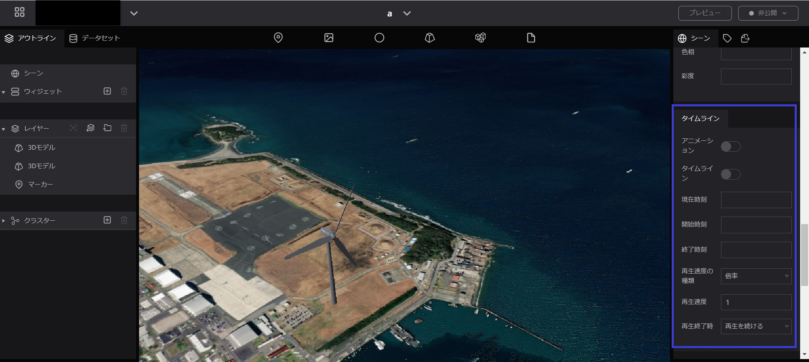
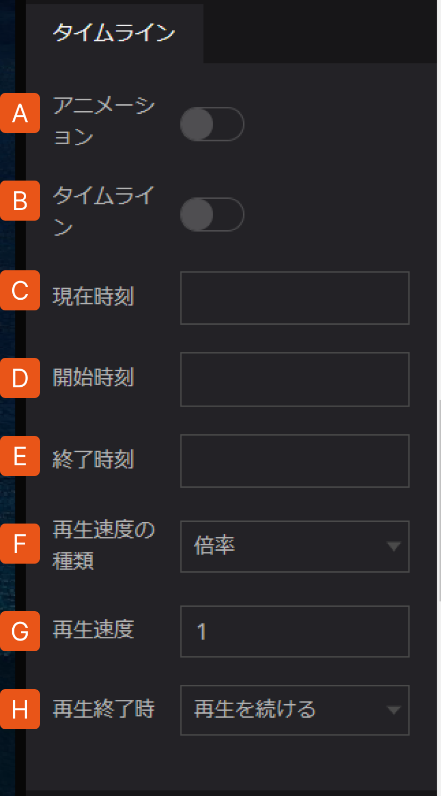
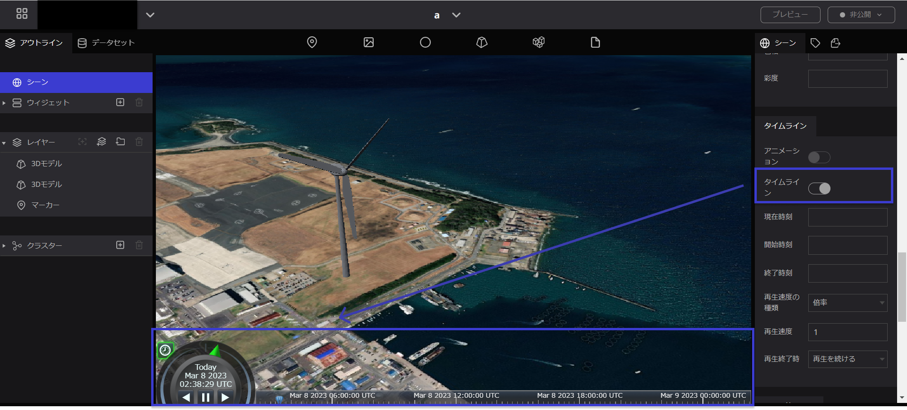

# タイムライン

3Dオブジェクトに対して動きが設定されている場合に、オブジェクトのアニメーションとして有効にします。Cesiumで搭載されているタイムライン機能が使えます。

A. タイムラインの再生を有効にします。３Dモデルのアニメーションが再生されるようになります。（３Dモデルのプロパティでもアニメーションをオンにする必要があります。）

B. タイムラインのUIを表示します。

C. 現在の時刻の入力します。

D. アニメーションの再生時刻を設定できます。（何も設定されていない場合は表示中のデータによって自動的に設定されます。）

E. アニメーションの再生終了時刻を設定できます。（何も設定されていない場合は表示中のデータによって自動的に設定されます。）

F. 再生速度の指定方法です。「倍率」「固定」から選択します。

G. 再生速度の現実の時間の速さに対する倍率で指定します。マイナス値も指定可能です。デフォルトは１倍です。

H. 現在時刻が終了時刻に達したときの処理方法を指定します。「再生を続ける」「停止する」「バウンス」から選択できます。