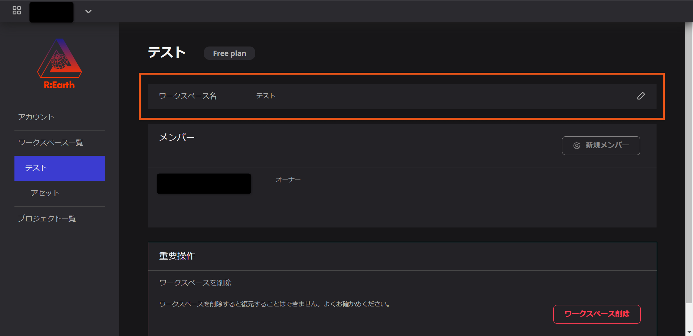
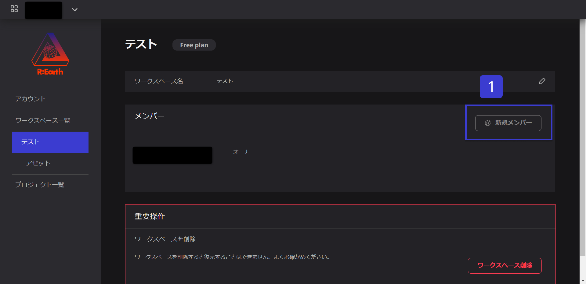
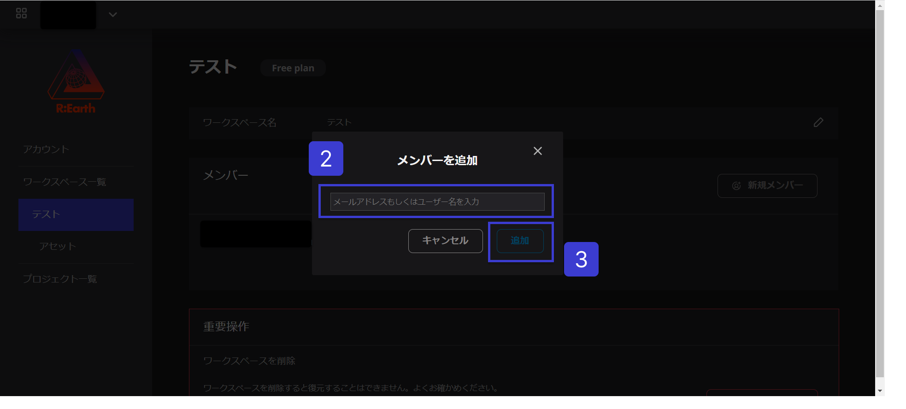
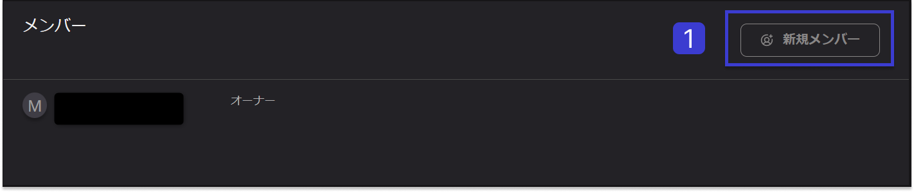
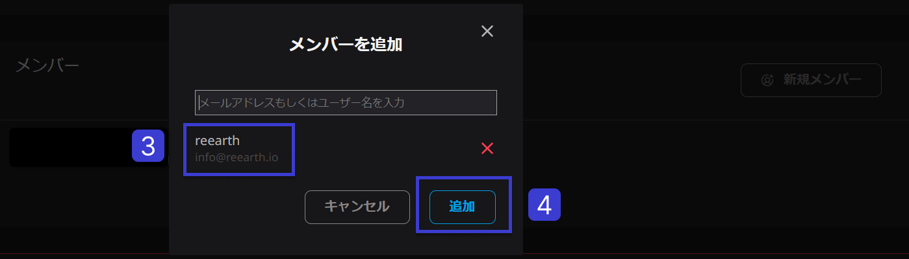
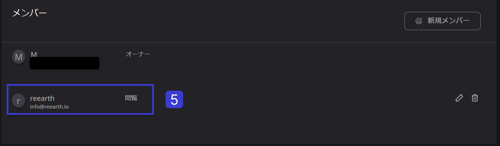

# メンバーの管理

メンバーの管理では、メンバーのロールの追加、名前変更、削除、変更を行うことができます。

## 新規メンバー登録の手順

1.  新規メンバーボタンは、USERワークスペースに新しいメンバーを追加するために使用されます。このボタンは、新しいメンバーを追加するための最初のステップとなります。
    
    
    
2. ユーザーは、電子メールアドレスまたはユーザー名を追加する必要があります。
3. 「追加」ボタンをクリックすると、ワークスペースに新しいチームメンバーを追加することができるようになります。

## 新規メンバーの招待

以下の手順で、新しいメンバーを招待することができます：

.png)

1. 新規メンバーボタンをクリックすると、「チームメンバーを追加する」モーダルが表示されます。
2. 招待したい登録ユーザーのユーザー名またはメールアドレスを記入する。
3. 検索結果が正しいユーザーかどうかを確認します。
4. 確認後、[追加]ボタンをクリックします。
5. メンバーリストに表示されるようになります。