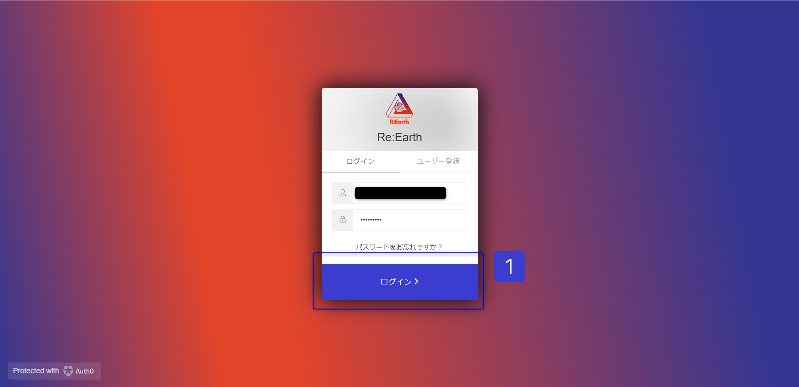
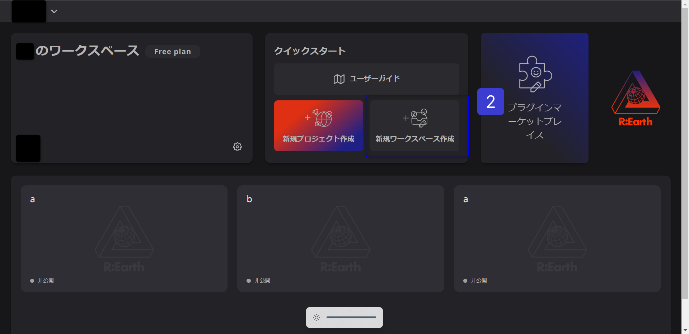
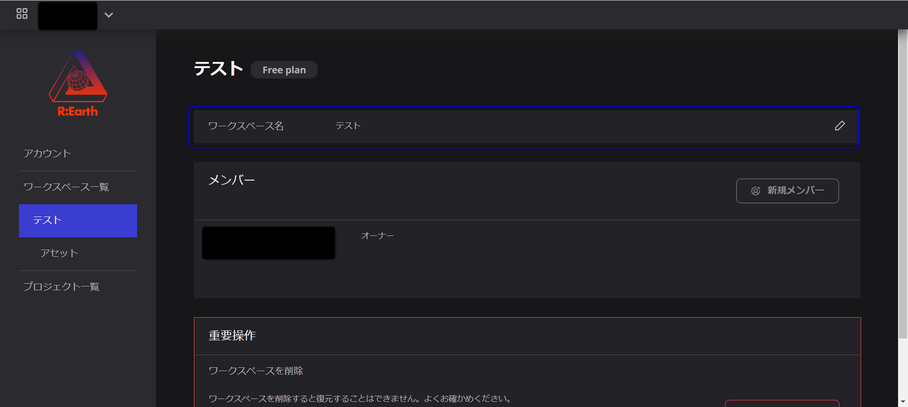
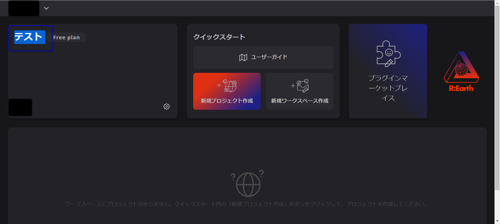
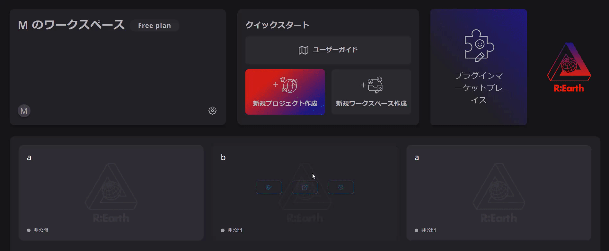

# ワークスペースの共有

## ワークスペースとは？

ユーザーが持続可能なプロジェクトを計画、設計、管理できるデジタル環境のことを指します。ユーザーがプロジェクトに取り組み、進捗状況を確認できる共同プラットフォームです。

ワークスペースでは、さまざまなプロジェクトの作成と管理、チームメンバーの追加、チームメンバーへのタスクの割り当てが可能です。また、画像、動画、ドキュメントなどのファイルをアップロードして共有することもできます。

### ワークスペースを作成する手順

1. **Re:Earthアプリを開き、アカウントにログインします。**
    
    
    
2. **ワークスペースをクリックします。**
    
    
    
3. **ワークスペースの名前を入力し、［作成］を選択します。**
    
    
    

**新しいワークスペースの作成**

### 動画で確認してみましょう！

