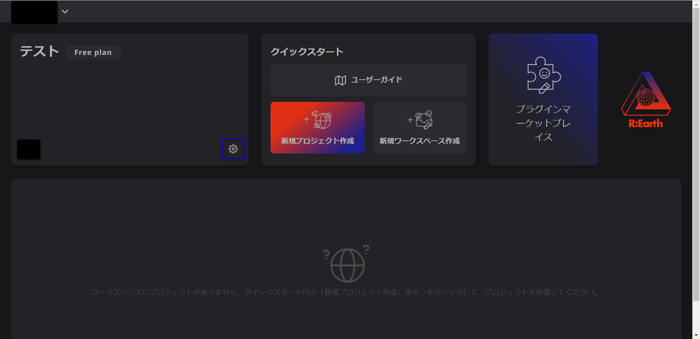
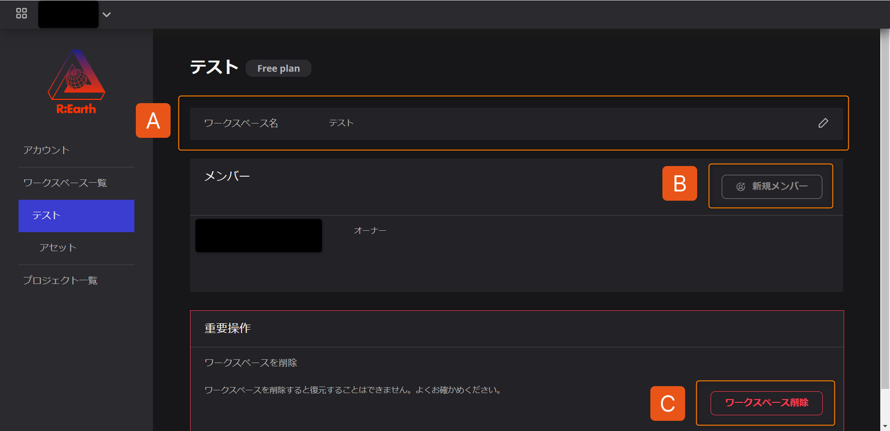
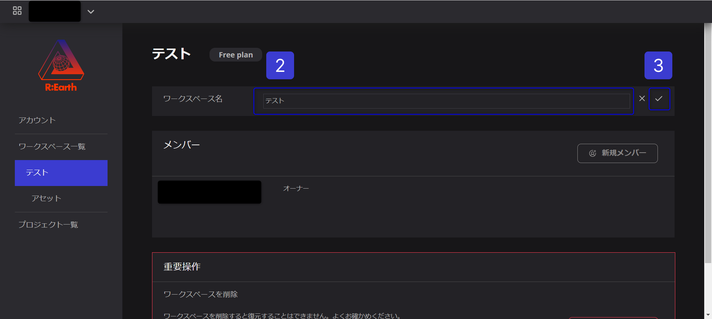
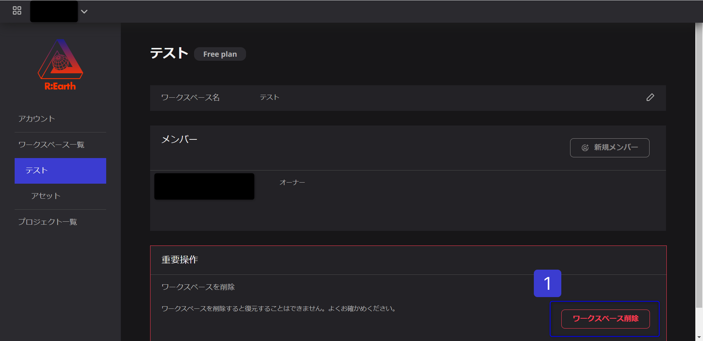
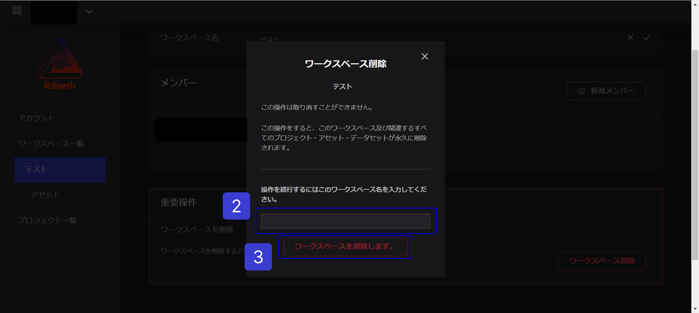

# ワークスペースの設定と削除

## ワークスペースの設定

ユーザーがワークスペースの基本情報の編集、メンバーの管理、ワークスペースの削除を行うために使用するセクションです。

**設定の場所**

歯車のような設定アイコンをクリックし、ワークスペースの設定画面を表示します。

**ワークスペースの設定**

**A.ワークスペース名：**

ユーザーが作成したワークスペースの名称を設定するセクションです。このセクションでは、ユ　ーザーがワークスペースの名前を変更することができます。

.png)

1. ワークスペース名の右端にある鉛筆のアイコンをクリックして、編集可能な状態にします。
2. ワークスペース名を入力します。
3. ✓をクリックするとワークスペース名が変更されます。

**B.新規メンバー：**

ワークスペース内のメンバーを管理することができる項目です。詳しくは、「[メンバーの管理](../managing-members/managing-members.md)」を参照してください。

**C.ワークスペースの削除：**

ワークスペースのアクセシビリティに影響を与える操作が含まれる「重要操作」で確認できます。ここでは、現在のワークスペースを削除することができます。

## ワークスペースの削除

Re:Earth内からワークスペースを削除する処理です。ワークスペースの削除が完了すると、元に戻すことはできません。

### ワークスペースを削除する方法

1. ワークスペース設定の重要操作にある「ワークスペースの削除」をクリックします。
    
    
    
2. 削除したいワークスペースの名前を入力します。
3. その後、「ワークスペースを削除します。」をクリックすると、ワークスペースが削除されます。