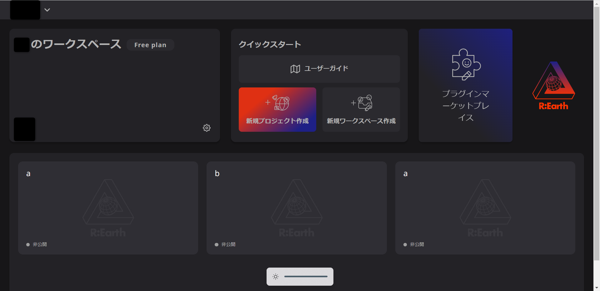

# 概要

ワークスペースは、Re:Earthアプリ内のセクションで、プロジェクトの構築や作成ができる場所です。

[ワークスペースの共有](../create-a-new-team-workspace/create-a-new-team-workspace.md)

[ワークスペースの設定を削除](../create-a-new-team-workspace/create-a-new-team-workspace.md)

[メンバーの管理](../managing-members/managing-members.md)

[アセットライブラリー](../assets-library/assets-library.md)
 