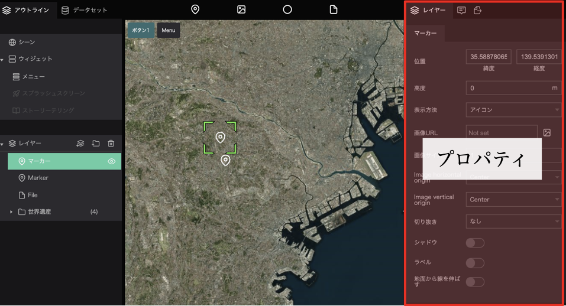
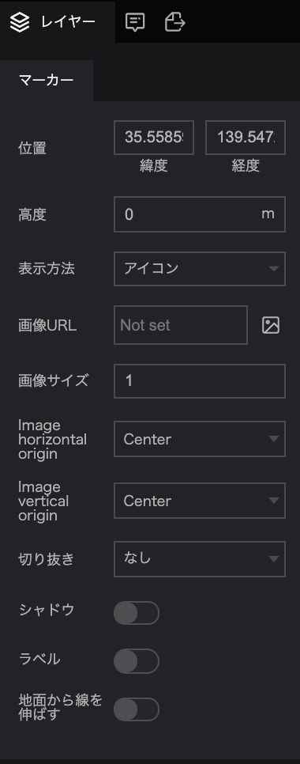
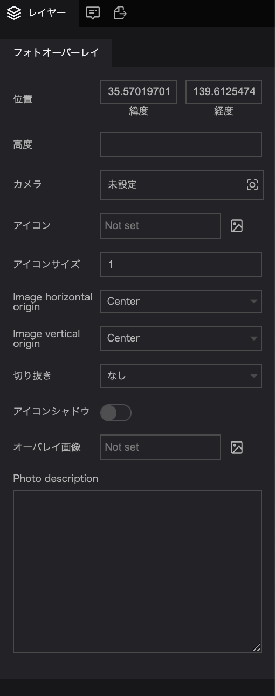
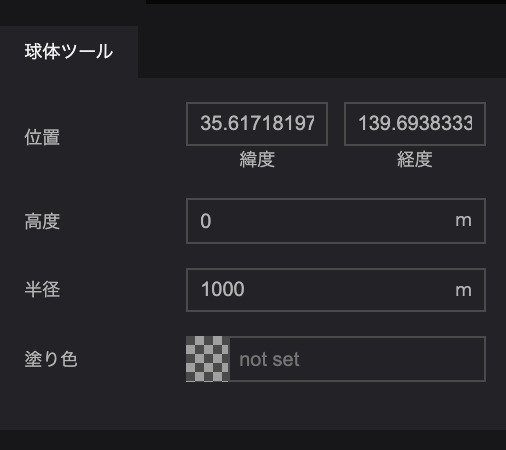
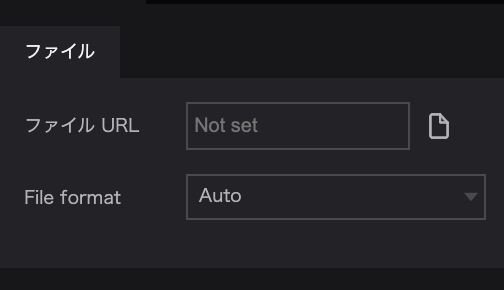
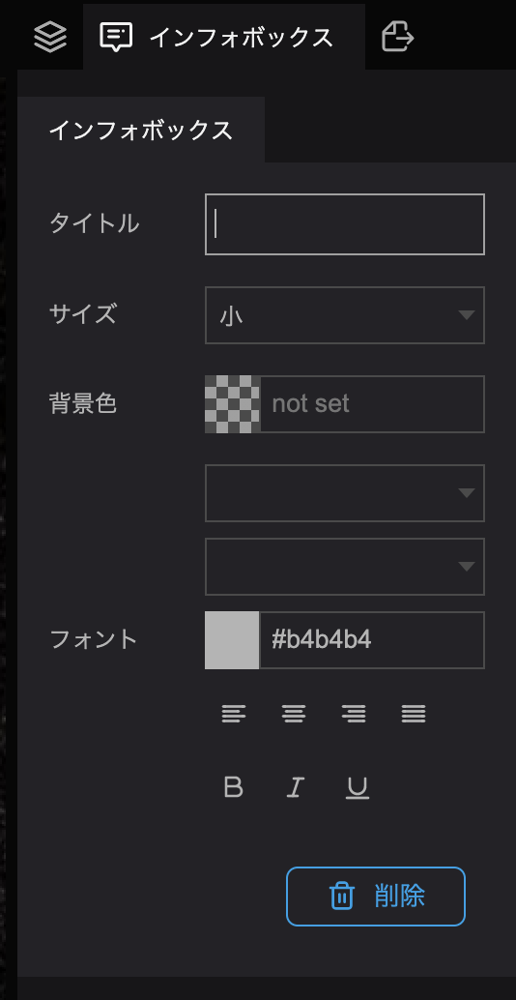
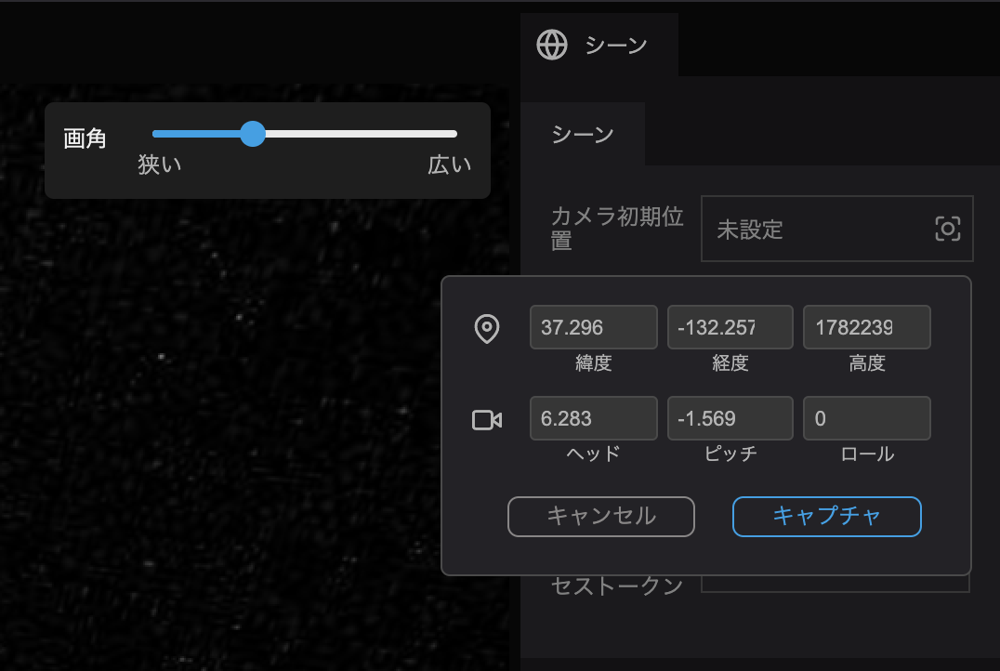
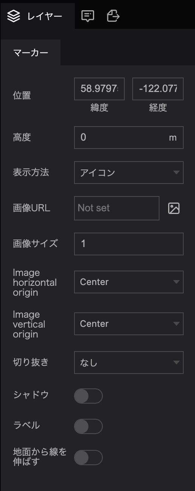
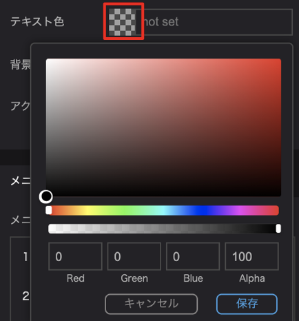
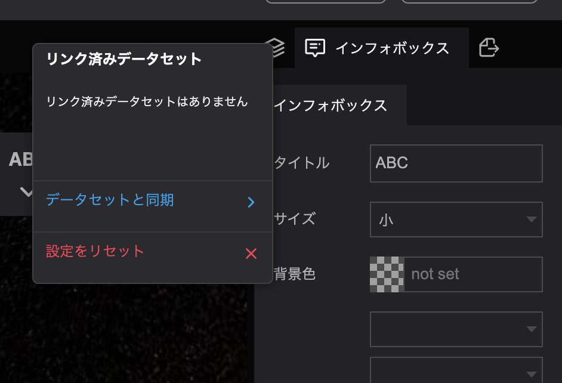

プロパティとは、レイヤー等を選択した際に主に右パネルに表示される、各種設定項目のことを指します。

左パネルで選択した項目に関する詳細や、インフォボックスに関する設定はプロパティで行います。

## レイヤーのプロパティ

プロパティは、画面左パネルでレイヤーやシーンなどを選択することにより、画面右パネルに表示されます。

### マーカーのプロパティ

`マーカー`のプロパティでは、以下の項目を設定することができます。

- 位置：マーカーの位置を設定します。
- 高度：マーカーの対地高度を設定します。
- 表示方法：`ポイント`か`アイコン`から選択します。ポイントの場合は色とサイズをアイコンの場合は画像とサイズ・配置を設定することができます。
- ポイント色：`ポイント`を選択した際に表示されます。ポイントの色を設定します。
- ポイントサイズ：`ポイント`を選択した際に表示されます。ポイントの大きさを設定します。
- ラベル：`ポイント`を選択した際に表示されます。ポイントへのラベル付与/非付与を切り替えます。
- ラベル文字：`ポイント`を選択した際に表示されます。ポイントへのラベル付与/非付与を切り替えます。
- シャドウ：マーカーに影をつけることができます。
- ラベル：マーカーにラベルをつけることができます。
- 地面から線を引き伸ばす：マーカーに高度を設定した際に、マーカーと地表との間に線を引き出すかどうかを設定します。

### フォトオーバーレイのプロパティ

- フォトオーバーレイでは以下の項目を設定することができます。
- 位置：フォトオーバーレイを表示する位置を設定します。
- 高度：フォトオーバーレイを表示する高度を設定します。
- カメラ：フォトオーバーレイの描画画角を設定します。
- アイコン：フォトオーバーレイの地点に描画するアイコンを指定します。
- アイコンサイズ：アイコンのサイズを設定します。
- image horizontal origin：画像の配置を左、中央、右亜から選択します。
- image vertical origin：画像の配置を上、中央、ベースライン、下から選択します。
- 切り抜き：画像を円形に切り抜くかどうかを設定します。
- アイコンシャドウ：アイコンに影をつけるかを設定します。
- オーバーレイ画像：フォトオーバーレイの画像を指定します。
- Photo description：フォトオーバーレイの説明を入力します。

### 球体ツールのプロパティ

球体ツールでは以下の項目を設定することができます。

- 位置：球体を表示する位置を設定します。
- 高度：球体を表示する高度を設定します。
- 半径：球体の半径を設定します。
- 塗り色：球体の色を設定します。

## ファイルのプロパティを設定する

ファイルのプロパティでは以下の項目を設定することができます。

- ファイルURL：ファイルとして読み込むデータを選択します。
- File format：読み込むファイルの拡張子を選択します。

## プロパティのタイトルを変更する

タイトルの入力欄をクリックし、テキストを入力します。

## カメラプロパティを変更する

シーンの設定などではカメラのプロパティを変更することができます。

プロパティ名の横の`未設定`をクリックします。

出てきたポップアップの中に、お好みの角度を入力して`キャプチャ`をクリックします。

(シーンついては[こちら](/user-manual/scene/set-up-scene-group-properties)をご覧ください)

## イメージプロパティを変更する

フォトオーバーレイや画像ブロックでのイメージプロパティでは、表示する画像を指定することができます。

プロパティの右側にある`Not set`もしくは`画像アイコン`をクリックすると画像モーダルが表示されます。

表示されたモーダルの名から画像を選択し、`選択`をクリックします。

(アセットについては[こちら](/user-manual/Asset/upload-a-new-asset)をご覧ください)

## 色の設定

マーカーやテキストの色の設定は、カラーパレットから色を選択することができます。

色設定項目のアイコンをクリックすると、カラーパレットが表示されます。

任意の色を選択して`保存`をクリックすると指定した色が設定されます。

## プロパティ値の初期化

入力したプロパティ値をクリアするには、プロパティ名をクリックし、設定をリセットをクリックします。

`設定をリセット`をクリックすることで、入力値を初期化することができます。

