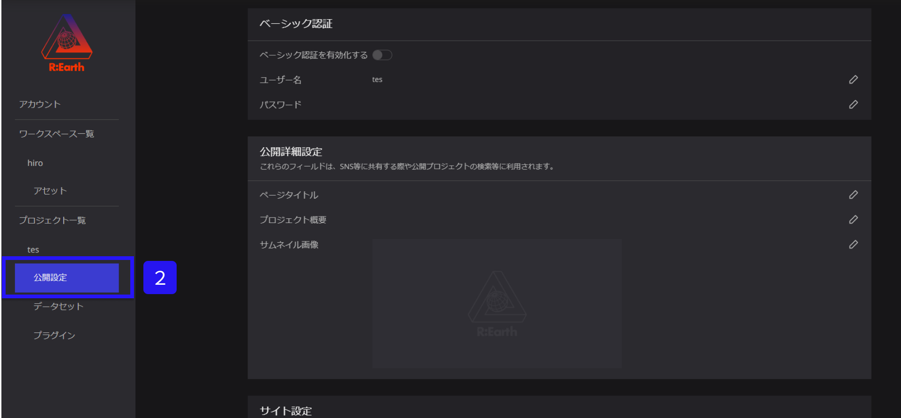

# サブドメインとカスタムドメイン

Re:Earthでは、サブドメインとカスタムドメインを設定することができます。

Ａ：サイト名よりサブドメインを設定することができます。

例えば「[example.com](http://example.com/)」というドメインがある場合、その下に「[blog.example.com](http://blog.example.com/)」

や「[shop.example.com](http://shop.example.com/)」といったサブドメインを設定することができます。

このように、サブドメインは、異なるサイトやサービスを区別し、同じドメイン内で

異なるコンテンツを提供するために使用されます。

B：カスタムドメインは、**有料ユーザー様のみご利用できます。**

外部でドメインを取得して、取得したドメインをRe:Earthのaddドメイン機能から設定

可能です。**設定後は数日間反映に時間がかかることがあり、自動的に反映されないため、**

**随時確認して更新ボタンを押す必要があります。**

### A：サブドメインの設定について

①ワークスペースの該当プロジェクトの設定ボタンをクリックします。

.png)

②公開設定をクリックします。

③サイト設定内にあるサイト名の編集ボタンをクリックします。

.png)

④サイト名を変更する画面が表示されます。

枠内に、表示したサイト名を入力し、保存をクリックします。

サイト名はアルファベットとハイフン(-)のみ利用可能です。

例：mihon

⑤すると、このようにサイト名が変更されます。

サブドメイン設定は以上となります。

### B：カスタムドメインの設定について　（ここより先は有料ユーザー様のみ）

①ワークスペースの該当プロジェクトの設定ボタンをクリックします。

%201.png)

②公開設定をクリックします。

③カスタムドメイン内にあるカスタムドメインを追加をクリックします

④エイリアスを追加というボックスが出力されるので、外部でドメインを取得し、取得した

ドメインをボックスへ入力後、確認ボタンをクリックします。

例：mapmihon.com

.png)

**※設定後は数日間反映に時間がかかることがあり、自動的に反映されないため、**

**こちらのカスタムドメイン設定画面を随時確認して、カスタムドメイン設定画面に出力される**

**更新ボタンを押す必要があります。**

カスタムドメインの設定は以上となります。