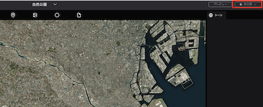
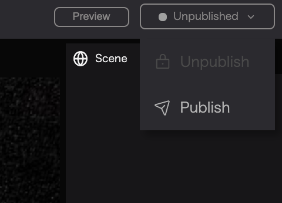
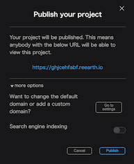
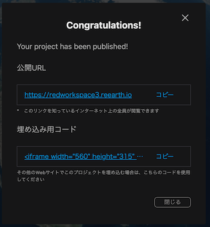

From the editor page, click the `Publish` button in the upper right corner to show a dropdown.

Click `Publish`.

A publishing modal will appear with the URL to be used and some extra options.

Press the `Publish` button to make the project public.

`Public URL`: Everyone on the Internet who knows the link will be able to view it.

`Embed code`: If you want to embed your project in other websites, please use the embed code.

## Options:

### Make your project appear in Google's search results

In the publishing modal when you are publishing your website, go to the `more options` area and turn on the `Search engine indexing` toggle button (green) to display your website in Google's search results.

### Basic project settings

Detailed publication settings can be made from the project settings.