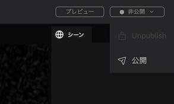
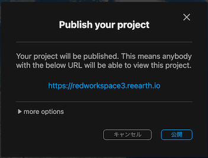
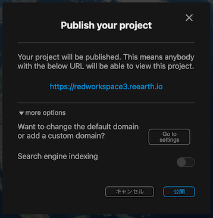

## プロジェクトを公開する

プロジェクト編集画面の右上の`公開メニュー`をクリックします。

`公開`を選択します。

画面中央に確認画面が表示されます。`公開`をクリックします。

`公開`ボタンを押すと、プロジェクトが公開されます。

`公開URL`：リンクを知っているインターネット上の全員が閲覧できます。

`埋め込み用コード`：その他のwebサイトでプロジェクトを埋め込む場合は、埋め込み用コードをお使いください。

## プロジェクトをGoogleの検索結果に表示させる

公開時の確認画面で、`more option`から、`Search engine indexing`のトグルボタンをオン（緑色の状態）にすることで、Googleの検索結果への表示が可能になります。

## プロジェクトの基本設定

詳細な公開設定はプロジェクトの設定から行うことができます。
