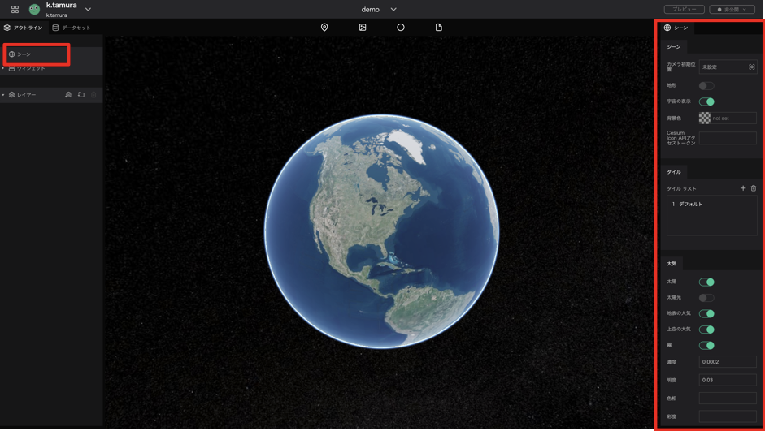
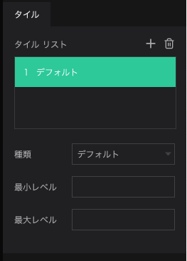
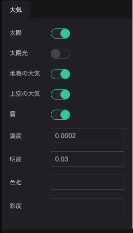

シーンでは、プロジェクト全体やデジタルアースの背景に関する設定を行うことができます。

シーン選択時に画面右に表示される項目について説明します。

## シーングループ

シーングループでは、カメラ初期位置や宇宙の表示に関する設定を行います。

1. カメラ初期位置：ページロード後、最初に表示されるカメラの位置を設定します。
2. 地形：地図タイルが高さ情報を持っている場合に、立体/平面を切り替えます。
3. 宇宙の表示：宇宙空間の太陽の表示/非表示を切り替えます。
4. 背景色：宇宙空間を非表示にした場合の、背景色を設定します。
5. Cesium ion APIアクセストークン：Cesium ionアカウントで発行したAPIキーを、プロジェクトへ設定します。Cesium ionアセット（地図タイルデータ・3Dデータなど）の使用が可能になります。

## タイルグループ

タイルグループでは、デジタルアースに表示される地図タイルを設定します。いくつかの既存のタイルセットから選択するか、URLを指定することにより、外部配信の地図タイルを適用することもできます。

Tilesリストから、任意のタイルをクリックすると詳細が展開されます。
1. プラスアイコン：タイルを追加します。
2. ゴミ箱アイコン：タイルを削除します。
3. 種類：タイルの種類を選択します。
4. 最小レベル：タイルデータ表示の最小ズームレベルを設定します。
5. 最大レベル：タイルデータ表示の最大ズームレベルを設定します。

## 大気

大気グループでは、大気圏や太陽・霧に関する設定を行います。

1. 太陽：宇宙空間にある太陽の表示/非表示を切り替えます。
2. 太陽光：デジタルアースへの太陽光の反映/非反映を切り替えます。これにより、地域による昼夜の表現が可能です。
3. 地表の大気：デジタルアース地表の大気圏の表示/非表示を切り替えます。
4. 上空の大気：デジタルアース上空の大気圏の表示/非表示を切り替えます。
5. 霧：霧のオンオフを切り替えます。
6. 濃度：霧の濃度を設定します。0~1の数値が有効です。
7. 明度：霧の明るさを設定します。-1~1の数値が有効です。
8. 色相：霧の色を設定します。-1~1の数値が有効です。
9. 彩度：霧の彩やかさを設定します。-1~1の数値が有効です。

## Google Analytics
Google Analyticsグループでは、Google Analyticsとの連携に関する設定を行います。

1. 有効： Google Analyticsを有効にするには、オン（緑の状態）にします。
2. Tracking ID： Google AnalyticsのTracking IDを入力してください。

