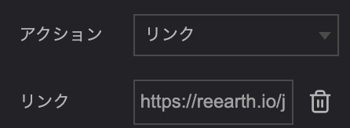
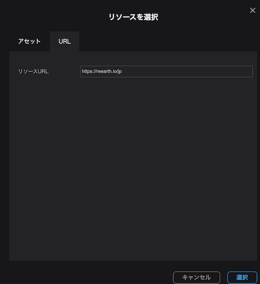
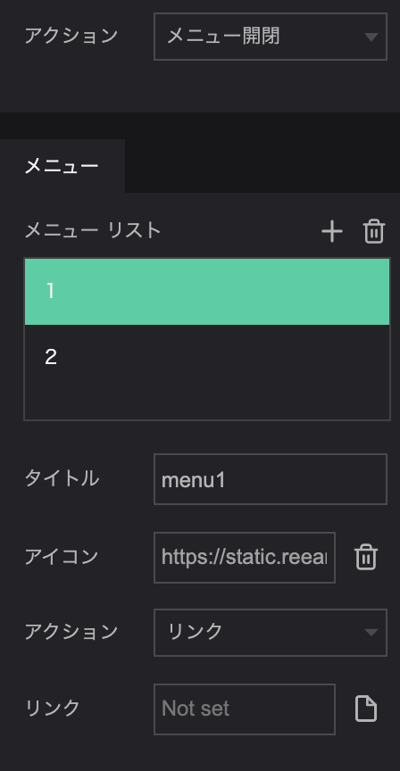
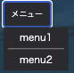
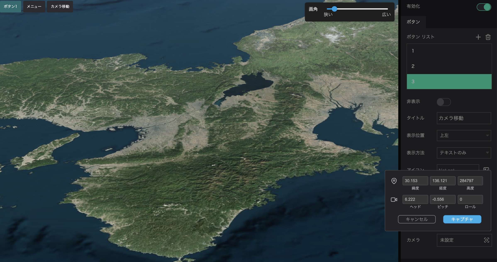

左パネルのアウトラインタブから`ウィジェット`をクリックし、`メニュー`をクリックしてください。  
画面右パネルに、メニューボタンに関する設定ウインドウが表示されます。  
`有効化`をクリックし、ボタンリストの`+`アイコンから、ボタンを追加してください。

`ボタン`では以下のことが設定できます。

- 非表示：ボタンの表示/非表示を切り替えます。
- タイトル：ボタンの表示名を入力します。
- 表示位置：ボタンの表示位置を左上、右上、左下、右下から選択することができます。
- 表示方法：ボタンの表示をテキストのみ、アイコン、テキストとアイコンから選択することができます。
- アイコン：ボタンの表示方法をアイコン、もしくはテキストとアイコンにした場合、画像を指定することができます。
- テキスト色：ボタンの文字色を変更することができます。
- 背景色：ボタンの背景色を変更することができます。
- アクション：ボタンをクリックしたときの動作をメニュー開閉、リンク、カメラ移動から選択することができます。それぞれの動作は以下の通りです。
    - メニュー開閉：クリックするとさらにメニューボタンを表示させるボタンになります。
    - リンク：クリックすると指定のアドレスにアクセスするボタンになります。
    - カメラ移動：クリックするとカメラの移動を実行するボタンになります。

## リンクボタンを設置する

`ボタン`では、指定したwebページへのリンクボタンを設置することができます。

- `ボタン`の`アクション`から`リンク`を選んでください。
- リンク欄をクリックすると、リソース選択ウインドウが表示されます。
- URLタブを選択し、リソースURLにアドレスを入力して`選択`をクリックすると、リンクボタンの設定が完了します。

## メニューボタンを設置する

クリックで展開するメニューボタンを設置します。  
これにより、複数のアクションをコンパクトにまとめることができます。

`ボタン`の`アクション`から`メニュー開閉`を選んでください。

メニューリストの`+`アイコンで、メニュー内項目を追加してください。

- タイトル：メニュー内項目の表示名を入力してください。
- アクション：メニュー内項目をクリックした際のアクションや表示形式を選択します。それぞれ内容は以下の通りです。
    - リンク：クリックすると指定のリンクに移動します。
    - カメラ移動：クリックするとカメラの移動を実行します。
    - 区切り線：メニュー内項目ではなく、区切り線を表示する役割を持たせます。

## カメラ移動ボタンを設置する

クリックでカメラを指定位置へ移動させるボタンを設置します。

`ボタン`の`アクション`から`カメラ移動`を選択してください。

その下にあらわれる`カメラ`の項目をクリックすると、画角の設定ウインドウが表示されます。緯度経度などに値を入力するか、マウス操作でデジタルアースを移動し、`キャプチャ`をクリックしてください。  
これらの動作により、移動先のカメラ画角を設定することができます。

