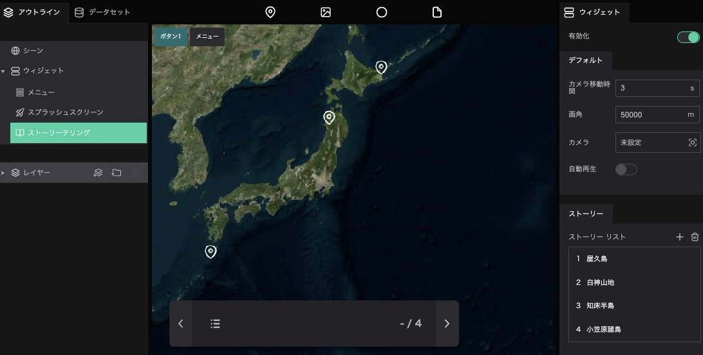
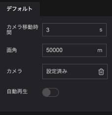
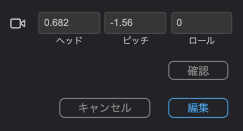
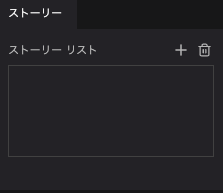
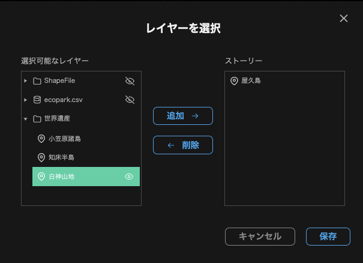
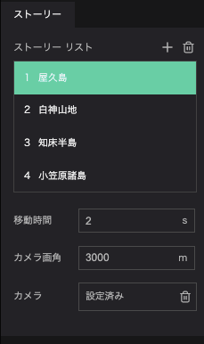

ストーリーテリング機能では、デジタルアース上のレイヤーに表示順を与えることができます。※レイヤーとは、マーカーやフォトオーバーレイなどの総称です。
これにより、物語のようにユーザーにデータを提示することが可能です。

## ストーリーテリングの有効化

- 左パネルのアウトラインタブから`ウィジェット`をクリックし、`ストーリーテリング`をクリックしてください。  
画面右パネルに、ストーリーテリングに関する設定ウインドウが表示されます。  
`有効化`をクリックしてください。

スーリーテリングでは、デフォルト項目とストーリー項目のふたつを設定する必要があります。

## デフォルト項目の設定

- 移動時間：レイヤー間の移動にかかる時間（秒）を指定します。
- 画角：指定した地点からカメラまでの距離を指定します。
- カメラ：カメラの位置を指定します。

　`カメラ`横の`未設定`と書かれている欄をクリックするとカメラ位置の設定画面が表示されます。数値を入力するか、デジタルアース上でカメラ位置を調整し、`編集`をクリックしてカメラ位置を決定してください。

- 自動再生：オンにすると、プロジェクト閲覧開始時にストーリーテリング機能の最初の項目からスタートします。

## ストーリー項目の設定

ストーリーテリング内の項目に関する設定を行います。

### 地点の追加

ストーリーリストの`+`アイコンをクリックすると、項目の追加ウインドウが表示されます。

`選択可能なレイヤー`から、追加したい項目を選択し、`追加`ボタンをクリックしてください。選択した項目が`ストーリーリスト`に追加されます。  
ストーリーテリングは、`ストーリーリスト`の上から順番に再生されます。 `ストーリー`内の項目はドラッグで並び替えることができます。  
また、`ストーリー`内の項目を削除したい際には、削除したい項目を選択し、`削除`ボタンをクリックしてください。  

順番が確定したら、`保存`ボタンを押してください。編集が保存されます。

### 項目ごとのカメラ設定

ストーリーテリング時のカメラ画角やカメラ位置は、項目ごとに設定することができます。

ストーリーリストに追加した項目をクリックしてください。

移動時間：レイヤー間の移動にかかる時間（秒）を指定します。

画角：指定した地点からカメラまでの距離を指定します。

カメラ：カメラの位置を指定します。

### ストーリーテリングの実行

ストーリーテリング機能を有効にしているプロジェクトでは、画面左下にストーリーテリングメニューが表示されます。

`>`で次のレイヤーへ、`<` で前のレイヤーに移動します。 
ストーリーテリング機能では、レイヤー移動と同時にインフォボックスも表示されます。

インフォボックスの設定については[こちら](/user-manual/infobox/set-up-infobox-properties)をご覧ください

ストーリーテリングメニュー左のアイコンをクリックすると、ストーリーリストが表示されます。ここから直接該当レイヤーを選択し、移動することも可能です。

