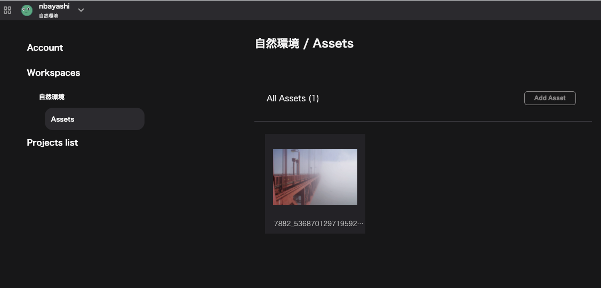

## アセットとは

Re:Earth内で使用する画像はアセット内で管理されます。

アセットはワークスペースに紐づくため、プロジェクト間で共有して利用することができます。

アセットの画像は、

- プロジェクトのサムネイル
- infobox/画像ブロックの画像
- フォトオーバーレイ/オーバーレイ画像
- マーカーのアイコン
- フォトオーバーレイ
- プロフィール画像

に設定することが可能です。

## アセットへのアクセス方法

アセットへは、`アカウント設定`→`ワークスペース`→ `アセット`でアクセスできます。

