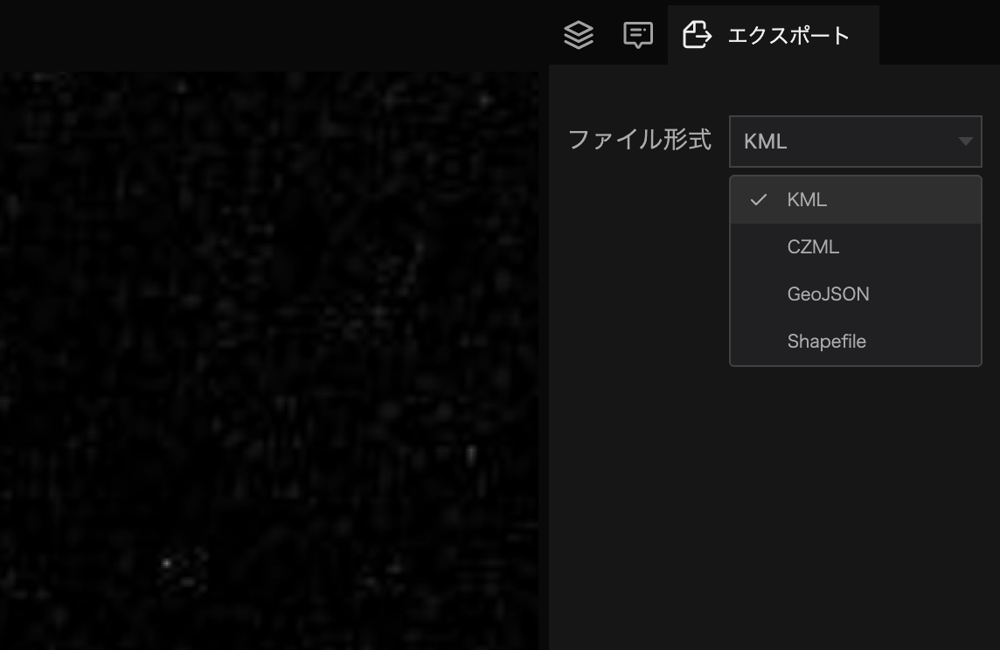
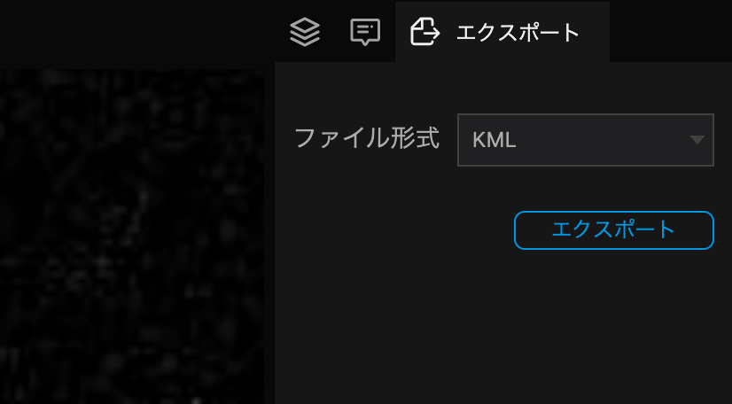

`アウトライン`タブに切り替え、エクスポートする`レイヤー`を選択します。

(データセット・ファイル・マーカー・フォトオーバーレイ・球体ツール全て選択可能です。)

レイヤーのエクスポートでは、選択されたレイヤーに含まれる全てのデータが1ファイルとしてエクスポートされます。例えば、単一のレイヤーの場合はそのレイヤーのみが、レイヤーフォルダを選択した場合はそのフォルダ内に含まれる子レイヤー全てがエクスポートされます。

画面右側にある、`エクスポートアイコン`タブを選択します。

フィル形式を選択します。

`エクスポート`をクリックするとデータがエクスポート されますので、保存先を指定してください。

