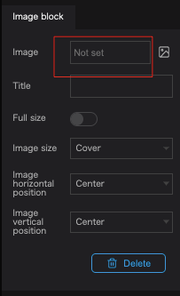
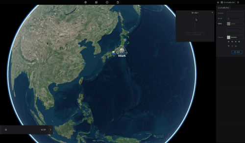
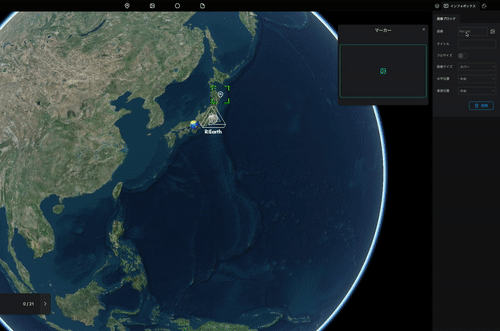

イメージブロックでは画像を追加します。

インフォボックスの`+`ボタンをクリックします。

Imageボタンをクリックします。

イメージボックスのプロパティの画像をクリックすると画像選択アセットが表示されます。

アセットから画像を選択するか、画像のURLを貼ります。

(アセットについては[こちら](/user-manual/Asset/upload-a-new-asset)をご覧ください)

- アセットから画像を選択する場合

- 画像のURLを貼る場合は、モーダルのURLタブから画像URLを入力してください。

