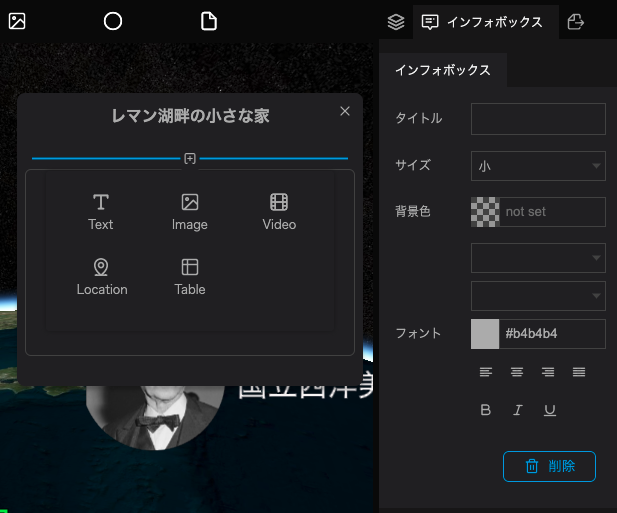

インフォボックスとは、閲覧者が地図上のレイヤーをクリックした際に表示されるボックスのことを指します。

インフォボックスにはテキストや画像、動画などを表示させることができます。

インフォボックスで指定した書体や書式は、各ブロック内で別途指定がない場合継承されます。

インフォボックスを設定することで、マーカーに情報を載せて表示させることができます。

インフォボックス内に挿入するテキストや画像は、ブロックで管理します。

画像やテキストを設定したインフォボックスは、公開したシーンで見ることができます。

