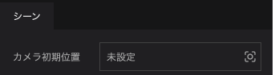
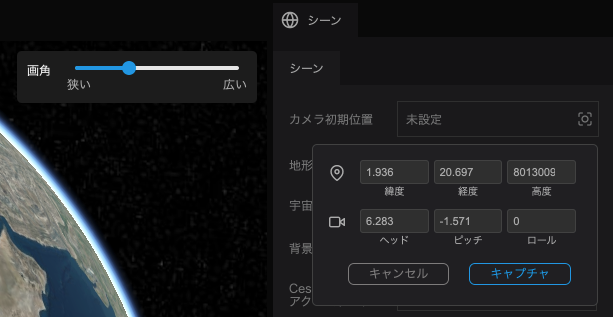
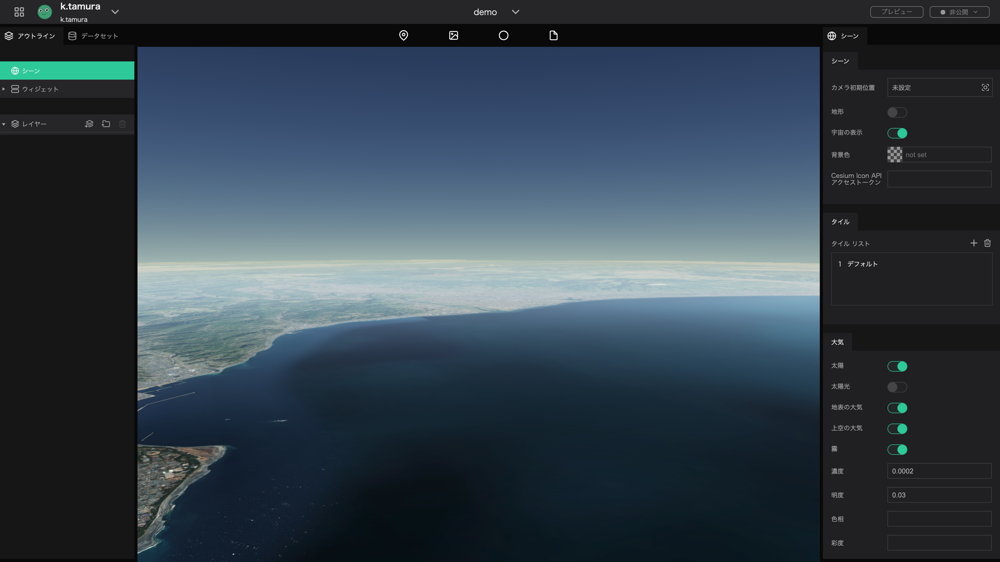
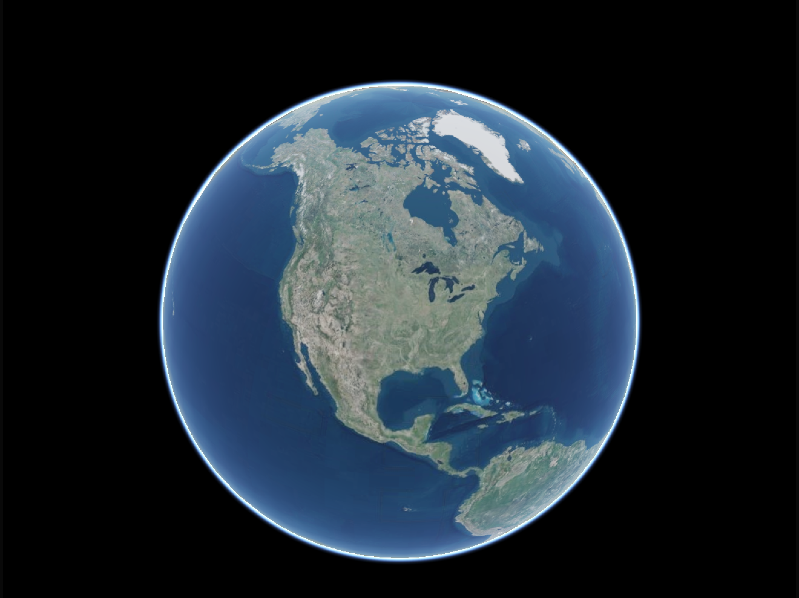
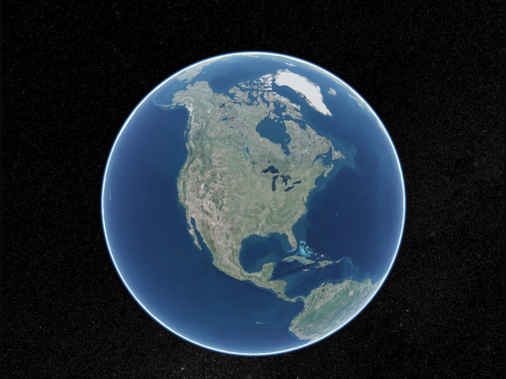
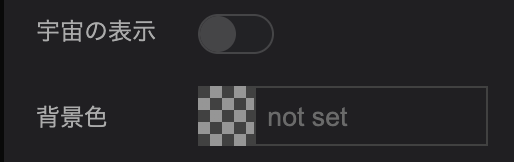
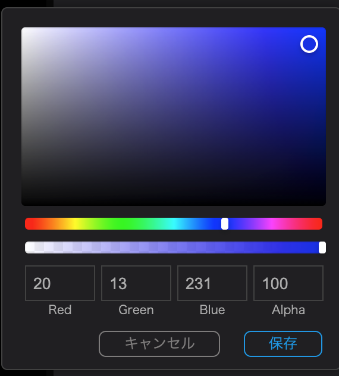

シーンでは、プロジェクト全体やデジタルアースの背景に関する設定等を行うことができます。ここではシーンの設定方法を説明します。

### カメラ初期位置の設定

デフォルトでは、ページロード時に北アメリカ全土が表示される設定になっています。`カメラ初期位置の設定`では、ページロード後、最初に表示されるカメラの位置を設定できます。

- デジタルアースを任意の場所・画角に動かしてください。

- `キャプチャ`をクリックすると、その位置と画角がカメラ初期位置に設定されます。

### 地形の表示

`地形`では、地図タイルが高さ情報を持っている場合に、立体的な地形表現と、平面的な地形表現を切り替えることができます。立体的な地形表現にする場合はオン（緑色の状態）にしてください。

地形表現なし

地形表示あり

### 宇宙の表示

`宇宙の表示`では、宇宙空間の表示/非表示を切り替えます。

宇宙の表示なし

宇宙の表示あり

### 背景色の設定

`背景色の設定`では、宇宙を非表示にした場合の、背景色を設定します。

- `宇宙の表示`を非表示設定にして、背景色の`not set`をクリックしてください。

- 表示されたカラーパネルから任意の色を選び、`保存`をクリックしてください。

変更前

変更後

### Cesium ion APIアクセストークン

`Cesium ion APIアクセストークン`から連携を行うと、Cesium ionアセット（地図タイルデータ・3Dデータなど）の使用が可能になります。Ceisum ion側で発行したAPIキーをプロジェクトへ設定してください。