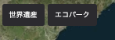
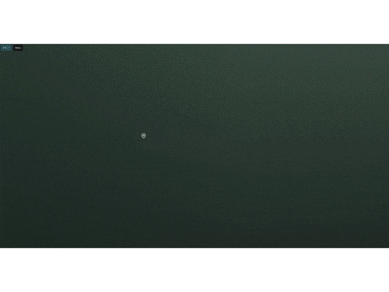

ウィジェットでは、ウインドウ上に配置される機能の設定が可能です。現在Re:Earthが公式に提供するウィジェットには、  
1. 任意のイベント(カメラ移動・外部サイトへのリンクなど)を発火するメニューボタン
2. テキストプロジェクトを起動した際に表示される画面を設定するためのスプラッシュスクリーン
3. プロジェクト上のレイヤーを順序立てて移動するストーリテリング機能  
があります。

## ボタン

## スプラッシュスクリーン

## ストーリーテリング

