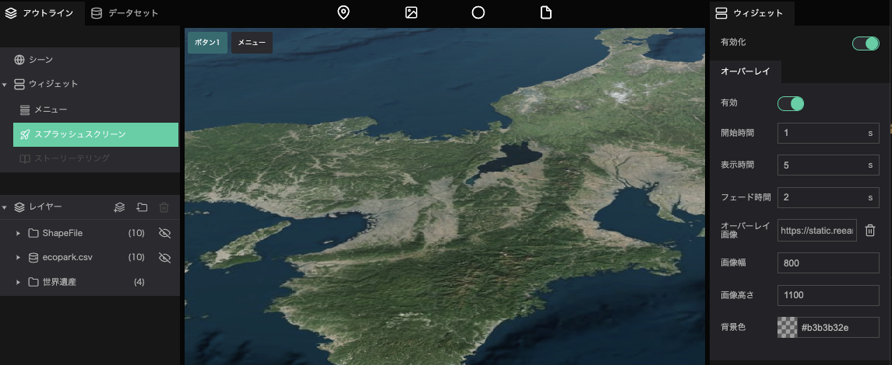

スプラッシュスクリーンとは、プロジェクトが起動するまでの間に表示される画面のことです。

プロジェクトのタイトルやロゴを表示するのに適しています。

## スプラッシュスクリーン画像の設定

- 左パネルのアウトラインタブから`ウィジェット`をクリックし、`スプラッシュスクリーン`をクリックしてください。  
画面右パネルに、スプラッシュスクリーンに関する設定ウインドウが表示されます。  
`有効化`をクリックしてください。

- 開始時間：プロジェクトを読み込んだ際に、スプラッシュスクリーンを表示させるまでの時間（秒）を指定します。
- 表示時間：スプラッシュスクリーンを表示させておく時間（秒）を指定します。
- フェード時間：スプラッシュスクリーンの表示・非表示にかかる時間を指定します。
- オーバーレイ画像：スプラッシュスクリーンで表示される画像を指定します。
- 画像幅：スプラッシュスクリーン画像の表示横幅を指定します。
- 画像高さ：スプラッシュスクリーン画像の表示縦幅を指定します。
- 背景色：スプラッシュスクリーン表示時の背景色を指定します。

## スプラッシュスクリーン表示時のカメラ移動の設定

'カメラアニメーション'では、スプラッシュスクリーン表示時のカメラ移動に関する設定を行います。

-'カメラアニメーションリスト'の'+'アイコンをクリックして、項目を追加してください。

- カメラ位置：スプラッシュスクリーン表示時のカメラ位置を設定します。

カメラ地点の緯度経度、高度、カメラの角度の数値を入力するか、デジタルアース上の操作しで画角を決めたら`キャプチャ`をクリックしてください。

- カメラ開始時間：プロジェクトにアクセスしてからカメラ移動を開始するまでの時間（秒）を指定します。
- カメラ移動時間：カメラ移動にかかる時間（秒）を指定します。

カメラアニメーションリストへ項目を複数追加すると、カメラを複数回移動させることもできます。
カメラアニメーションは、リストの上から順に実行されます。