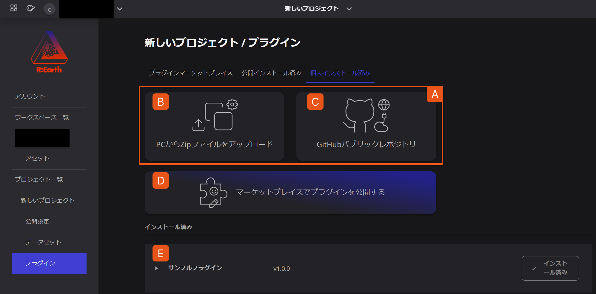

# 概要

プラグインシステムは、Re:Earhの最大の特徴のひとつです。独自のプラグインを開発したり、コミュニティ内の他のユーザーが開発したプラグインを利用することで、Re:Earthの機能を拡張することができます。

例えば、マーカーを選択した際に表示されるインフォボックスに新しい項目を表示したり、画面上にオリジナルの機能のウィジェットを配置するなど、既存のRe:Earth機能では実現することができない処理を実行することが可能になります。

また、将来的にはシーン編集の効率化やデータ処理のための計算をプラグインで行えるようになる予定です。

「プラグインライブラリ」のページでは、プロジェクトへのプラグインの管理を行います。

A. プラグインのインストール手段を示しています。

B. **PCからZipファイルをアップロード** ボタンでは、自身のPCからzipファイルを選択してプラグインをインストールします。

C. **GitHubパブリックレポジトリ** ボタンでは、GitHubから直接プラグインをインストールします。

D. **マーケットプレイスでプラグインを公開する** ボタンでは、作成したプラグインをマーケットプレイスで公開することができます。

E **インストール済み** の配下には、現在のプロジェクトにインストールされているすべてのプラグインが表示されます。