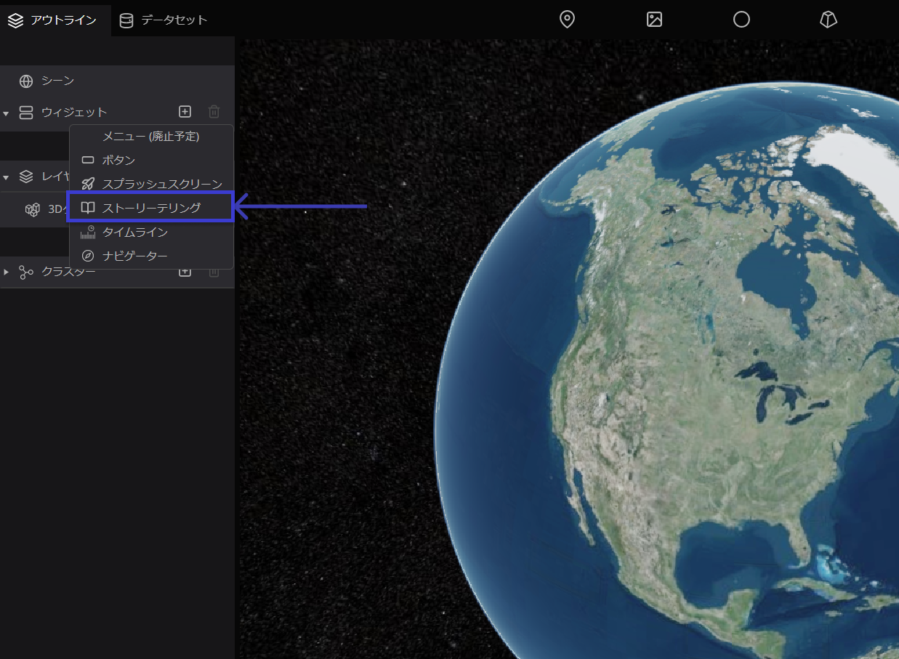

# ストーリーテリング

ストーリーテリング機能では、デジタルアース上のレイヤーに表示順を与えることができます（※レイヤーとは、マーカーやフォトオーバーレイなどの総称です）。 

これにより、物語のようにユーザーにデータを提示することが可能です。

## 設定方法 

左パネルのアウトラインタブから`ウィジェット`をクリックし、`+アイコン`から、`ストーリーテリング`をクリックしてください。

## デフォルト項目の設定

画面右パネルに、ストーリーテリングに関する設定ウインドウが表示されます。

A. カメラ移動時間：レイヤー間の移動にかかる時間（秒）を指定します。

B. 画角：指定した地点からカメラまでの距離を指定します。

C. カメラ：カメラの位置を指定します。カメラ横の`未設定`欄をクリックすると、カメラ位置の設定画面が表示されます。数値を入力するか、デジタルアース上でカメラ位置を調整し`キャプチャ`をクリックして、カメラ位置を指定します。

D. 自動再生：オンにすると、プロジェクト閲覧開始時にストーリーテリング機能の最初の項目からスタートします。

E. 表示：表示形式を指定します。

## ストーリー項目の設定 

ストーリーテリング内の項目に関する設定を行います。

### 地点の追加 

ストーリーリストの`+アイコン`をクリックすると、項目の追加ウインドウが表示されます。

選択可能なレイヤーから、追加したい項目を選択し、`追加`ボタンをクリックしてください。選択した項目がストーリーリストに追加されます。

ストーリーテリングは、ストーリーリストの上から順番に再生されます。 ストーリー内の項目はドラッグで並び替えることができます。また、ストーリー内の項目を削除したい際には、削除したい項目を選択し、`削除`ボタンをクリックしてください。

順番が確定したら、`保存`ボタンを押してください。編集が保存されます。

### 項目ごとのカメラ設定 

ストーリーテリング時のカメラ画角やカメラ位置は、項目ごとに設定することができます。

ストーリーリストに追加した項目を選択してください。

- 移動時間：レイヤー間の移動にかかる時間（秒）を指定します。
- 画角：指定した地点からカメラまでの距離を指定します。
- カメラ：カメラ横の`未設定`欄をクリックすると、カメラ位置の設定画面が表示されます。数値を入力するか、デジタルアース上でカメラ位置を調整し`キャプチャ`をクリックして、カメラ位置を指定します。

### ストーリーテリングの実行 

ストーリーテリング機能を有効にしているプロジェクトでは、画面左下にストーリーテリングメニューが表示されます。

`>ボタン`で次のレイヤーへ、`<ボタン` で前のレイヤーに移動します。 ストーリーテリング機能では、レイヤー移動と同時にインフォボックスも表示されます。

ストーリーテリングメニュー左のアイコンをクリックすると、ストーリーリストが表示されます。ここから直接該当レイヤーを選択し、移動することも可能です。

