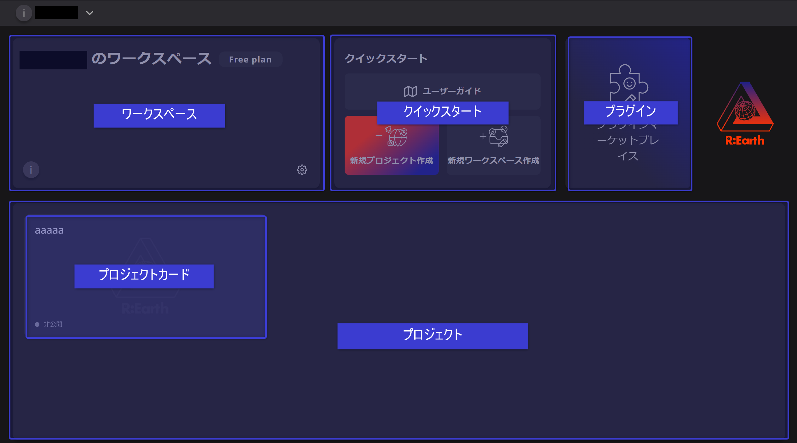
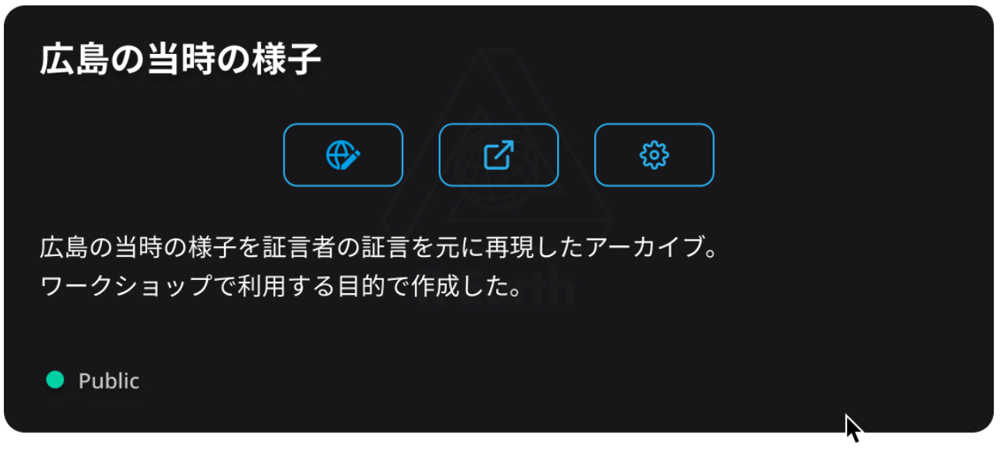

# ダッシュボード

アプリケーションへのログインに成功すると、ホーム画面（ダッシュボード）に移動します。これはアプリケーションのホームページで、便利な機能がいくつか用意されています。

- **ワークスペース**には、メンバーのアバターを含む現在のワークスペースが表示されます。右下の⚙️ボタンを押すと、現在のワークスペースの設定ページに移動できます。（ワークスペースの詳細はこちら）。
- **プロジェクト**には、アーカイブされたプロジェクトを除く、現在のワークスペースにあるすべてのプロジェクトが表示されます。
- **クイックスタート**は、クイック操作ボタンの集まりです。今後もボタンを追加していく予定です。
- **プラグイン**では、プラグインの設定ができます。

- **プロジェクトカード**

プロジェクトカードにカーソルを合わせると、プロジェクトの詳細（プロジェクト名、説明、公開状況）が表示されます。3つのボタンを使用すると、編集ページ、プレビューページ、プロジェクト設定ページに移動できます。

## **今後において**

今後のバージョンアップでは、開発変更履歴、新機能の紹介、コミュニティからのニュースなど、他の機能モジュールを追加していく予定です。