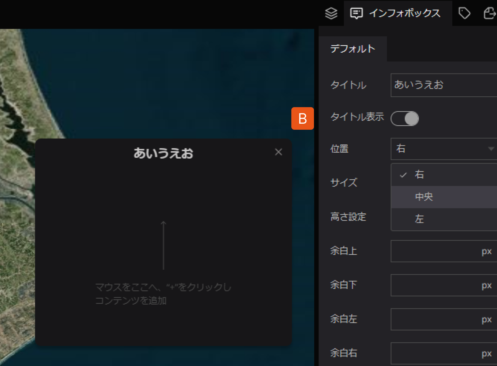

# インフォボックスの設定

インフォボックスは右側パネル（A～N）にて、レイアウトの設定ができます。

A：タイトルを設定できます。

B：タイトル表示は、タイトルの表示/非表示が選択できます。

C：位置は、インフォボックスの表示場所（右/中央/左）と位置を調整できます。

D：サイズは、インフォボックスの表示の大きさ（小/中/大）と調整できます。

E：高さ設定は、インフォボックスの表示サイズを自動/手動の選択で調整できます。

F：余白上は、高さ設定を「手動」に設定した場合に、調節可能です。

（余白設定範囲：0~40px）

G：余白下は、高さ設定を「手動」に設定した場合に、調節可能です。

（余白設定範囲：0~40px）

H：余白左は、高さ設定を「手動」に設定した場合に、調節可能です。

（余白設定範囲：0~40px）

I：余白右は、高さ設定を「手動」に設定した場合に、調節可能です。

（余白設定範囲：0~40px）

J：背景色は、インフォボックスの背景の色を変更することが可能です。

併せて、背景の透明度も調節できます。

K：線幅は、インフォボックス枠線の太さ調整が可能です。

L：線色は、インフォボックス枠線の色を変更することが可能です。

M：背景オーバーレイは、ONにすることで、インフォボックスが表示された際に、背景マップが暗くなり、インフォボックスが強調されて表示されます。

N：フォントは、タイトルやテキストブロック文章の書式、サイズ、色、配置、太さの調整をすることが可能です。

