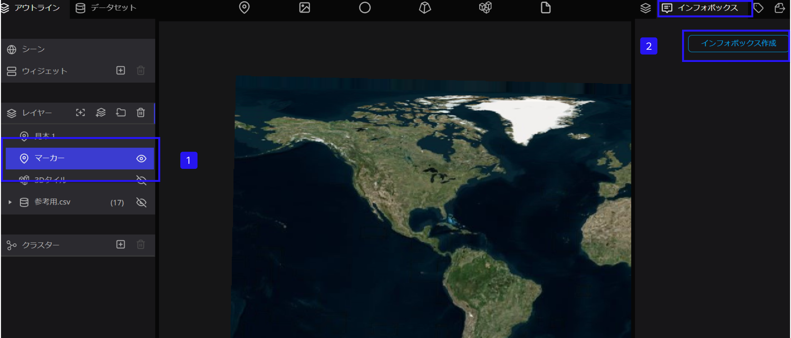
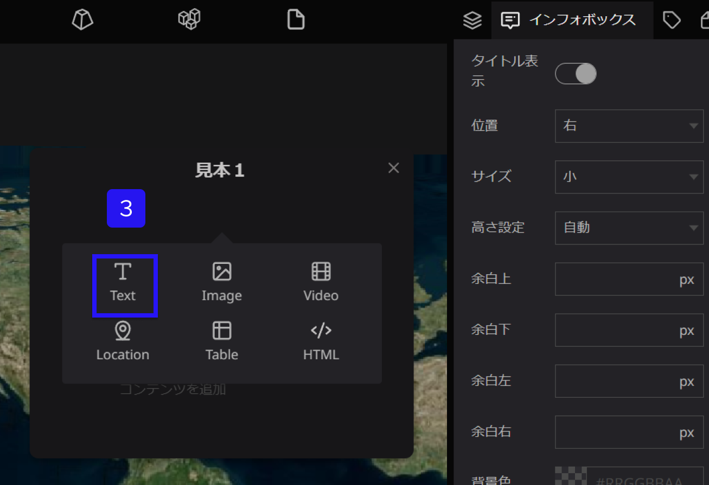
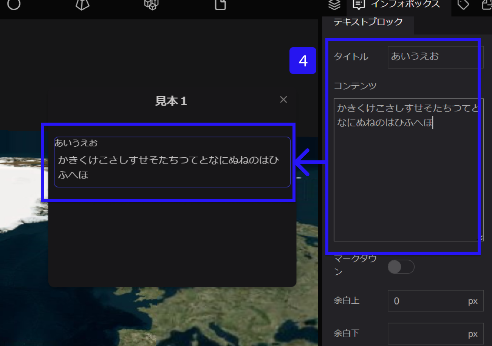
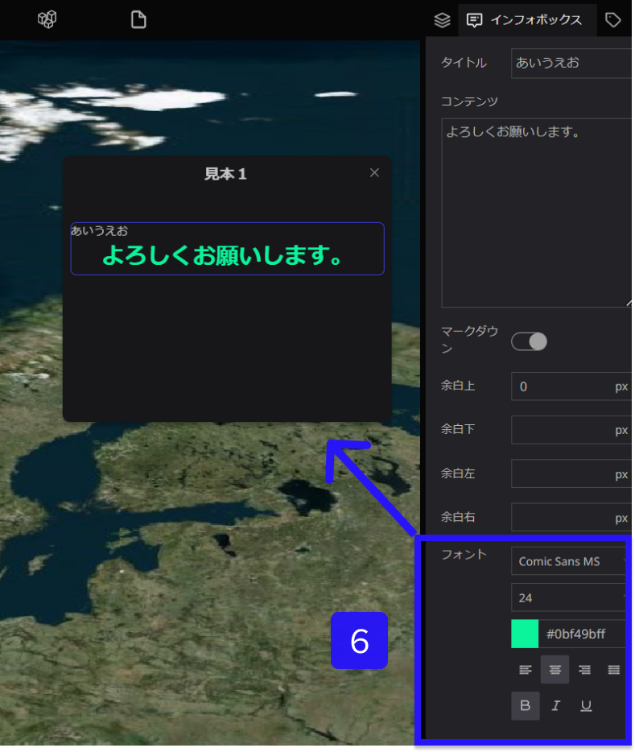

# テキストブロック

テキストブロックはインフォボックスに文章を作成するためのツールです。

①左側パネルからテキストを設定したいレイヤーを選択します。

②右側パネルのインフォボックスタブを選択し、インフォボックス作成をクリックします。

③インフォボックス内にカーソルをおくと、＋が表示されます。併せて、＋をクリックし、Textを選択します。

④必要に応じて、タイトルを追加します。コンテンツには、文章を追加します。

⑤マークダウン記法でテキストを追加したい場合は、マークダウンをONにすることで、可能となります。

> Markdown(マークダウン)とは、「# 見出し」「* リスト」など、シンプルな書き方で文書構造を明示でき、装飾されたHTML文書に変換できる軽量マークアップ言語です。
> 

.png)

⑥フォントは、テキストの書体、サイズ、色、位置、太さなどの調節ができます。

併せて、タイトルのフォントも同様の手順で調節可能です。

