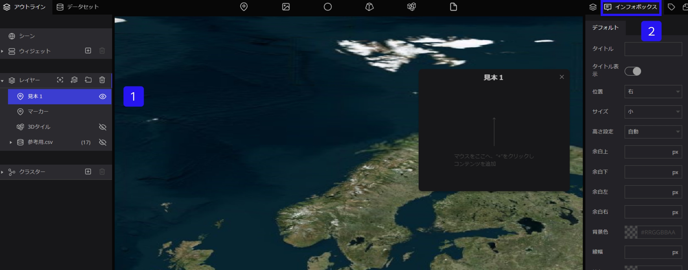
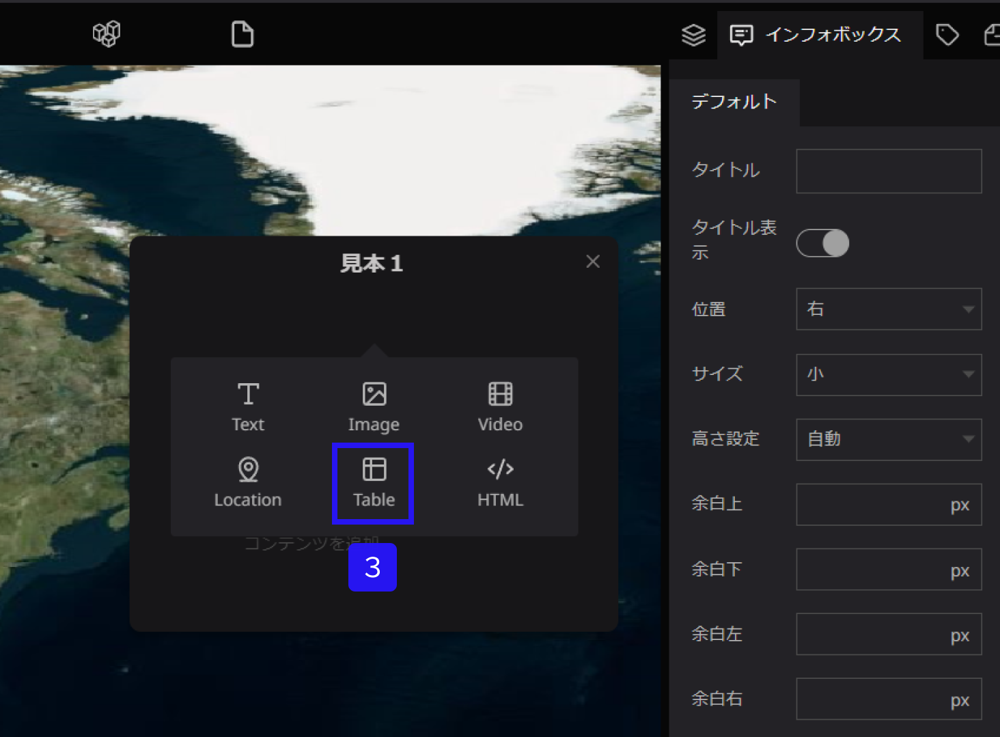
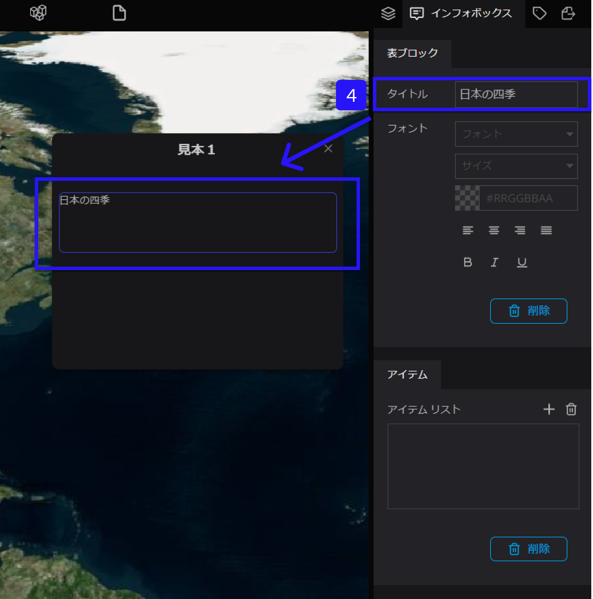
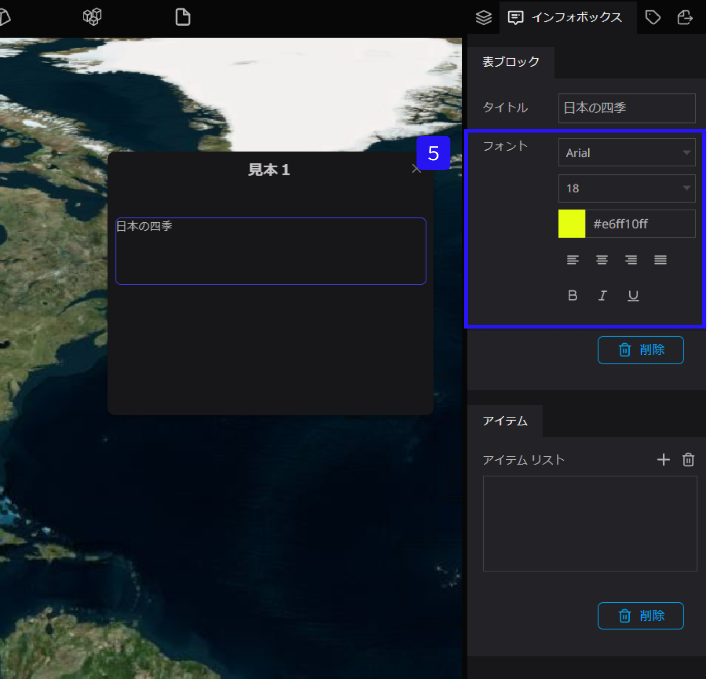
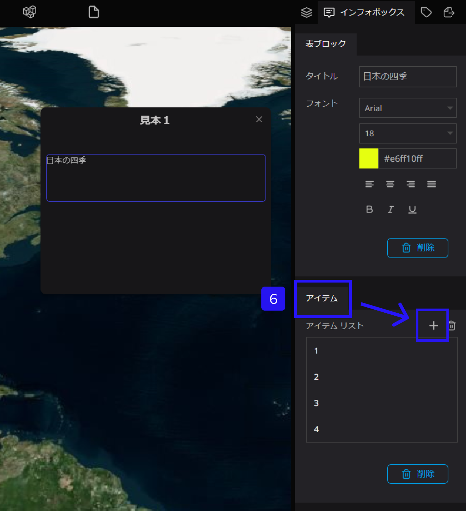
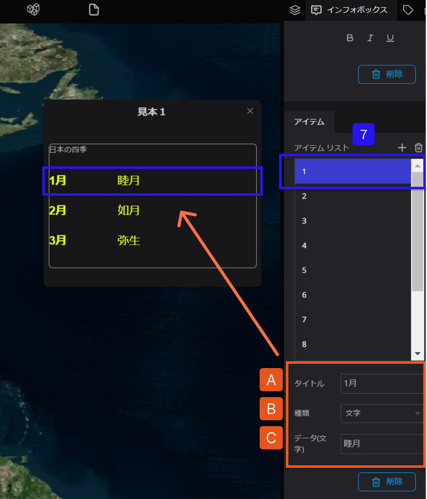
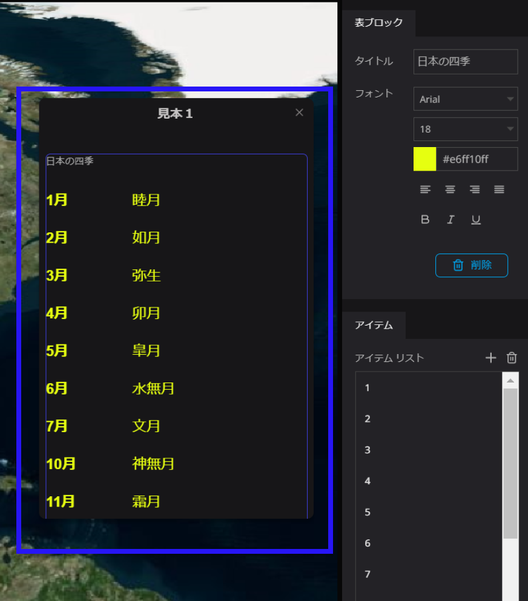

# テーブルブロック

テーブルブロックは、インフォボックス内に表テーブルを追加することができます。

①左側パネルからテキストを設定したいレイヤーを選択します。

②右側パネルのインフォボックスタブを選択します。

③インフォボックス内にカーソルをおくと、＋が表示されます。併せて、＋をクリックし、Tableを選択します。

④タイトルにテキストを入力すると、テーブルブロックにタイトルが表示されます。

⑤フォントにて、リスト内のテキスト書体、サイズ、色、配置、太さを設定することができます。

⑥アイテム内にあるアイテムリスト右側、＋をクリックします。

追加したい、リストの数だけ＋を押下することで、追加することができます。

⑦アイテム内にリスト表を作成するには、まず、該当のリストを選択し、下記設定を行います。

A：タイトルにテキストを入力します。（例：1月）

B：種類は文字/数字のどちらかを選択します　（例：文字）

C：データ（文字）を入力します。　（例：睦月）

すると、このように表示されます。

