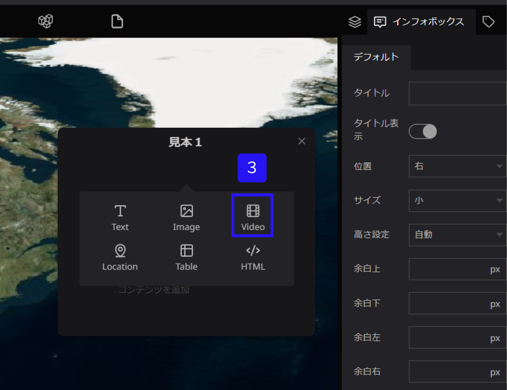
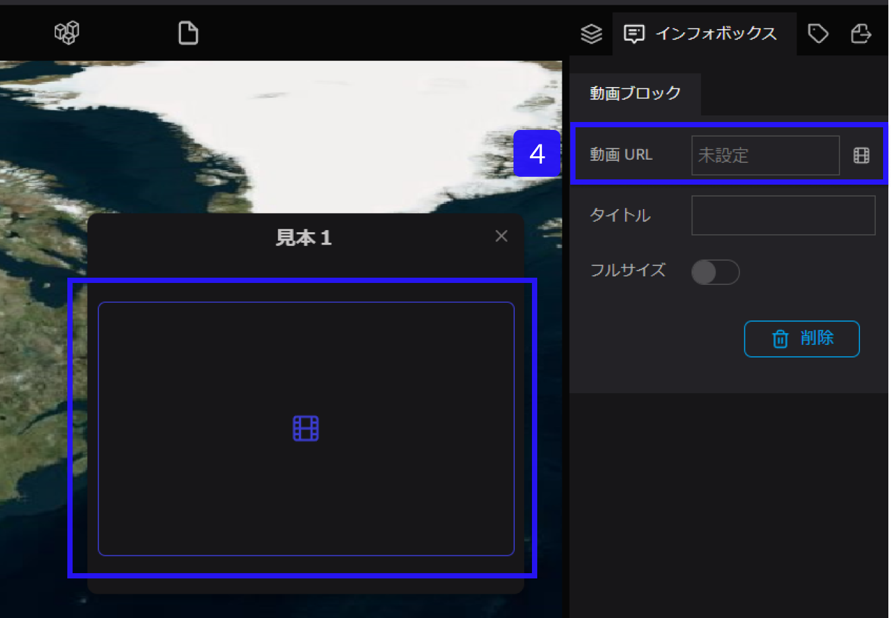
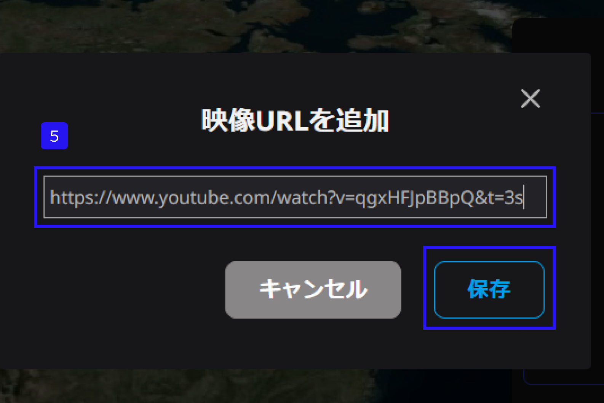
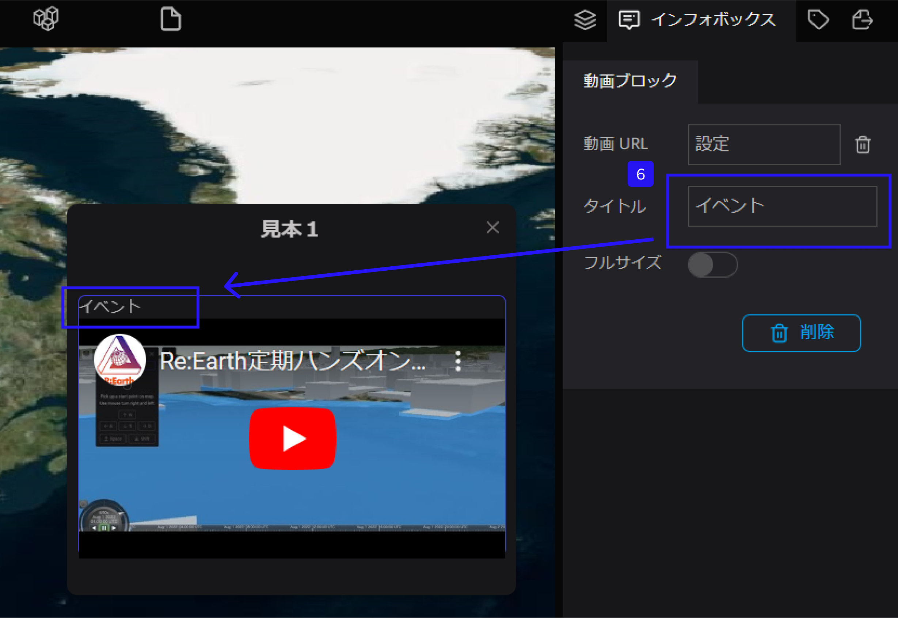
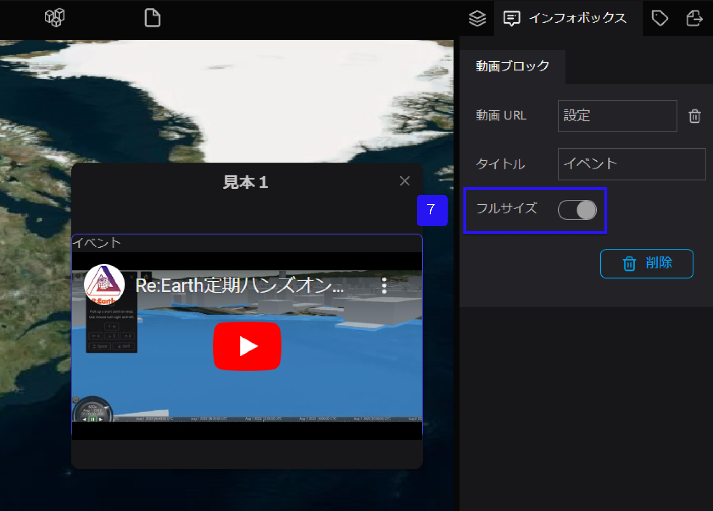

# 動画ブロック

動画ブロックは、インフォボックスに写真や画像を追加するためのツールです。

①左側パネルからテキストを設定したいレイヤーを選択します。

②右側パネルのインフォボックスタブを選択します。

③インフォボックス内にカーソルをおくと、＋が表示されます。併せて、＋をクリックし、Videoを選択します。

④動画URLをクリックします。

⑤映像URLを追加が出てくるので、動画URLを添付し、保存をクリックします。

すると、インフォボックス内に動画が表示されます。

⑥動画にタイトルを追加したい場合は、タイトルにテキストを追加します。

⑦フルサイズをONにすると、インフォボックスいっぱいに動画が表示されます。

