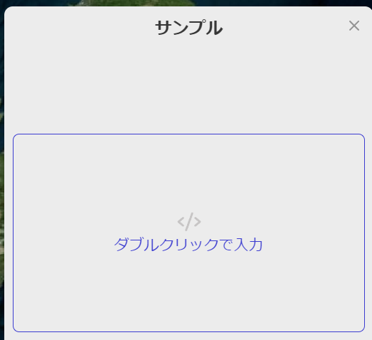

# 概要

インフォボックスはユーザーがマップ上のレイヤーをクリックしたときに、表示ボックスです。

①インフォボックスには、テキスト、画像、動画などを追加できます。

②レイヤーをクリックするとインフォボックスがこの様に表示されます。

# ブロックについて

インフォボックスに設定できるブロックは6種類です。

- **テキストブロック**

説明文や、詳細内容を記載する文字を追加できます。

- **イメージブロック**

画像を追加することができます。

- **Videoブロック**

動画を追加することができます。

- **Locationブロック**
    
    
    

地図を追加することがきます。

- **Tableブロック**

表形式の一覧表を追加することができます。

- **HTMLブロック**

HTML形式のコーディングを追加することができます。

※**各種インフォボックス設定方法の詳細は次の項目でご説明します。**