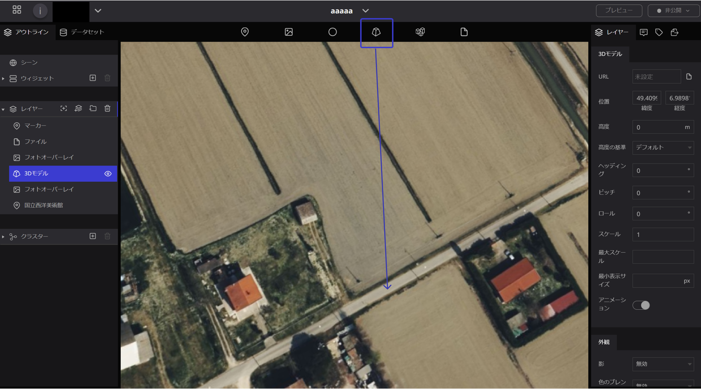
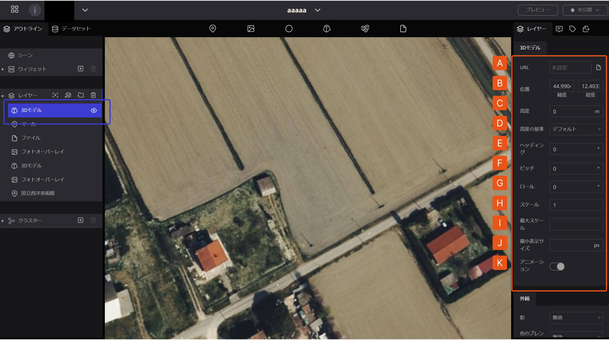
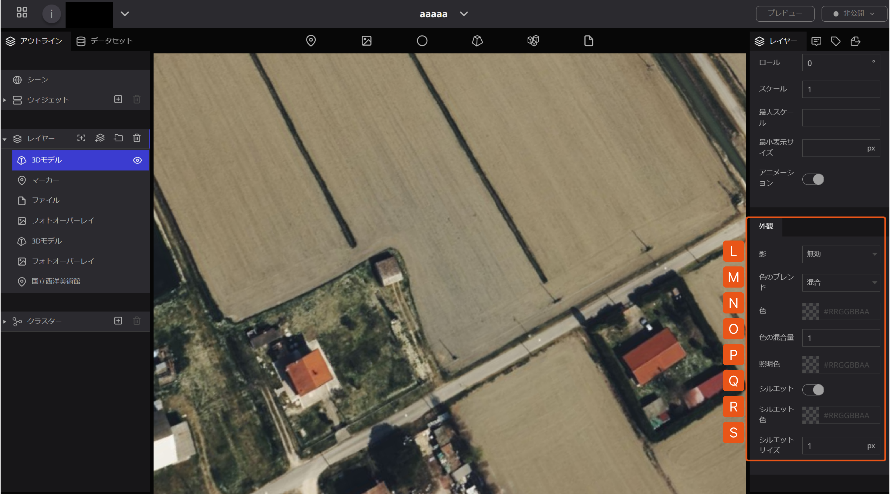
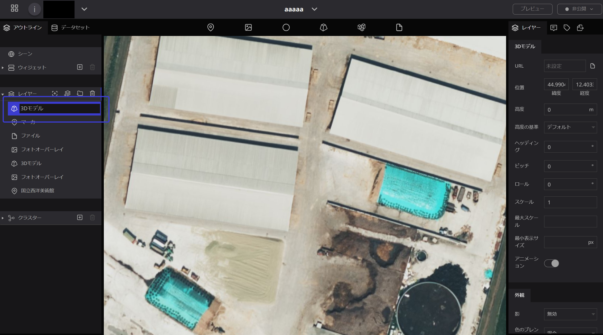
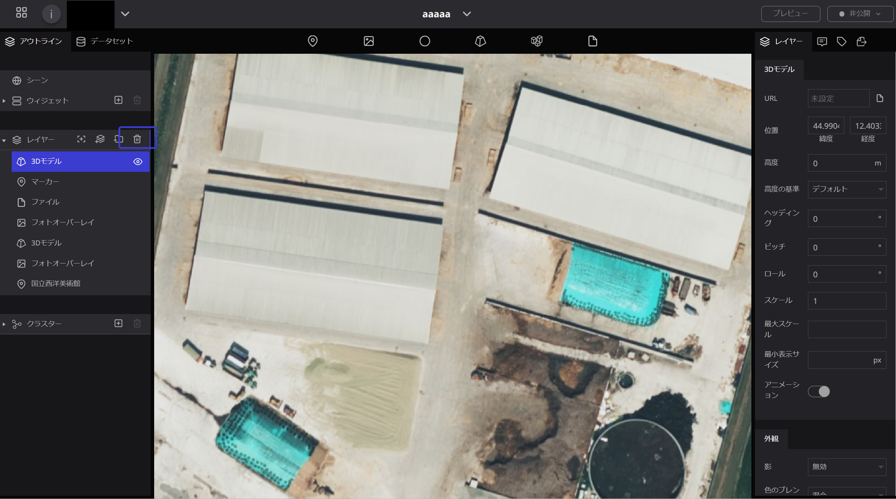

# 3Dモデル

お手持ちの3Dモデルデータをデジタルアース上に配置するためのツールです。

### 対応データフォーマット

- glTF

　・glTF 1.0 または 2.0 をサポートしています。Draco圧縮もサポートしています。

　・glTFには様々な形式がありますが、画像など含めて全てのデータが1つのファイルに埋め　　　　　込まれている glTF Embedded （ `.gltf` ）または glTF Binary （ `.glb` ）形式を主にサポートしています。

　・複数ファイルに分かれている glTF Separated （ `.gltf` + `.bin` + 画像ファイル等）形式は、Re:Earth内でのアップロード表示には対応していません。ただし、適切にCORSが設定されたサーバー上で配信されているファイルURLを直接指定した場合は、表示できることがあります。

　・これ以外のフォーマット（例： `.obj` `.fbx`）はサポートしていません。あらかじめご自身でglTF形式への変換をお願いいたします。

1. ３Dモデルのマークをドラック＆ドロップで任意の位置に落とします。

　　この時点では目印やアイコンなどは何も表示されません。

  2.  左側のレイヤー一覧に新たに「３Ｄモデル」の項目が追加され青色の帯が付くと、右側に３D　　　モデルレイヤーの設定画面が開きます。

A.   **URL**:アップロード済み3DモデルデータのURLを入力することで、表示させることが可能です。

- URL入力欄をクリックすると、アセットモーダルが表示されます。こちらから3Dモデルのアップロードや選択などが可能です。詳しくはアセットモーダルをご覧ください。

B.   **位置** : 3Dモデルを表示する緯度・経度を設定します。

C.   **高度** : 3Dモデルを表示する高さを設定します。

D.   **高度の基準** : 「デフォルト」・「地表に固定」・「地表からの高度」から選択が可能です。「デフォルト」を選択した場合には、WGS84楕円体（デジタルアース）からの絶対的な高度となります。「地表に固定」及び「地表からの高度」は、シーンで「地形」の設定を有効にした場合のみ「デフォルト」と異なる高さになります。

E.    **ヘッディング** : 3Dモデルの水平方向の角度を指定します。有効範囲は0~360です。

F.    **ピッチ** : 3Dモデルの垂直方向の角度を指定します。有効範囲は0~360です。

G.   **ロール** : 3Dモデルの傾き角度を指定します。有効範囲は0~360です。

H.   **スケール** : 3Dモデルデータの表示サイズを等倍で指定します。

 I.    **最大スケール** : 画面上に表示される最大のスケールです。単位は「大きさ」の設定と同じです。これ以上大きくは表示されません。

 J.    **最小表示サイズ** : 画面上に表示される最小の大きさです。単位はピクセルです。これ以上小さくは表示されません。

 K.   **アニメーション** : 3Dモデルデータに含まれるアニメーションのON・OFFを切り替えます。アニメーションを有効にしたい場合、シーンの設定でもアニメーションを有効にする必要があるのでご注意ください。

 L.  **3Dモデルの影** : 3Dモデルに関する影のON・OFFを切り替えます。影を有効にしたい場合、シーンの設定でも影を有効にする必要があるのでご注意ください。

M.  **色のブレンド** : 指定した色で3Dモデルを染めることができます。「無効」・「ハイライト」・「置き換え」・「混合」から選択が可能です。「無効」を選択した場合には色のブレンドを行いません。「ハイライト」では、3Dモデルの固有色に設定した色を乗算します。「置き換え」では、3Dモデルの固有色そのものを設定した色で置き換えます。「混合」では3Dモデルの固有色と設定した色で混ぜ合わせます。

N.   **色** : 3Dモデルの色を設定します。HTMLカラーコードが有効です。

O.   **色の混合量** : 色の混合量を指定します。有効範囲は0~1です。色のブレンドで「混合」を選んだ場合のみ有効です。

P.    **照明色** : 3Dモデルの照明の色を指定します。HTMLカラーコードが有効です。

Q.   **シルエット** : 3Dモデルの輪郭線を表示します。

R.   **シルエット色** : 3Dモデルの輪郭線の色を指定します。HTMLカラーコードが有効です。

S.   **シルエットサイズ** : 3Dモデルの輪郭線の幅を設定します。単位はピクセルです。

### ３Dモデルの名前変更

レイヤー内の「３Dモデル」の文字の上をダブルクリックすると、名前の変更が可能です。

### ３Dモデルの削除

左パネルのレイヤー内の削除したい３Dモデルをクリックし、青く選択されている状態にして、”ごみ箱”マークを押すと削除されます。

