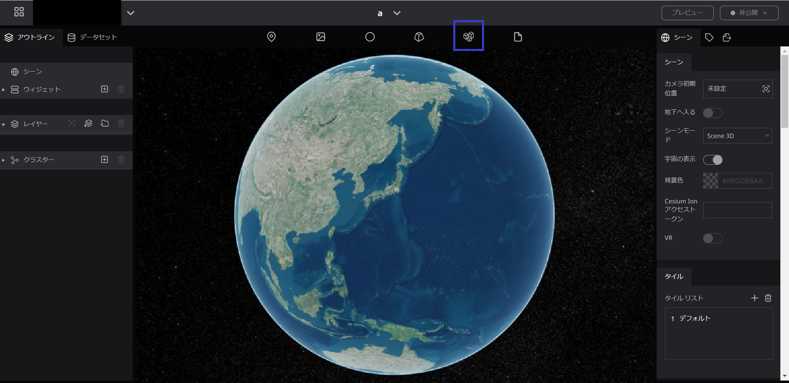
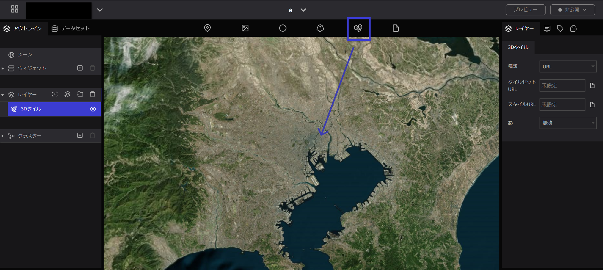
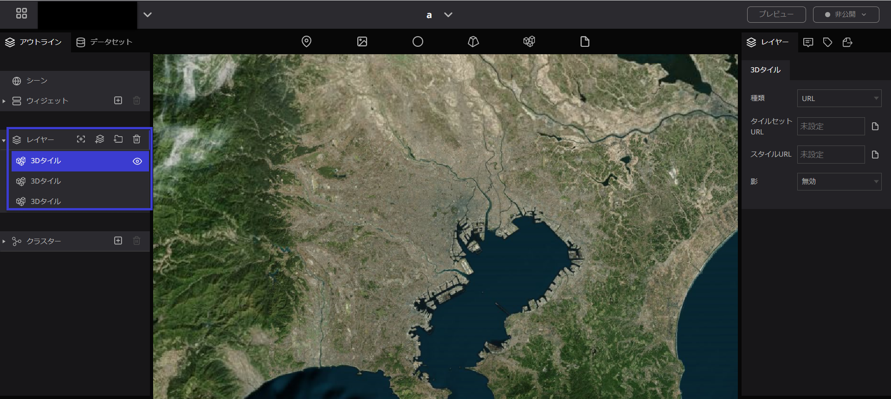
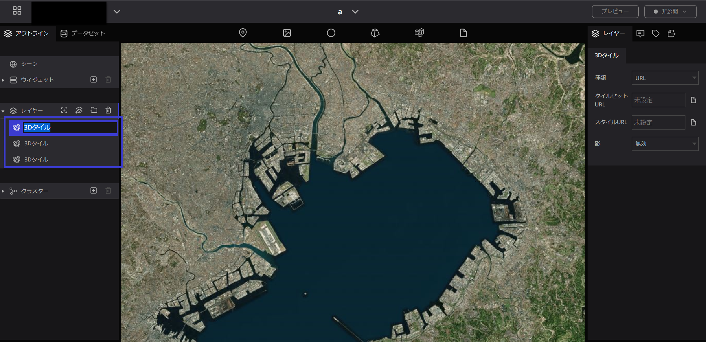
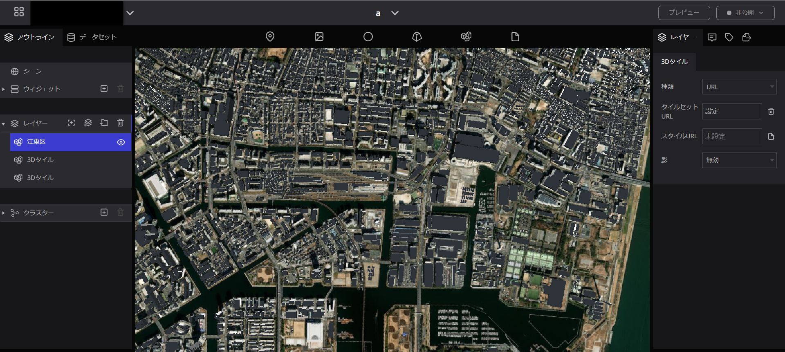
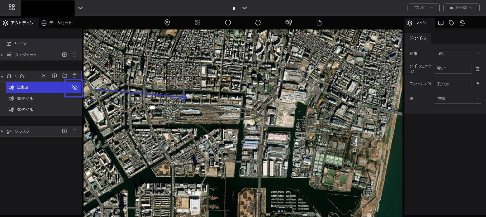
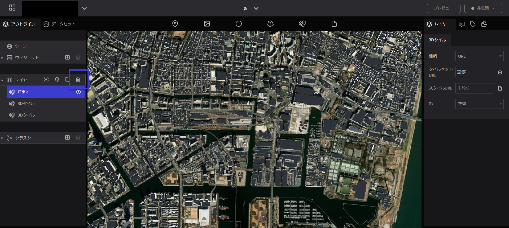
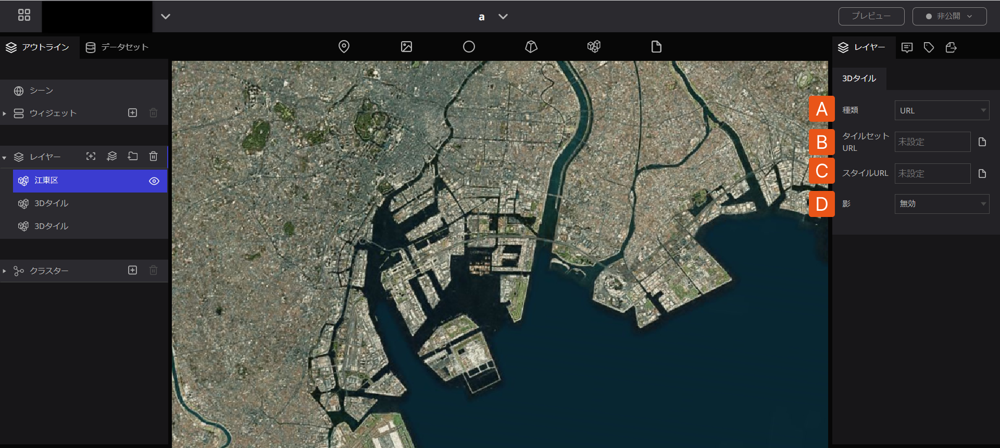
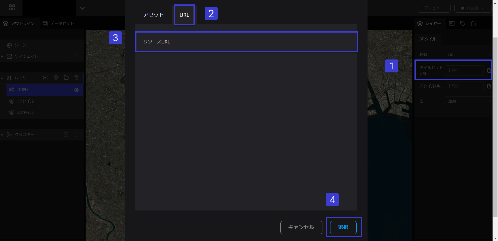
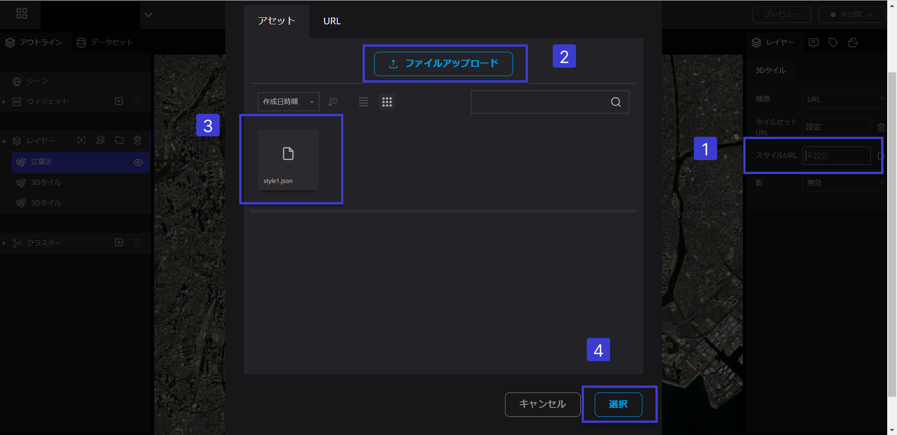

# 3Dタイル

## **3Dタイルとは**

立体の建築物など、様々なオブジェクトを広い範囲にわたって地球儀上に表示できる機能です。

## **3Dタイルの使い方**

### 3Dタイルの追加

- 地球儀上で、任意の場所に3Dタイルのアイコンをドラッグ＆ドロップします。（マーカーのようにアイコンの表示はされません。）

- 3Dタイルを地球儀上に落とすと、左パネルのレイヤーの中に青色で記された”3Dタイル”の文字が表示されます。これは地球儀上に落とした3Dタイルのことです。また、3Dタイルのアイコンを落としていくとレイヤーの中に3Dタイルが増えていきます。

### 3Dタイルの名前変更

レイヤーの中で名前を変更したい3Dタイルの文字の上をダブルクリックすると、変更できるようになるので名前を入力します。

### 3Dタイルを非表示にする

左パネルの3Dタイルの右横の目のマークをクリックすると、地球儀上の3D部分が消えます。

### 3Dタイルの削除

表示されている3Dタイルを削除したい場合は、左パネルのレイヤーの中で、削除したい3Dタイルをクリックし、青く選択されている状態にしてから、レイヤーの右横にある”ごみ箱”のマークを押すと削除されます。

## 3Dタイルのプロパティ

３Dタイルのプロパティでは、以下の項目を設定することができます。

A. 種類：URLかOSMBuildingsから選択します。

※OSM Buildingsは、OpenStreetMap（OSM）のデータを使用して、建物の3Dモデルを生成するオープンソースのプロジェクトです。OSM Buildingsは、ウェブマップやモバイルアプリケーションに組み込まれることができ、ユーザーが建物の高さ、色、形状、テクスチャなどを自由に変更できます。これにより、都市計画や建築デザインなどの目的に役立つ情報を実装することができます。

B. タイルセットURL：3Dタイルが配信させているURLを指定します。必ず、tileset.jsonで終了する　　URLになっていることを確認してください。 

1.  URL入力欄をクリックするとセットモーダルが表示されます。
2. セットモーダル内のURLのタブを選択します。
3. URLを入力することが可能です。
4. 右下の選択ボタンをクリックします。

C. スタイルURL：3Dタイルのスタイル、色や属性ごとに分ける等、変更したいときに、3D tiles styles形式のJSONファイルのURLを指定します。

1. URL入力欄をクリックするとセットモーダルが表示されます。
2. ファイルをアップロードで3D tiles style形式のjsonファイルをアップロードします。
3. アセット内にアップロードされたjsondファイルを選択します。
4. 右下の選択ボタンをクリックします。

D. 影：3Dオブジェクトなどに対して影の表現の有無を設定します。影を有効にしたい場合、シーンの設定でも影を有効にする必要があるのでご注意ください。

# Re:Earthで利用可能な3Dタイルデータ

Re:Earthでの利用をし、PLATEAUで一般公開されていると想定している3Dタイルをサーバーへ用意しました。

PLATEAUについて詳しくは、[公式サイト](https://www.mlit.go.jp/plateau/)をご覧ください。

2021年度末の時点でProject PLATEAUが[G空間情報センター](https://www.geospatial.jp/ckan/dataset/plateau)において公開している56都市の3DTilesデータを利用可能です。 配信URL一覧の取得方法は[こちら](https://github.com/Project-PLATEAU/plateau-streaming-tutorial/blob/main/README.md)を参照してください。

| データセット名 | 細分 | URL |
| --- | --- | --- |
| 建物モデル（千代田区） | テクスチャなし | https://plateau.geospatial.jp/main/data/3d-tiles/bldg/13100_tokyo/13101_chiyoda-ku/notexture/tileset.json |
|  | テクスチャ付き | https://plateau.geospatial.jp/main/data/3d-tiles/bldg/13100_tokyo/13101_chiyoda-ku/texture/tileset.json |
|  | テクスチャ付き（低解像度） | https://plateau.geospatial.jp/main/data/3d-tiles/bldg/13100_tokyo/13101_chiyoda-ku/low_resolution/tileset.json |
| 建物モデル（中央区） | テクスチャなし | https://plateau.geospatial.jp/main/data/3d-tiles/bldg/13100_tokyo/13102_chuo-ku/notexture/tileset.json |
|  | テクスチャ付き | https://plateau.geospatial.jp/main/data/3d-tiles/bldg/13100_tokyo/13102_chuo-ku/texture/tileset.json |
|  | テクスチャ付き（低解像度） | https://plateau.geospatial.jp/main/data/3d-tiles/bldg/13100_tokyo/13102_chuo-ku/low_resolution/tileset.json |
| 建物モデル（港区） | テクスチャなし | https://plateau.geospatial.jp/main/data/3d-tiles/bldg/13100_tokyo/13103_minato-ku/notexture/tileset.json |
|  | テクスチャ付き | https://plateau.geospatial.jp/main/data/3d-tiles/bldg/13100_tokyo/13103_minato-ku/texture/tileset.json |
|  | テクスチャ付き（低解像度） | https://plateau.geospatial.jp/main/data/3d-tiles/bldg/13100_tokyo/13103_minato-ku/low_resolution/tileset.json |
| 建物モデル（新宿区） | テクスチャなし | https://plateau.geospatial.jp/main/data/3d-tiles/bldg/13100_tokyo/13104_shinjuku-ku/notexture/tileset.json |
|  | テクスチャ付き | https://plateau.geospatial.jp/main/data/3d-tiles/bldg/13100_tokyo/13104_shinjuku-ku/texture/tileset.json |
|  | テクスチャ付き（低解像度） | https://plateau.geospatial.jp/main/data/3d-tiles/bldg/13100_tokyo/13104_shinjuku-ku/low_resolution/tileset.json |
| 建物モデル（文京区） | テクスチャなし | https://plateau.geospatial.jp/main/data/3d-tiles/bldg/13100_tokyo/13105_bunkyo-ku/notexture/tileset.json |
| 建物モデル（台東区） | テクスチャなし | https://plateau.geospatial.jp/main/data/3d-tiles/bldg/13100_tokyo/13106_taito-ku/notexture/tileset.json |
| 建物モデル（墨田区） | テクスチャなし | https://plateau.geospatial.jp/main/data/3d-tiles/bldg/13100_tokyo/13107_sumida-ku/notexture/tileset.json |
| 建物モデル（江東区） | テクスチャなし | https://plateau.geospatial.jp/main/data/3d-tiles/bldg/13100_tokyo/13108_koto-ku/notexture/tileset.json |
|  | テクスチャ付き | https://plateau.geospatial.jp/main/data/3d-tiles/bldg/13100_tokyo/13108_koto-ku/texture/tileset.json |
|  | テクスチャ付き（低解像度） | https://plateau.geospatial.jp/main/data/3d-tiles/bldg/13100_tokyo/13108_koto-ku/low_resolution/tileset.json |
| 建物モデル（品川区） | テクスチャなし | https://plateau.geospatial.jp/main/data/3d-tiles/bldg/13100_tokyo/13109_shinagawa-ku/notexture/tileset.json |
|  | テクスチャ付き | https://plateau.geospatial.jp/main/data/3d-tiles/bldg/13100_tokyo/13109_shinagawa-ku/texture/tileset.json |
|  | テクスチャ付き（低解像度） | https://plateau.geospatial.jp/main/data/3d-tiles/bldg/13100_tokyo/13109_shinagawa-ku/low_resolution/tileset.json |
| 建物モデル（目黒区） | テクスチャなし | https://plateau.geospatial.jp/main/data/3d-tiles/bldg/13100_tokyo/13110_meguro-ku/notexture/tileset.json |
| 建物モデル（大田区） | テクスチャなし | https://plateau.geospatial.jp/main/data/3d-tiles/bldg/13100_tokyo/13111_ota-ku/notexture/tileset.json |
|  | テクスチャ付き | https://plateau.geospatial.jp/main/data/3d-tiles/bldg/13100_tokyo/13111_ota-ku/texture/tileset.json |
|  | テクスチャ付き（低解像度） | https://plateau.geospatial.jp/main/data/3d-tiles/bldg/13100_tokyo/13111_ota-ku/low_resolution/tileset.json |
| 建物モデル（世田谷区） | テクスチャなし | https://plateau.geospatial.jp/main/data/3d-tiles/bldg/13100_tokyo/13112_setagaya-ku/notexture/tileset.json |
| 建物モデル（渋谷区） | テクスチャなし | https://plateau.geospatial.jp/main/data/3d-tiles/bldg/13100_tokyo/13113_shibuya-ku/notexture/tileset.json |
|  | テクスチャ付き | https://plateau.geospatial.jp/main/data/3d-tiles/bldg/13100_tokyo/13113_shibuya-ku/texture/tileset.json |
|  | テクスチャ付き（低解像度） | https://plateau.geospatial.jp/main/data/3d-tiles/bldg/13100_tokyo/13113_shibuya-ku/low_resolution/tileset.json |
| 建物モデル（中野区） | テクスチャなし | https://plateau.geospatial.jp/main/data/3d-tiles/bldg/13100_tokyo/13114_nakano-ku/notexture/tileset.json |
| 建物モデル（杉並区） | テクスチャなし | https://plateau.geospatial.jp/main/data/3d-tiles/bldg/13100_tokyo/13115_suginami-ku/notexture/tileset.json |
| 建物モデル（豊島区） | テクスチャなし | https://plateau.geospatial.jp/main/data/3d-tiles/bldg/13100_tokyo/13116_toshima-ku/notexture/tileset.json |
|  | テクスチャ付き | https://plateau.geospatial.jp/main/data/3d-tiles/bldg/13100_tokyo/13116_toshima-ku/texture/tileset.json |
|  | テクスチャ付き（低解像度） | https://plateau.geospatial.jp/main/data/3d-tiles/bldg/13100_tokyo/13116_toshima-ku/low_resolution/tileset.json |
| 建物モデル（北区） | テクスチャなし | https://plateau.geospatial.jp/main/data/3d-tiles/bldg/13100_tokyo/13117_kita-ku/notexture/tileset.json |
| 建物モデル（荒川区） | テクスチャなし | https://plateau.geospatial.jp/main/data/3d-tiles/bldg/13100_tokyo/13118_arakawa-ku/notexture/tileset.json |
| 建物モデル（板橋区） | テクスチャなし | https://plateau.geospatial.jp/main/data/3d-tiles/bldg/13100_tokyo/13119_itabashi-ku/notexture/tileset.json |
| 建物モデル（練馬区） | テクスチャなし | https://plateau.geospatial.jp/main/data/3d-tiles/bldg/13100_tokyo/13120_nerima-ku/notexture/tileset.json |
| 建物モデル（足立区） | テクスチャなし | https://plateau.geospatial.jp/main/data/3d-tiles/bldg/13100_tokyo/13121_adachi-ku/notexture/tileset.json |
| 建物モデル（葛飾区） | テクスチャなし | https://plateau.geospatial.jp/main/data/3d-tiles/bldg/13100_tokyo/13122_katsushika-ku/notexture/tileset.json |
| 建物モデル（江戸川区） | テクスチャなし | https://plateau.geospatial.jp/main/data/3d-tiles/bldg/13100_tokyo/13123_edogawa-ku/notexture/tileset.json |
| 建物モデル（八王子市南大沢） | テクスチャなし | https://plateau.geospatial.jp/main/data/3d-tiles/bldg/13201_hachioji/notexture/tileset.json |
|  | テクスチャ付き | https://plateau.geospatial.jp/main/data/3d-tiles/bldg/13201_hachioji/texture/tileset.json |
|  | テクスチャ付き（低解像度） | https://plateau.geospatial.jp/main/data/3d-tiles/bldg/13201_hachioji/low_resolution/tileset.json |
| 建物モデル（東村山市） | テクスチャなし | https://plateau.geospatial.jp/main/data/3d-tiles/bldg/13213_higashimurayama/notexture/tileset.json |
|  | テクスチャ付き | https://plateau.geospatial.jp/main/data/3d-tiles/bldg/13213_higashimurayama/texture/tileset.json |
|  | テクスチャ付き（低解像度） | https://plateau.geospatial.jp/main/data/3d-tiles/bldg/13213_higashimurayama/low_resolution/tileset.json |