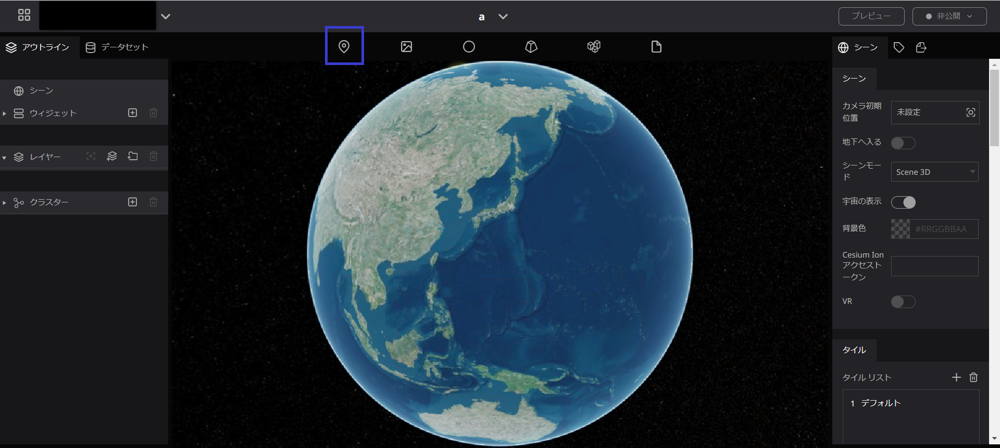
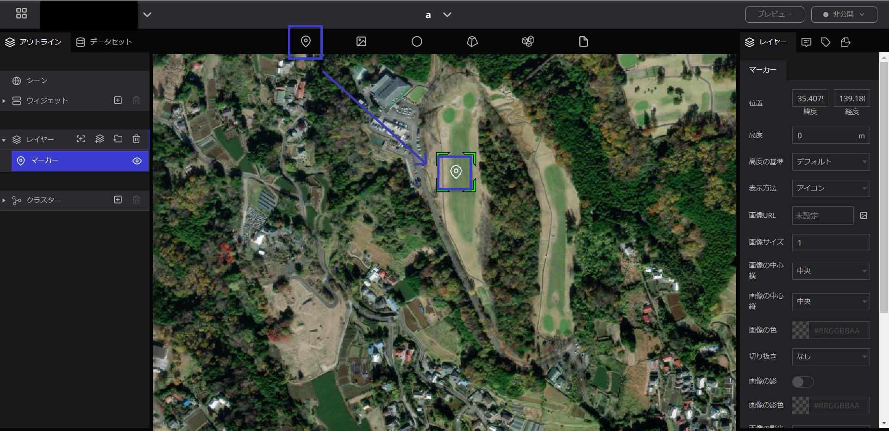
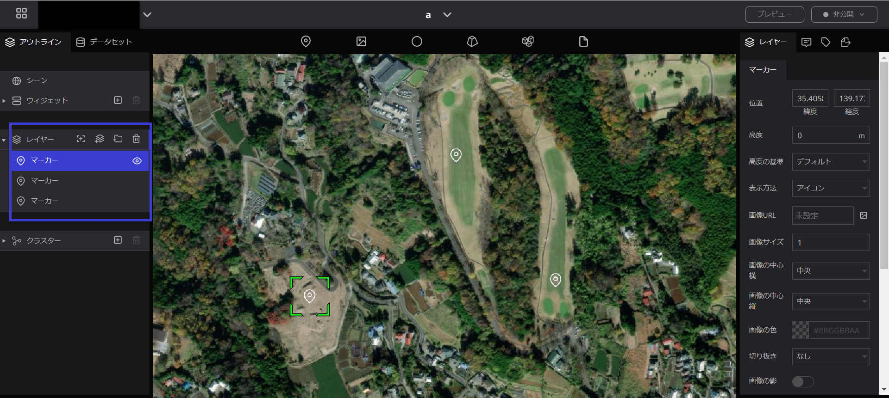
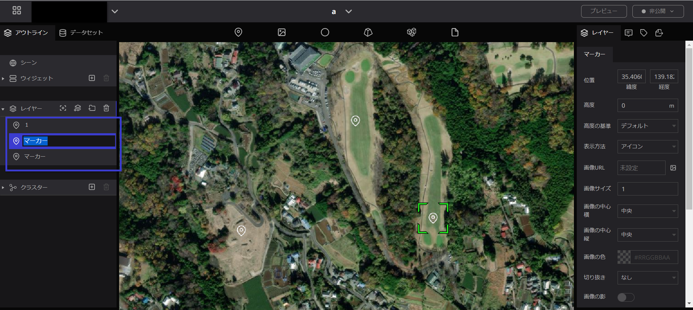
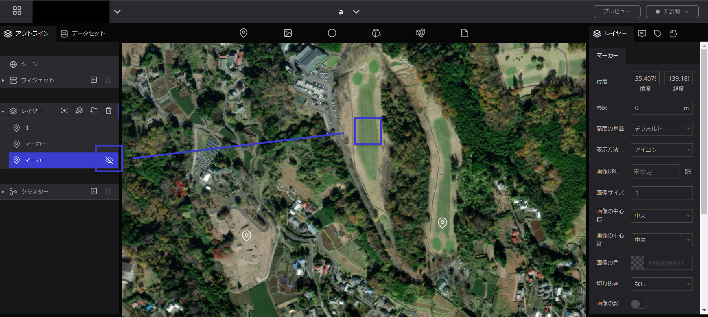
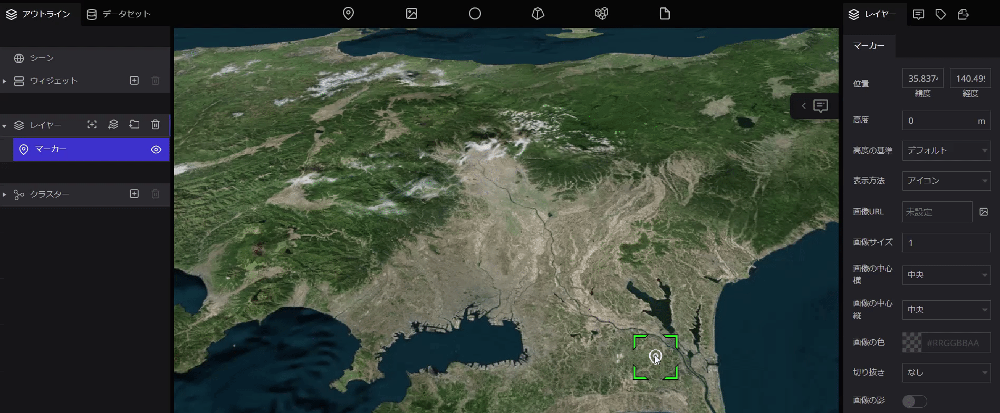
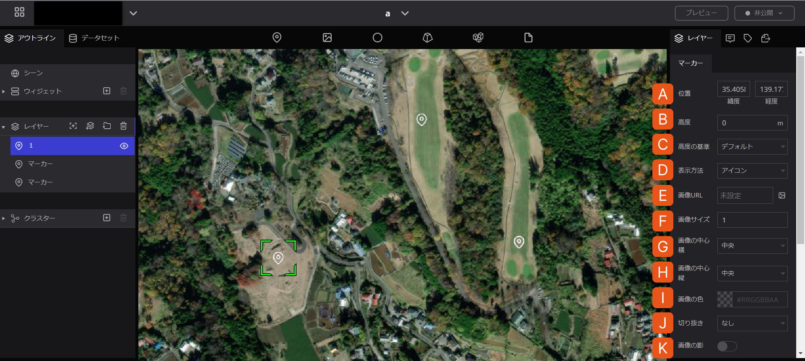
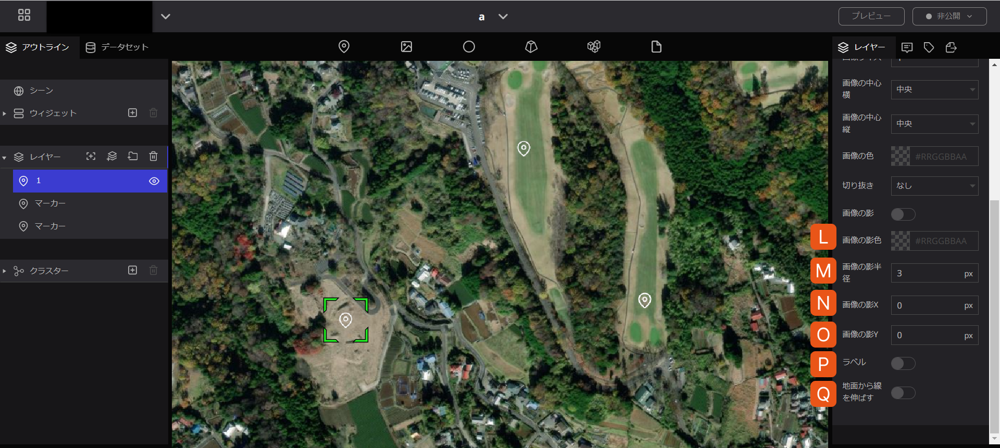
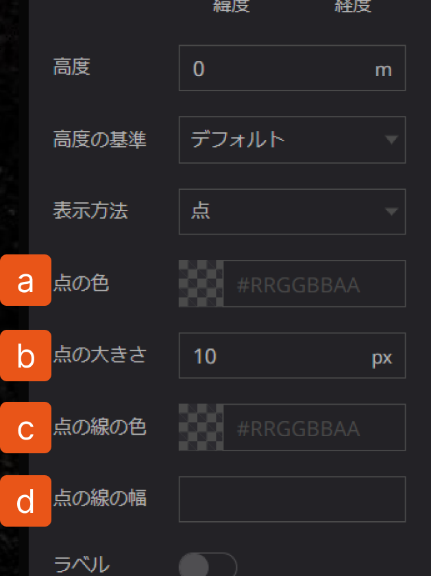
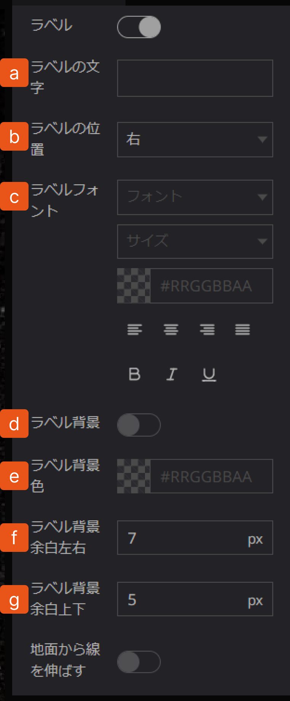

# マーカー

## **マーカーとは**

地球儀上の位置をピンポイントで指定したいときに使う機能です。

## **マーカーの使い方**

### マーカーの追加

- マーカーのアイコンを置きたい位置までドラッグし、ドロップすると地球上にマーカーが落とされます。

- マーカーを地球上に落とすと、画面左の”レイヤー”の中に青色で記されたマーカーの文字が表示されます。これは地球上に落としたマーカーのアイコンのことです。また、マーカーの地点を落としていくとレイヤーの中にマーカーが増えていきます。

### 名前変更

レイヤー内のマーカーの文字の上をダブルクリックすると、名前の変更が可能です。

### マーカーのアイコンを非表示にする

左パネルのマーカーの右横の目のマークをクリックすると、地球上のアイコンが消えます。

### ポジション変更

レイヤーをクリックした後、地球儀上のアイコンにマウスを合わせて、手の形になるまで左クリックを１秒以上長押します。その状態でドラック＆ドロップすると位置を移動させることができます。

### マーカーの削除

左パネルのレイヤー内の削除したいマーカーをクリックし、青く選択されている状態にして、”ごみ箱”マークを押すと削除されます。

## マーカーのプロパティ

マーカーのプロパティでは、以下の項目を設定することができます。

 

A. **位置**：マーカーの位置を設定します。

B. **高度**：マーカーの対地高度を設定します。

C. **高度の基準**: 「デフォルト」・「地表に固定」・「地表からの高さ」から選択が可能です。「デ  フォルト」を選択した場合には、WGS84 楕円体（デジタルアース）からの絶対的な高さとなります。「地表に固定」及び「地表からの高さ」は、シーンで「地形」の設定を有効にした場合のみ「デフォルト」と異なる高さになります。

D. **表示方法**：点かアイコンから選択します。点の場合は色とサイズをアイコンの場合は画像とサイズ・配置を設定することができます。

1. **点の色**：点の色を変更できます。
2. **点の大きさ**：点の大きさを変更できます。
3. **点の線の色**：点の周りの色を変更できます。
4. **点の線の幅**：点の周りの線の幅を変更できます。

E. **画像URL**: 画像をアップロードするとアイコンが選択した画像に変わります。

F. **画像サイズ**: 画像のサイズを設定できます。

G. **画像の中心横**：画像の中心が選択した範囲の「中央」「左」「右」から設定できます。

H. **画像の中心縦**：画像の中心が選択した範囲の「中央」「上」「下」「ベースライン」から設定できます。

I. **画像の色**：画像の色、またアイコンの色を変更できます。

J. **切り抜き**: 画像をそのまま表示するか、丸く切り抜くかが選択できます。

K. **画像の影**: 画像アイコンに影を付与できます。ONにするとシャドウの設定項目が表示されます。

L. **画像の影色**: 影の色を設定できます。

M. **画像の影半径**: 影の大きさを設定できます。

N. **画像の影X**: 影の、縦方向の位置を設定できます。

O. **画像の影Y**: 影の、横方向の位置を設定できます。

P. **ラベル**：マーカーにラベルをつけることができます。ラベルを付けた場合、ラベルに対する細かな設定ができます。

1. **ラベルの文字**：アイコンや点、画像に対する名前を入力します。
2. **ラベルの位置**：アイコン等に対して、ラベルの位置を設定できます。
3. **ラベルフォント**：ラベルの文字のフォント、サイズ、色などの設定ができます。
4. **ラベルの背景**：ラベルの文字に背景を付けることができます。
5. **ラベルの背景色**：ラベルの背景の色を変更できます。
6. **ラベル背景余白左右**：ラベルの背景の左右の余白を調整できます。
7. **ラベル背景余白上下**：ラベルの背景の上下の余白を調整できます。

Q. **地面から線を引き伸ばす**：マーカーに高度を設定した際に、マーカーと地表との間に線を引き出すかどうかを設定します。