# フォトオーバーレイ

マーカーでは設定する画像がサイズを調整できるのに対し、フォトオーバーレイ機能は全画面に画像を設置したい場合に使用します。

## フォトオーバーレイの**使い方**

### フォトオーバーレイの追加

- フォトオーバーレイのマークをドラック＆ドロップで任意の場所に落とします。

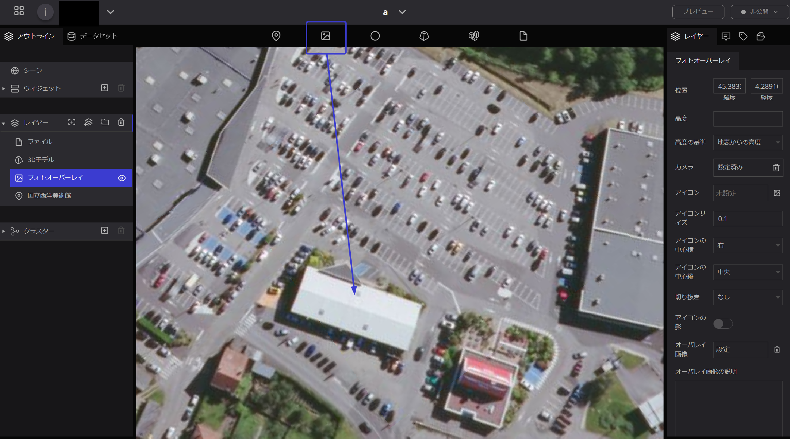

- 左側のレイヤーの欄に新しく「フォトオーバーレイ」の項目が追加され、青色の帯が付くと、画面右側にレイヤーの設定画面が表示されます。

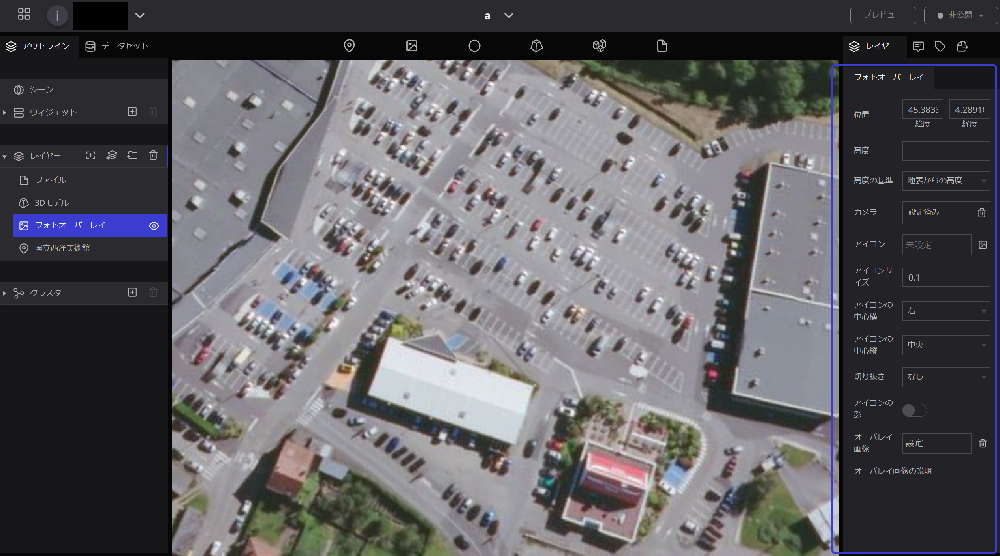

### フォトオーバーレイの名前変更

レイヤー内の「フォトオーバーレイ」の文字の上をダブルクリックすると、名前の変更が可能です。

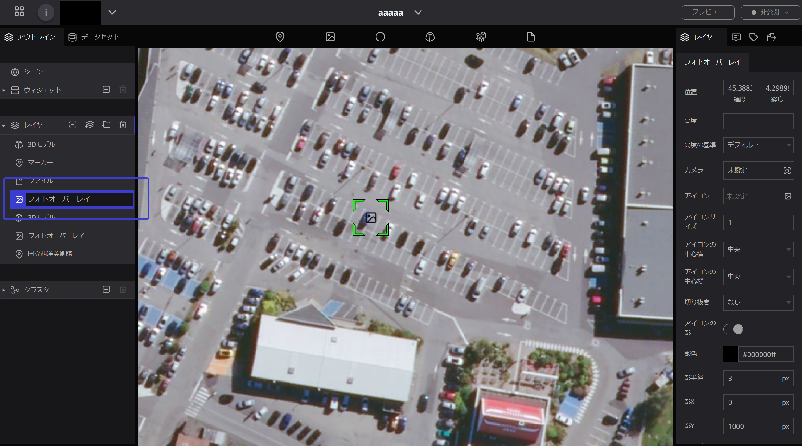

### フォトオーバーレイのアイコンを非表示にする

左パネルのフォトオーバーレイの右横の目のマークをクリックすると、地球上のアイコンが消えます。

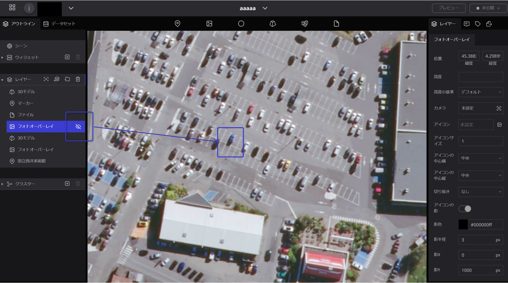

## プロパティ

A.   **位置**：フォトオーバレイの場所を緯度・経度で設定できます。

B.   **高度**：フォトオーバーレイの高さを設定できます。

C.   **高度の基準**：高さの基準となる位置を（デフォルト・地表に固定・地表からの高度から選択）設定できます。

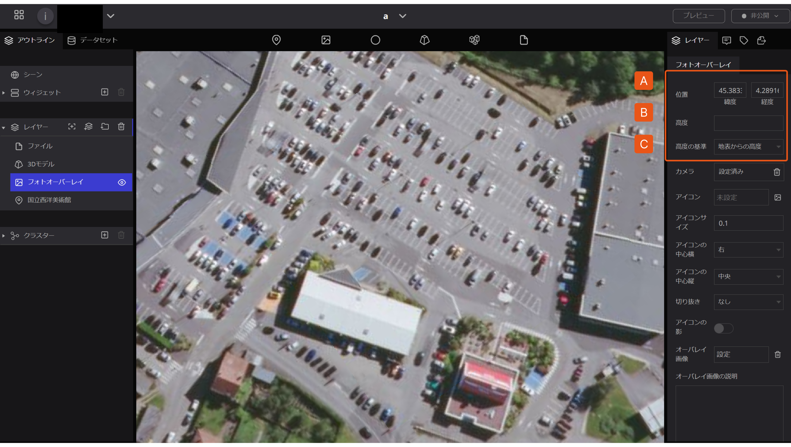

### **カメラ設定**

画像表示時に描画するマップの画角を設定できます。

　　

1. 「カメラ」の入力欄をクリックします。
    
    .png)
    
2. カメラの画角設定画面が開きます。「緯度・経度・高度」　「ヘッディング・ピッチ・ロール」に数値を入れることによって詳細な画角を設定することができます。
3. 画角が決まったら「編集」ボタンを押して画角を固定します。
    
    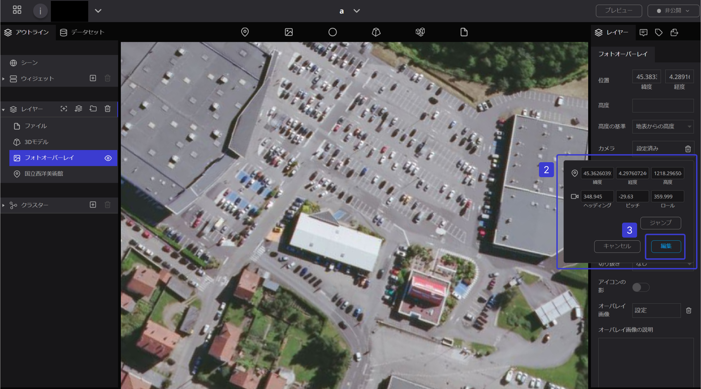
    
    - マウス操作でも変更が可能です。「カメラ」ボタンを押して画角の設定画面を開いてからマウスで画角を決めてください。最後に「編集」ボタンを押して画角を固定してください。

A.   **アイコン**：マップ上に表示するアイコンを設定できます。パソコンもしくはURLから選択が可能です。

B.   **アイコンサイズ**：アイコンのサイズ設定ができます。

C.   **アイコンの中心横**：アイコンの水平方向原点の設定（左・中央・右から選択）ができます。

D.   **アイコンの中心縦**：アイコンの垂直方向原点の設定（上・中央・ベースライン・下から選択）　　　　　　　　　ができます。

E.   **切り抜き**：アイコンの形を設定（なし・円形から選択）できます。

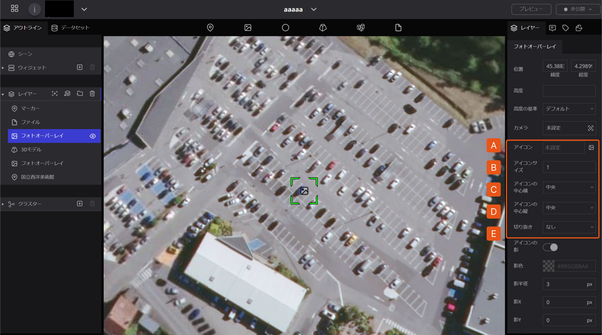

F.   **アイコンの影**：アイコンの陰影の有無を設定（オンの場合Ｇ～Ｊの項目を設定）できます。

G.  **影色**：影の色が選択できます。HTMLカラーコードが有効です。

H.  **影半径**：影の半径を設定できます。単位はピクセルです。

 I.   **影X**：横方面の影を設定できます。単位はピクセルです。

 J.   **影Y**：縦方向の影を設定できます。単位はピクセルです。

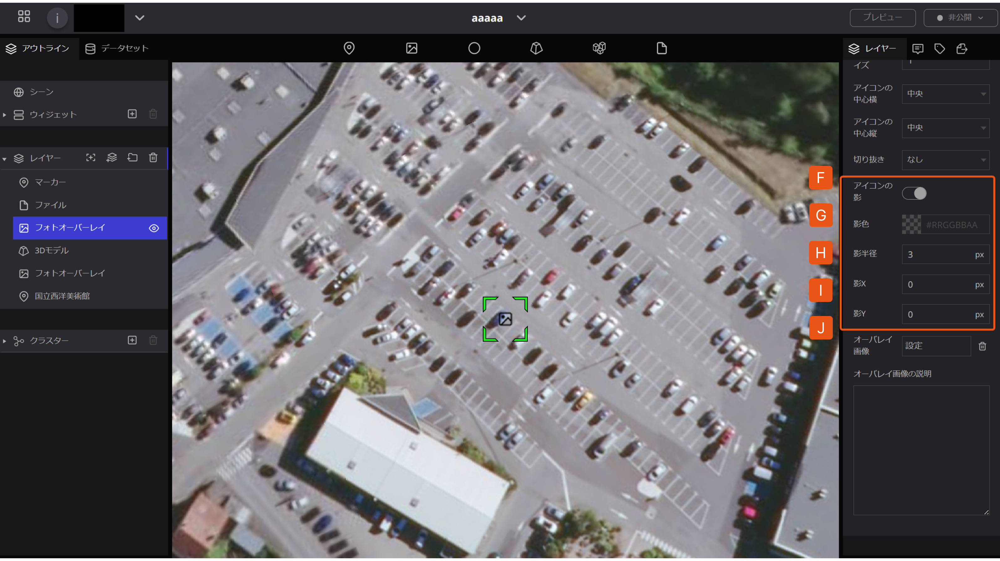

**オーバーレイ画像**

マップに表示させる画像を指定します。

- パソコンのデータもしくは外部URLから画像を選択することができます。

1. 「オーバーレイ画像」の入力欄をクリックします。
    
    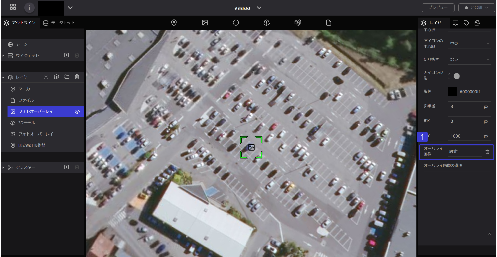
    

- 画像をアップロードします。

A.   **アセット**：パソコンから画像をアップロードする場合は「ファイルアップロード」を押してパソコンにある画像をファイルに入れた後、「選択」ボタンを押して決定します。

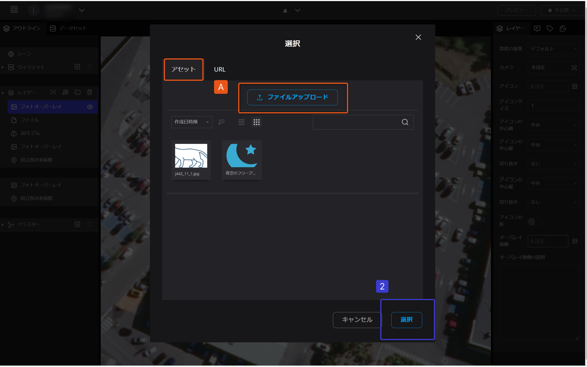

B.   **URL**：外部URLからアップロードする場合は「リソースURL」に画像のURLを入力し、「選択」ボタンを押して決定します。

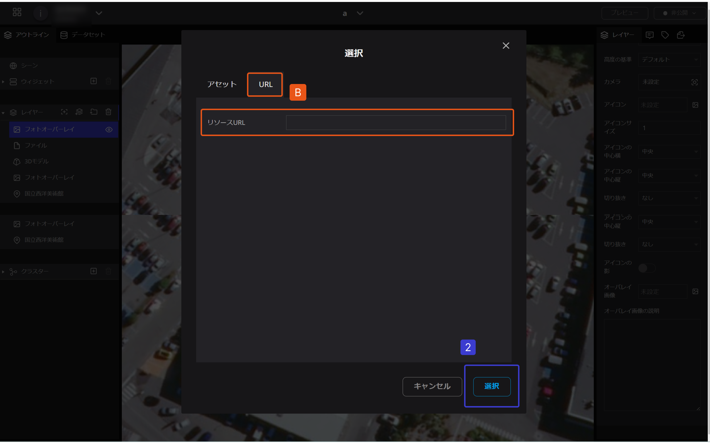

　

### **オーバーレイの画像の説明**

- 画面表示時に合わせて表示するテキストを設定します。

　

「オーバーレイ画像の説明」の入力欄に説明文を直接入力します。

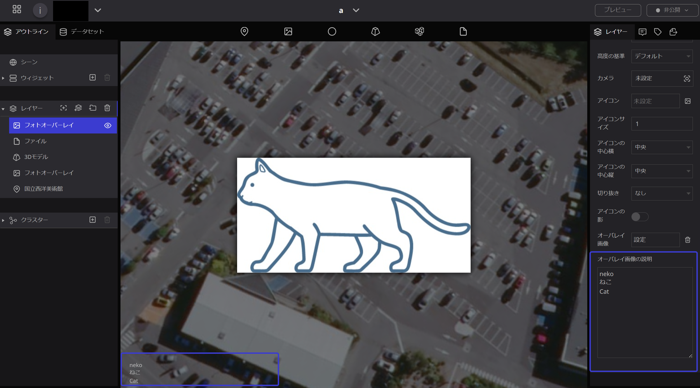

入力した説明文は、画面下部に表示されます。