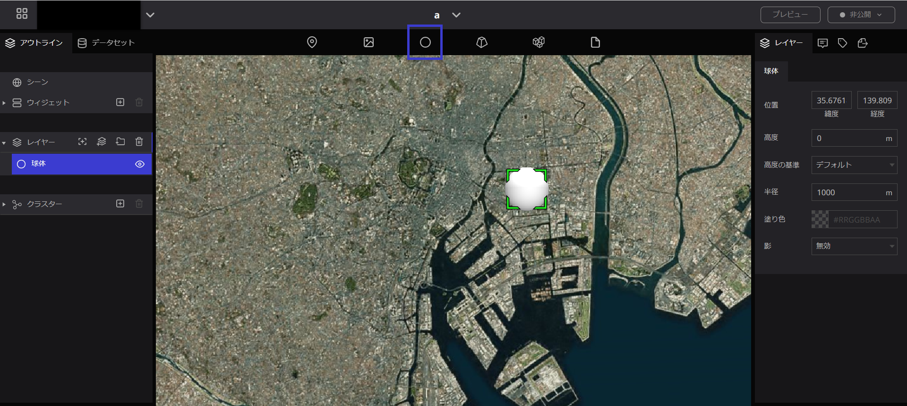
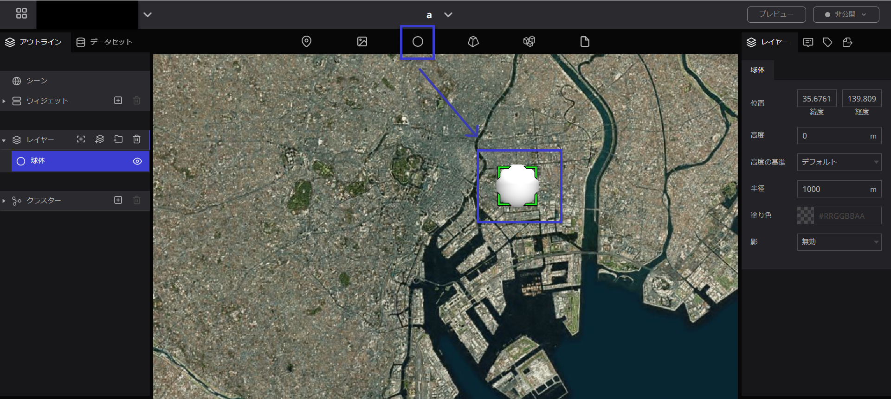
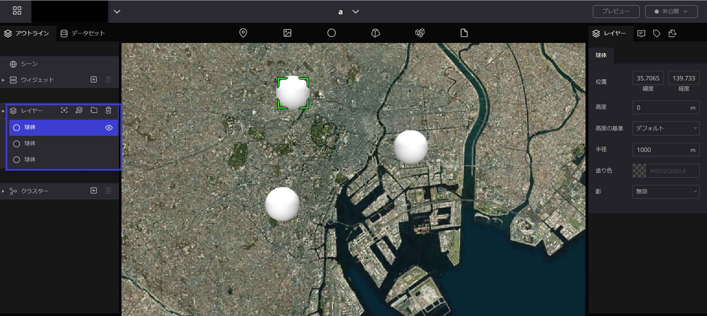
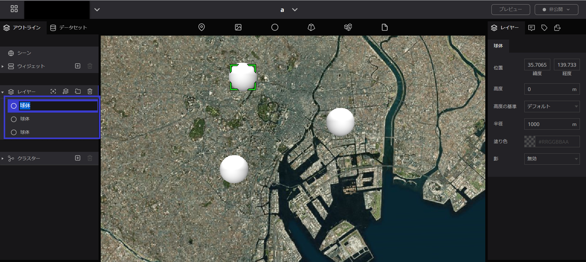
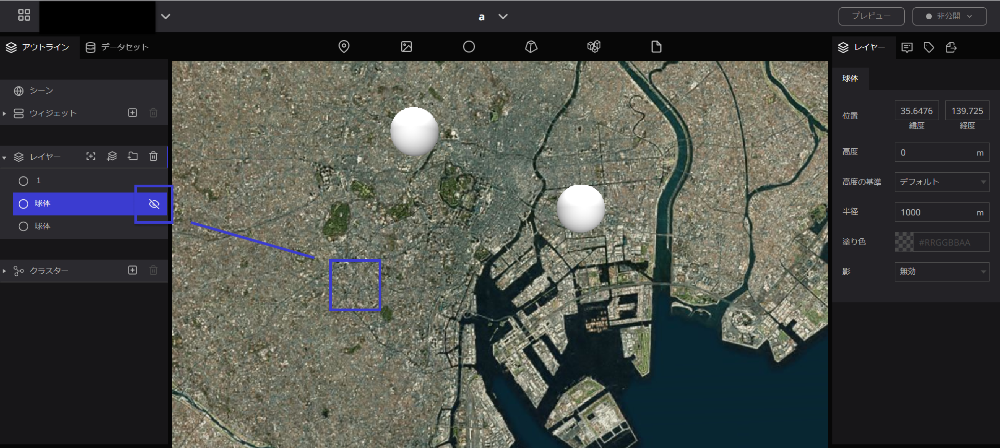
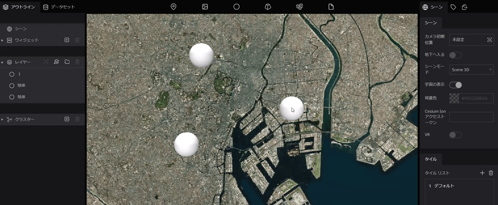
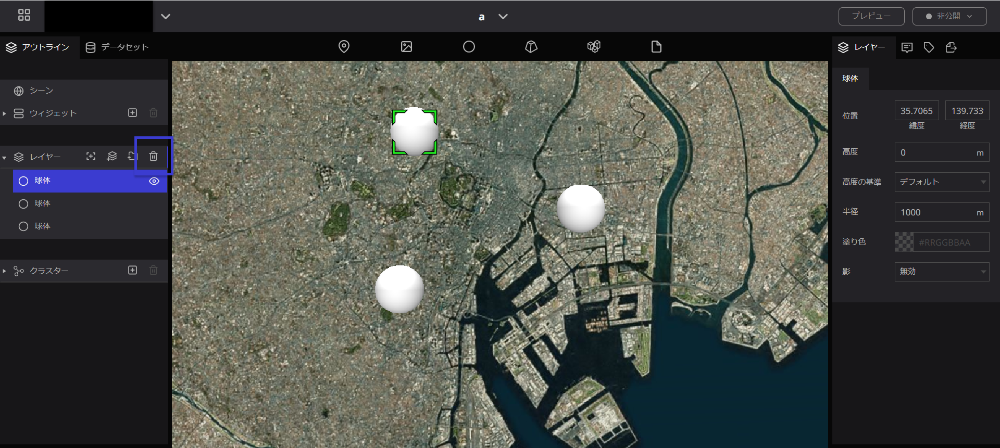
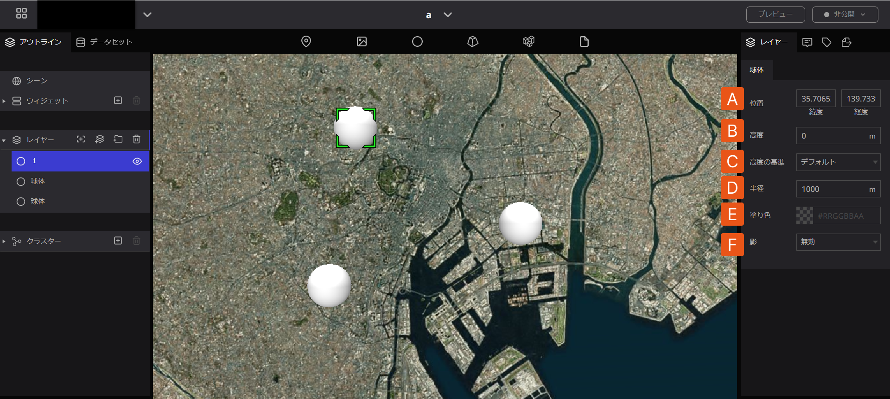

# 球体

## **球体とは**

地球儀上のある地点で、広い範囲を指定したり、体積のあるものを示したいときに使用します。

## **球体の使い方**

### 球体の追加

- 地球儀上で指定したい箇所に、球体のアイコンをドラッグ＆ドロップします。

- 球体を地球儀上に落とすと、左パネルの”レイヤー”の中に青色で記された球体の文字が表示されます。これは地球儀上に落とした球体のアイコンのことです。また、球体の地点を落としていくとレイヤーの中に球体が増えていきます。

### 球体の名前の変更

左パネルのレイヤーの中にある”球体”をダブルクリックすると、名前を変更できます。

### 球体のアイコンを非表示にする

左パネルの球体の右横の目のマークをクリックすると、地球上のアイコンが消えます。

### 球体の位置変更

一度落とした球体を移動させたい場合、地球儀上の球体のアイコンにマウスを合わせて、手の形になるまで左クリックを長押しし、そのままドラッグすれば位置の変更が可能です。

### 球体の削除

削除したい場合は、削除したいアイコンを左パネルのレイヤーの中から選択し、レイヤーの文字の右端にある”ごみ箱”のマークをクリックすると削除できます。

## 球体ツールのプロパティ

球体ツールでは以下の項目を設定することができます。

A. 位置：球体を表示する位置を設定します。

B. 高度：球体を表示する高度を設定します。

C. 高度の基準：「デフォルト」「地面に固定」「地表からの高度」から選択できます。

D. 半径：球体の半径を設定します。

E. 塗り色：球体の色を設定します。

F. 影：球体の影の有無を設定します。