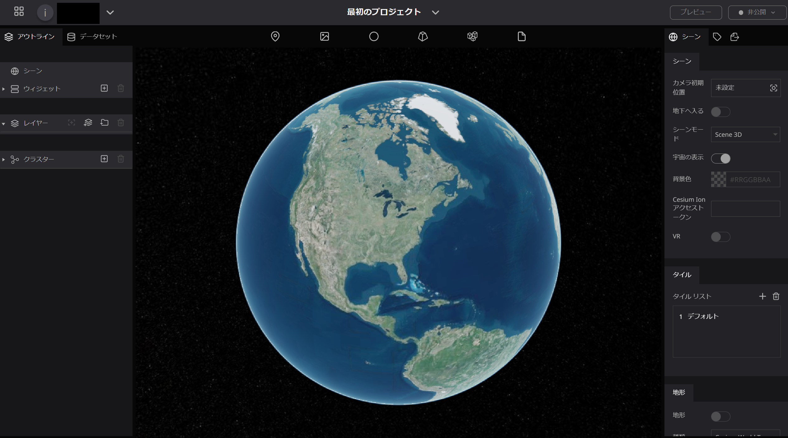
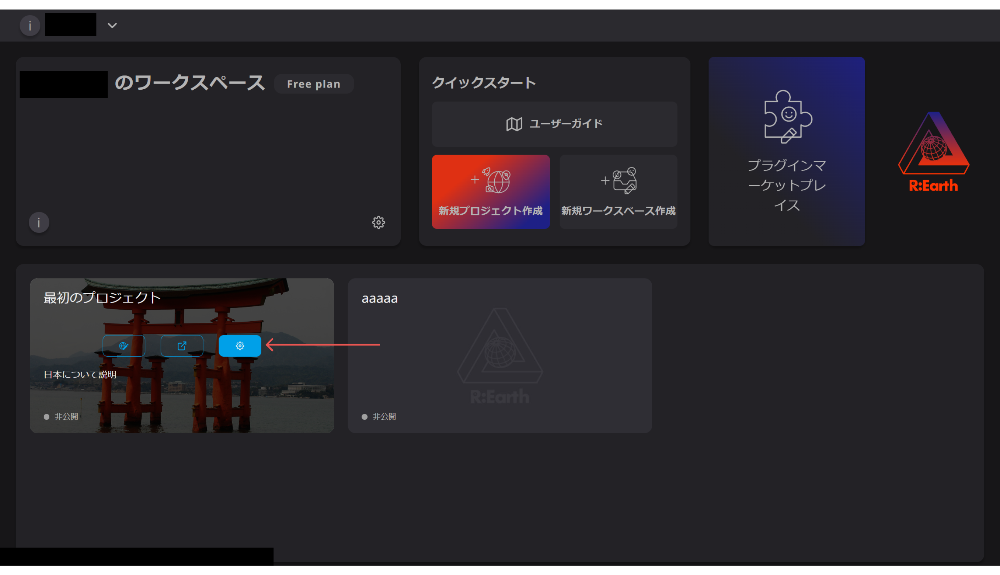
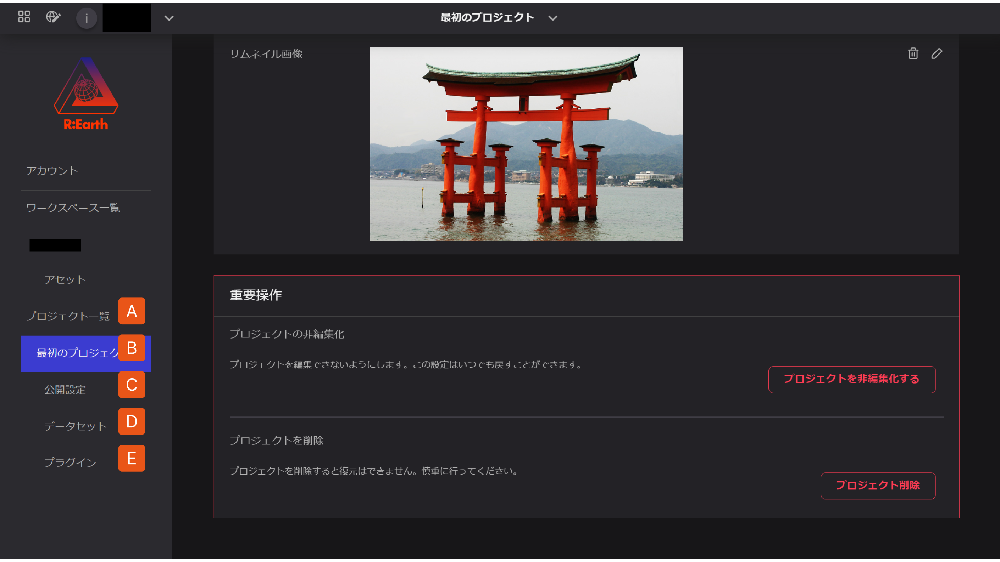
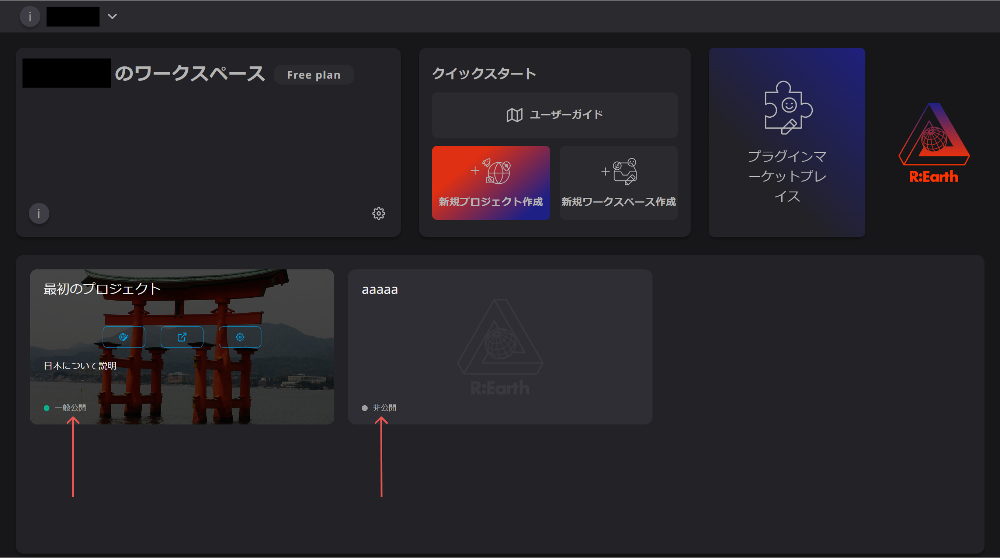
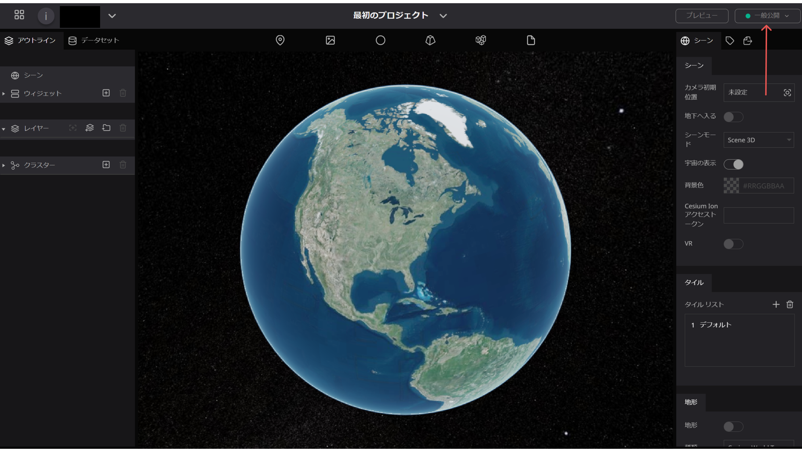

# 概要

Re:Earth ではすべての機能がここからスタートします。編集、公開、データのインポートなどさまざまなことができます。

プロジェクトを作成すると編集画面を開くことができます。デフォルトでは宇宙に浮かぶデジタル地球が表示されます。プロジェクトが作成されるとそのプロジェクトのためにシーンが作成、添付、使用されます。現在利用可能なのはセシウムベースのシーンのみですが、将来的にはもっと多くのシーンが登場する予定です。詳しい説明は[シーン](../scene/overview.md)のページをご覧ください。

これまで説明したように地球上に様々なコンテンツを追加して構築することができます。プロジェクトを移動装置、地球そのものをキャンバス、Re:Earthをブラシやツールのセットとして扱いあなたのイメージを作り上げるのに役立ててください。

プロジェクトに対して以下の操作が可能です。

- [作成](./create-a-new-project.md)  
- [プレビュー](./public-settings.md)
- [公開](./settings-archiving-and-deleting.md)

## プロジェクト設定ページ

設定ページでは各プロジェクトごとの設定にアクセスしタイトルや基本認証の追加、データセットやプロジェクトで使用するプラグインの管理などを行うことができます。

### 設定へのアクセス

プロジェクトの設定にアクセスする方法は2つあります。

**ダッシュボードから**

ダッシュボード → プロジェクトカード → ⚙️ ボタン

**編集画面から**

ヘッダー→プロジェクトメニュー→プロジェクトの設定

## ナビゲーション

左側のナビゲーションバーでは現在のプロジェクトに関連するさまざまな設定にアクセスしたり、すべてのプロジェクトを管理したりすることができます。

1. **プロジェクトリスト** 現在のワークスペースにあるすべてのプロジェクトを表示します。このページではさまざまなプロジェクトを選択してそれぞれの設定にアクセスできます。
2. **現在のプロジェクト** プロジェクトの基本情報の変更、プロジェクトのアーカイブや削除を行うことができます。~~詳しくは、[設定・非編集化・削除](https://docs.reearth.io/ja/user-manual/project-and-workspace/project/settings-archiving-and-deleting)をご覧ください。~~
3. **公開設定** プロジェクトの公開に関する設定を行うことができます。~~詳しくは公開設定をご覧ください。~~
4. **データセット** 現在のプロジェクトにインポートされているデータセットを管理することが出来ます。詳しくは[データセットライブラリ](./dataset-library.md) ~~および [データセットの説明]~~をご覧ください。
5. **プラグイン** 現在のプロジェクトにインポートされているプラグインを管理することが出来ます。詳しくは[プラグインライブラリ](./plugin-library.md) ~~および [プラグインの説明]~~をご覧ください。

## 公開状況

プロジェクトが完成したらプロジェクトをインターネット上に公開することができます。プロジェクトの公開状況は2 つの方法で確認することができます。

### **ダッシュボードから**

ダッシュボードの各プロジェクトカードで公開状況を確認することができます。

### 編集画面から

編集画面の右上に公開状況が表示されおり、いつでも確認・変更することが可能です。

## 共同編集

ワークスペースシステムにより、チームメンバー間の共同編集が可能になります。同じワークスペースにいるメンバーは同じプロジェクトを編集することが出来ます。具体的な操作方法については[ワークスペース](../workspace/overview.md) をご覧ください。