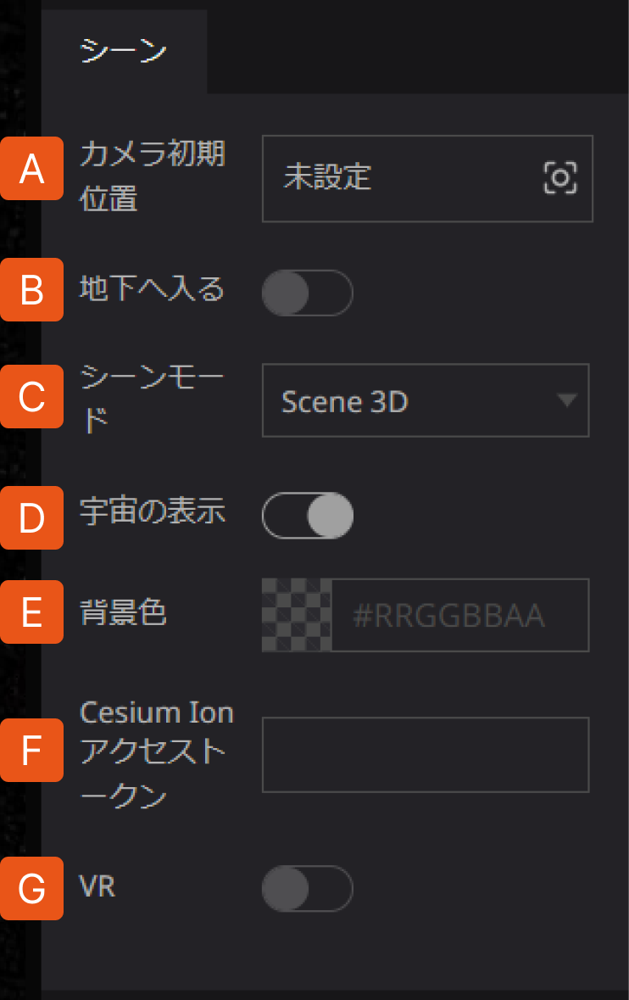
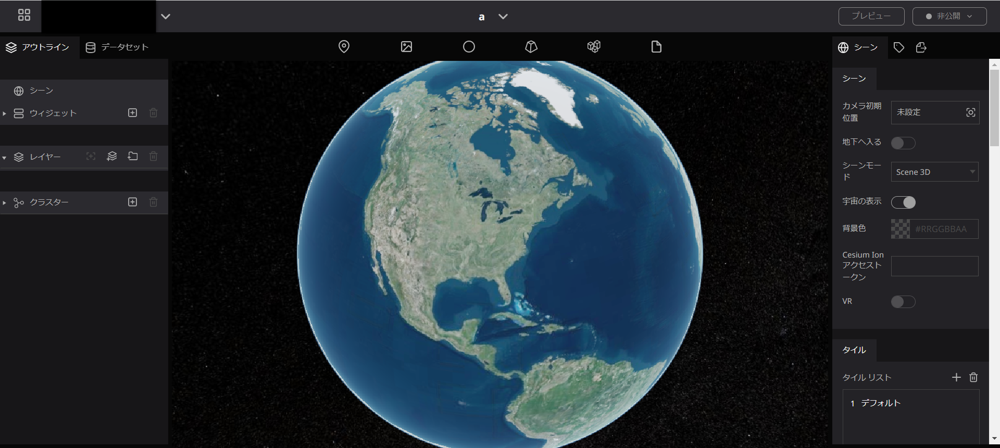
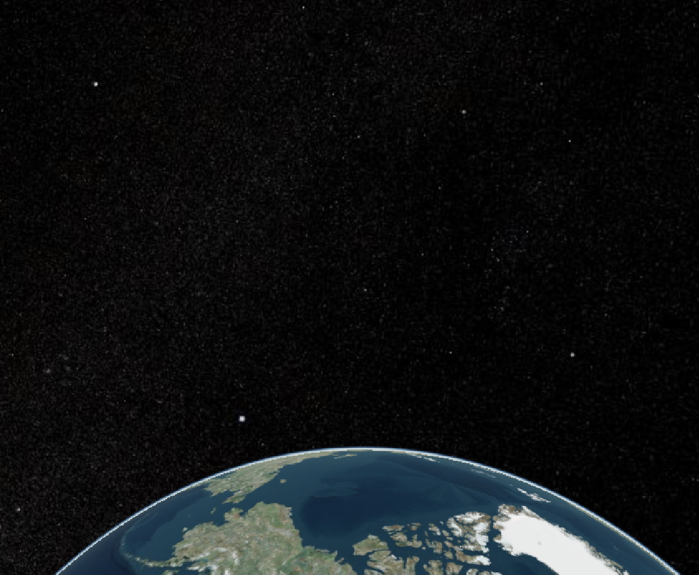
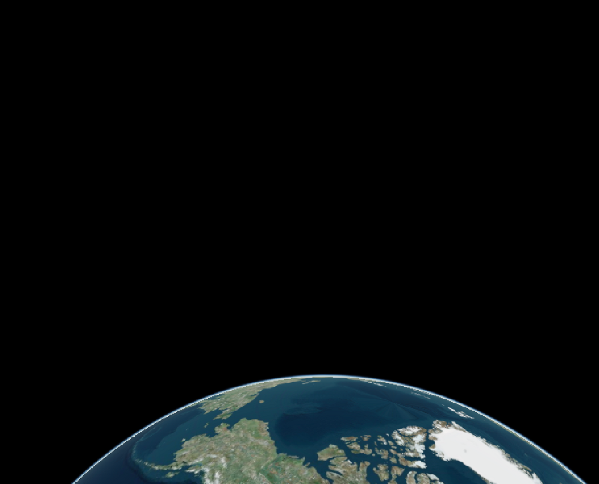
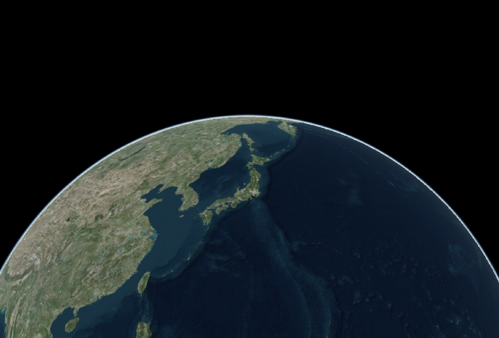
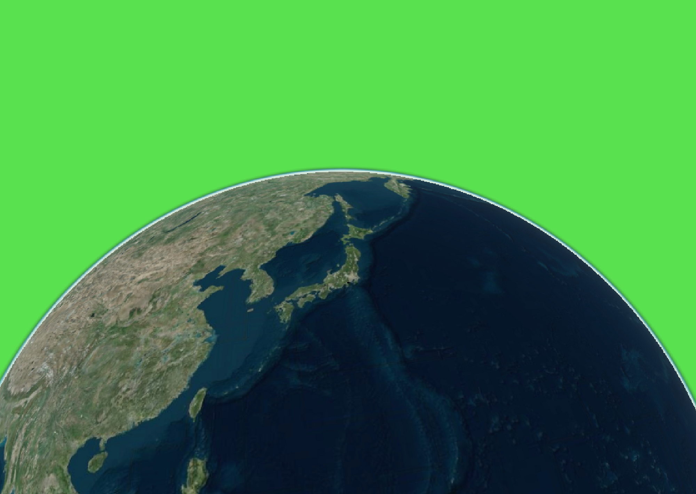
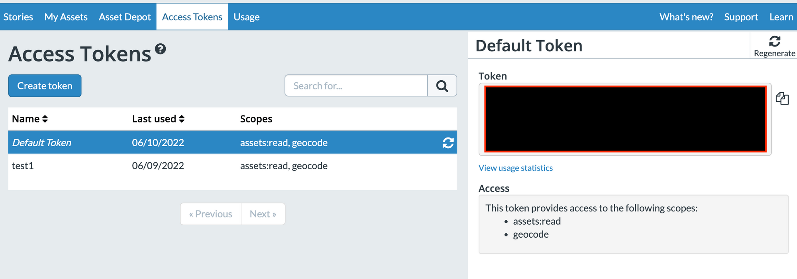

# 概要

## シーンとは

シーンでは、プロジェクト全体やデジタルアースの背景に関する設定を行うことができます。

## 設定方法

シーングループでは、カメラ初期位置や宇宙の表示に関する設定を行います。

### **A. カメラ初期位置**

プロジェクトを開いた際に一番最初に表示される画角を設定します。

デフォルトでは、ページロード時に北アメリカ全土が表示される設定になっています。

**設定方法**

1. `カメラ初期位置`をクリックすると画角の設定項目が表示されます。項目内の数値を直接変更するか、地図を操作すると画角が入力されます。
2. `キャプチャ`をクリックすると、その位置と画角がカメラ初期位置に設定されます。

再度項目をクリックすると、設定中の画角が確認できます。

A. `ジャンプ`をクリックすると、設定中の画角に移動します。

B. `編集`をクリックすると、画角の再設定を行うことができます。

### **B. 地下へ入る**

ボタンをオンにすることで、地下に入ることが出来ます。

### C. シーンモード 
地図の表示方法を変更できます。「Scene 3D」「Scene 2D」「Columbus View」から選択できます。

Scene 3D

Columbus View

「鳥瞰図」のように上空から斜めに見下ろしたような形式のものを言います。パノラマ図とも言います。

Scene 2D

### D. 宇宙の表示

`宇宙の表示`では、宇宙空間の表示/非表示を切り替えます。

表示あり

表示なし

### E. 背景色の設定 

`背景色の設定`では、宇宙を非表示にした場合の、背景色を設定します。

- `宇宙の表示`を非表示設定にして、背景色の`not set`をクリックしてください。

- 表示されたカラーパネルから任意の色を選び、`保存`をクリックしてください。

背景色なし

背景色あり

### F. Cesium ion アクセストークン

Cesiumを活用する際にTokenを設定するよう推奨されており、設定しているとCesiumのバージョンアップに即座に対応できます。

設定しなくてもRe:Earthの機能には特に変化はございません。

Tokenは、Cesium ion にログインし、`Access Token`ページから入手することができます。

### G. VR

<aside>
🔥 注意：開発中の機能ですので現在は使用することができません。オンにすると地球儀が消えるなどの不具合が生じることがありますのでご注意ください。

</aside>