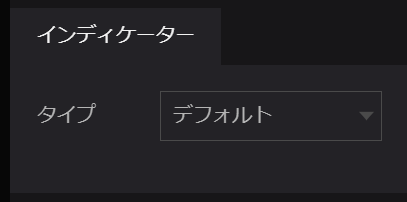
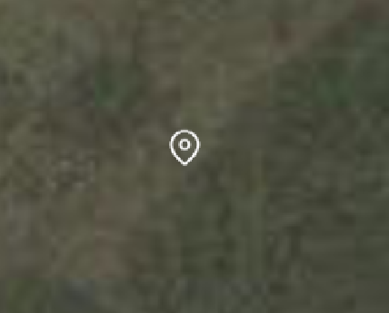
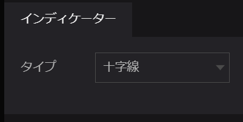
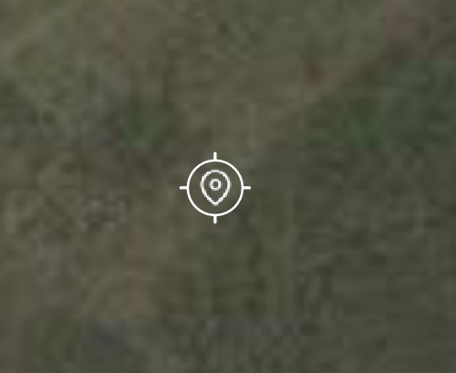
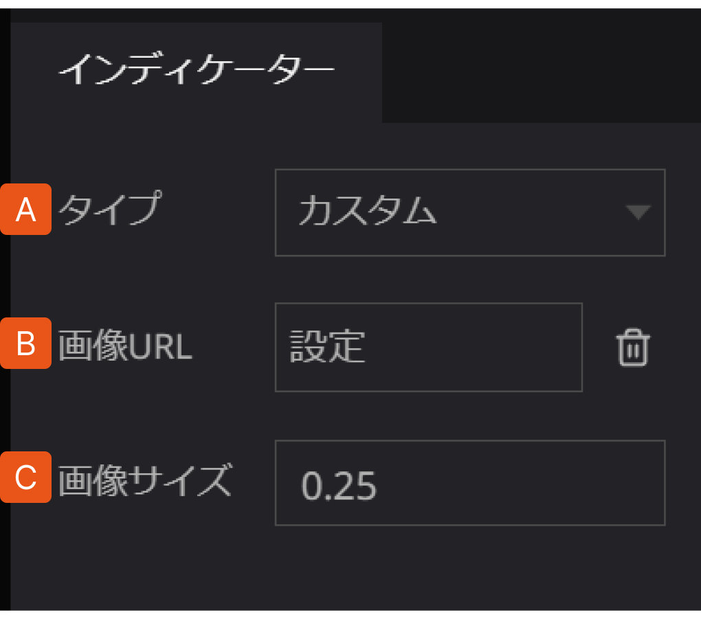
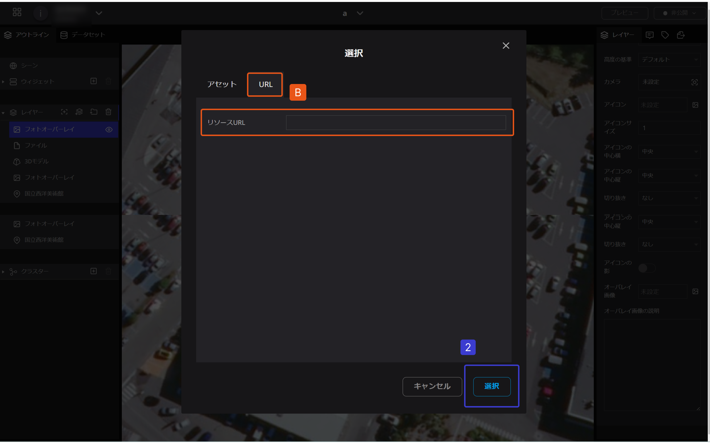
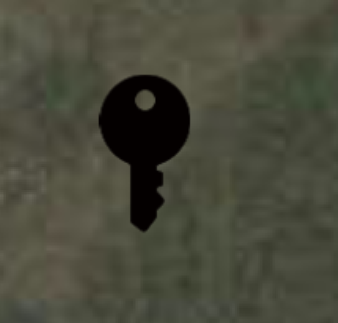
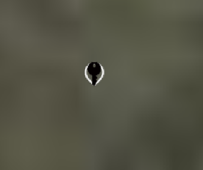

# インディケーター

インディケーターでは、レイヤーのアイコンの形を変えることができます。

### **デフォルト**

### **十字線**

### カスタム

A.   タイプからカスタムを選択します。

B.   画像URLからアップロードする画像を選択します。

C.   画像サイズが変更できます。

- パソコンからアップロードする場合
    
    
    

　　　A. アセットのファイルアップロードで画像を選択します。

- 外部URLからアップロードする場合

　　　B. リソースURLに画像のURLを入力して選択します。

画像例：

※カスタムアイコンはデフォルトマークの上に表示されます。大きさや画像によってはデフォルトマークが見えてしまいますのでご注意ください。

