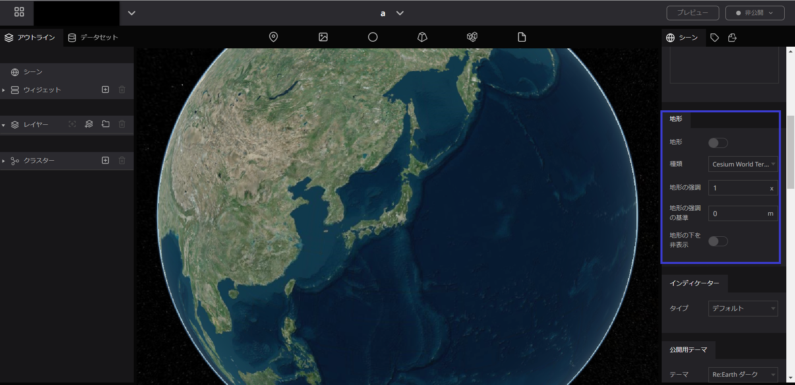
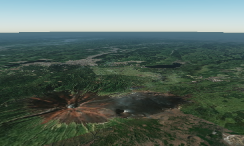
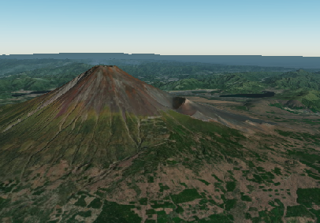
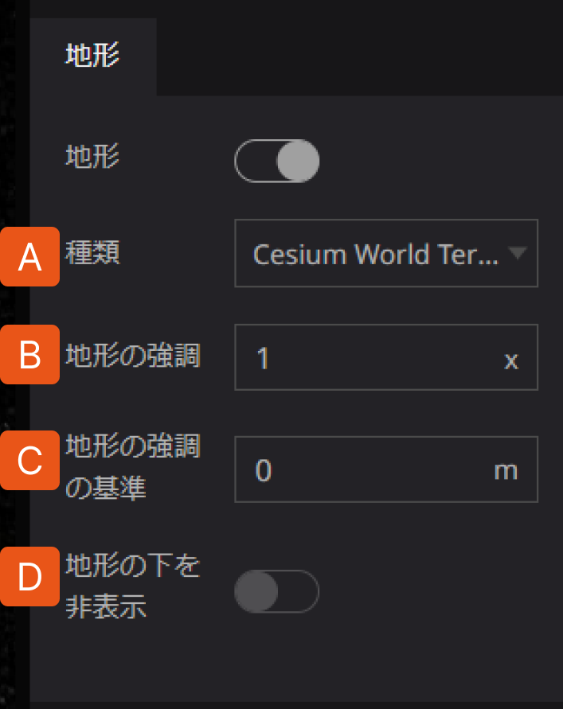
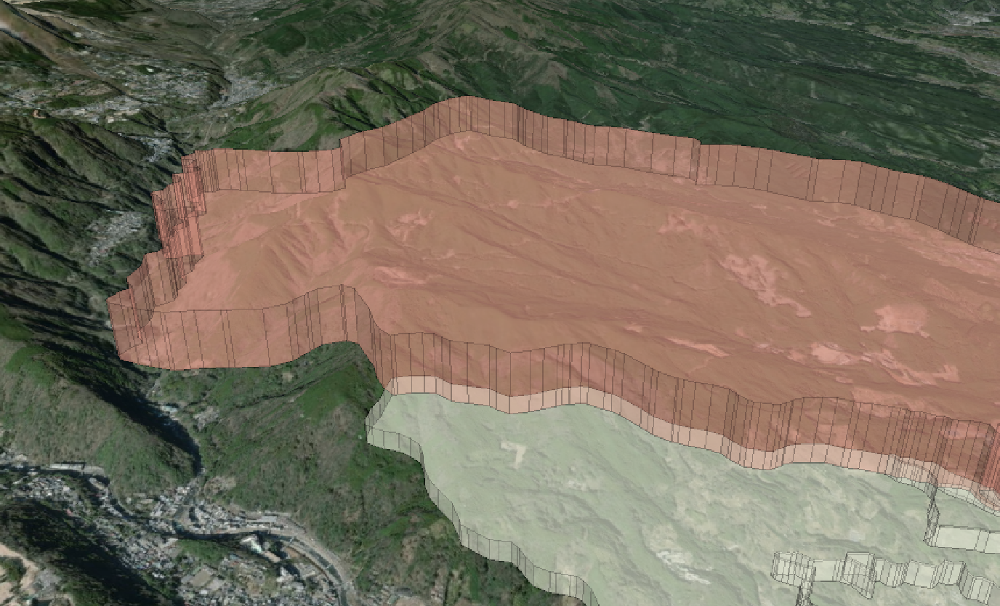
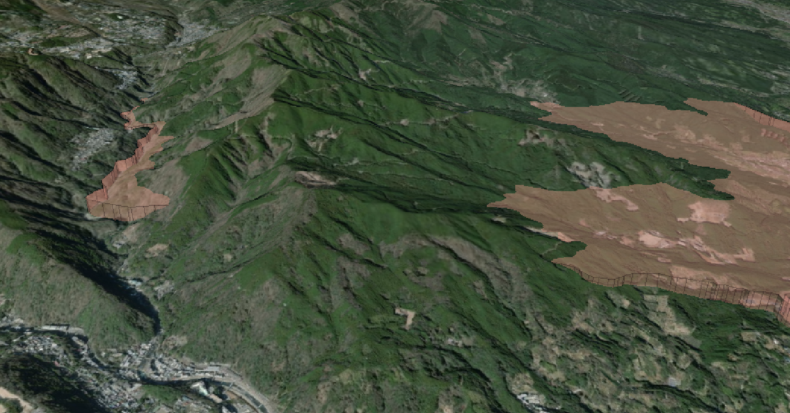

# 地形

## 地形とは

`地形`では、地図タイルが高さ情報を持っている場合に、立体的な地形表現と、平面的な地形表現を切り替えることができます。立体的な地形表現にする場合はオンにしてください。

[data:image/png;base64,iVBORw0KGgoAAAANSUhEUgAAAVkAAAAzCAYAAAA96ntTAAAGc0lEQVR4Ae2de1MTVxiH/ZdP0UgSbLgrxkKTKAJBqgOEa6AoAkVoy82KfoOSjsqllCm3GQYGHK4f8u28p266gSom2QNN8/yxkw0k2eU9z3n2t+cc4EZJSYm4N99XpcJGDWAABmAgfwZERG64Bav7FDb/wlJDaggDMKAMIFlSOxdVGIABiwwgWYvFJcmQZGAABpAskiXFwAAMWGQAyVosLimGFAMDMIBkkSwpBgZgwCIDSNZicUkxpBgYgAEki2RJMTAAAxYZQLIWi0uKIcXAAAwgWSRLioEBGLDIAJK1WFxSDCkGBmAAySJZUgwMwIBFBpCsxeKSYkgxMAADSBbJkmJgAAYsMoBkLRaXFEOKgQEYQLJIlhQDAzBgkQEka7G4hZxibvoCUlVZIw31EXnY2CzxeKvE44882lrNZ+pn6zH0WIVcK86dtPo5BpAskr0gOBVf08OWjO1vybZKY2Oz1NdHpLKiWkpvBnPa/KVBKQuGpLq6ViKRmDmOHvNzoPI9RFaoDBSWZH1+OqLli0L47j1paY4b8V2WXGOxRrlVFspJtG5Bh0KV0vigSfTYhdqROG8uAp9iwJpk9Rbw9PT0Qqd5/fqN9PclM74eClXI/PwbmZ6aydhevZpPv663p0/ev3uffv6pH4iv5w67Sq65qcVI9jLBOt9XIZeXV+Ut2kCgTKLRGKK1fBGlf+TeP3KtnTXJ6gkdHR0ZKeqt5cHBgdmfnZmT7q7uDFkG/EHp6EjI1taWPH06LGOjP8jaH2vS3t5pxuumfp6Wzc1NOqDFDqi36ypM3RyBfumjvseLRKui1UTL0MHViyBXgfC+y9vqSiSrHXBvby8t2cHBIenp6ZPUQkoqyqvTwl1aWpJwuF5isQeysJCSaCQmGxsbsvBrSvSW0sdwQbpWXsKtdx3OGOyXivX863TowD0EkOu+trOeC5Nhl3deLxngs+zV24pkk8lB2d3dlbOzMyPXeEurSbK9vf2ytrZmvjY1NS2Hh4cmATkNfF6y1VU18uRxuxFL6OsKWf9zXaKR+1ZE45xDMT46E13nxZnt83wmw9xS1skw0qy9Tl+MjF/nz2xFsk7i1OECTSVv376Tk5MTmZmZM+m16+NwgRlC8Pkl0dllhKtjuCpe3VTQ+ni79q7U3QkbOb94MYlgLQwZ6FIqbadspXr+9brqwC3LXPd11YGe03V2DI6N5L1iwI5kP4pAJdvQEJXv2p5kDBf8I9kPpiOZW0OfX9bXN+R2bV16uCAYKJPhZ8/TKdirH5rPyexAug7WC8nq8q5cxep+ny7v0nOinTLbiXoUZj2sS1bB0HE295js9PSsTE7+JIuLixkdSZNtMHArLdn7sUYzNltXFzavSyS6ZXZ2LuM9gJc/eM4a2PPJNPvnrZ5IVtfR6jnRtvm3LTW8/hrak6zPb4YIlpeXzSSXI9mXL3+RkeejMpAcNDPJKlUFobamTra3t82+M/HlBqTt0WM5OPgg3zZE6XweDxkg2evviG7W2f9/tYcVyepk1c7Ojkmhehuqt3+OZHW5z71wgxGlLtcaH58w+xMTP5p0q4BlSNbnl6GhZ2bIQGewAdB7ABku8L6mcEpNHQasSFYnLcLhb9JC1Nu/4+Nj0aVbXYlusyX7B2R5eUU6O7tMOt3f35eamjvmPSrZVOo3s2ZzdXVVVlZ+N5Nfzknz6C3ATHx5W0/4pJ5uBqxI1n0AZ7813iajI2PiJNaxsXHp6e41a191YqyzI5GWss5S6297DQ+PyEDye9ZMejw84LSJ88gSLqTgsMCj9yxcmWRpPO8bz6ua8ssI/9228aqN+Zzra2MkazklFgrcmmb5tdrr64iFwgnnmT0jSBbJpodp+AMx2XcgpEPNLmMAySLZtGQVFv7UIdK4TBp8PztGkCySzZCsdiBnIkyX3zmbs5aWP9qdXQdDSNQLySLZC5JVMehkmMpWl3fx72cQBReL3BlAskj2XyVLp8q9U1E7audmAMkiWSQLAzBgkQEka7G47qsZ+6QbGChOBpAskiXFwAAMWGQAyVosLsmlOJML7U67uxlAskiWFAMDMGCRASRrsbjuqxn7pBsYKE4GkCySJcXAAAxYZADJWiwuyaU4kwvtTru7GUCySJYUAwMwYJEBJGuxuO6rGfukGxgoTgaQLJIlxcAADFhkAMlaLC7JpTiTC+1Ou7sZQLJIlhQDAzBgkQGV7F+AEwtUe3mAogAAAABJRU5ErkJggg==](data:image/png;base64,iVBORw0KGgoAAAANSUhEUgAAAVkAAAAzCAYAAAA96ntTAAAGc0lEQVR4Ae2de1MTVxiH/ZdP0UgSbLgrxkKTKAJBqgOEa6AoAkVoy82KfoOSjsqllCm3GQYGHK4f8u28p266gSom2QNN8/yxkw0k2eU9z3n2t+cc4EZJSYm4N99XpcJGDWAABmAgfwZERG64Bav7FDb/wlJDaggDMKAMIFlSOxdVGIABiwwgWYvFJcmQZGAABpAskiXFwAAMWGQAyVosLimGFAMDMIBkkSwpBgZgwCIDSNZicUkxpBgYgAEki2RJMTAAAxYZQLIWi0uKIcXAAAwgWSRLioEBGLDIAJK1WFxSDCkGBmAAySJZUgwMwIBFBpCsxeKSYkgxMAADSBbJkmJgAAYsMoBkLRaXFEOKgQEYQLJIlhQDAzBgkQEka7G4hZxibvoCUlVZIw31EXnY2CzxeKvE44882lrNZ+pn6zH0WIVcK86dtPo5BpAskr0gOBVf08OWjO1vybZKY2Oz1NdHpLKiWkpvBnPa/KVBKQuGpLq6ViKRmDmOHvNzoPI9RFaoDBSWZH1+OqLli0L47j1paY4b8V2WXGOxRrlVFspJtG5Bh0KV0vigSfTYhdqROG8uAp9iwJpk9Rbw9PT0Qqd5/fqN9PclM74eClXI/PwbmZ6aydhevZpPv663p0/ev3uffv6pH4iv5w67Sq65qcVI9jLBOt9XIZeXV+Ut2kCgTKLRGKK1fBGlf+TeP3KtnTXJ6gkdHR0ZKeqt5cHBgdmfnZmT7q7uDFkG/EHp6EjI1taWPH06LGOjP8jaH2vS3t5pxuumfp6Wzc1NOqDFDqi36ypM3RyBfumjvseLRKui1UTL0MHViyBXgfC+y9vqSiSrHXBvby8t2cHBIenp6ZPUQkoqyqvTwl1aWpJwuF5isQeysJCSaCQmGxsbsvBrSvSW0sdwQbpWXsKtdx3OGOyXivX863TowD0EkOu+trOeC5Nhl3deLxngs+zV24pkk8lB2d3dlbOzMyPXeEurSbK9vf2ytrZmvjY1NS2Hh4cmATkNfF6y1VU18uRxuxFL6OsKWf9zXaKR+1ZE45xDMT46E13nxZnt83wmw9xS1skw0qy9Tl+MjF/nz2xFsk7i1OECTSVv376Tk5MTmZmZM+m16+NwgRlC8Pkl0dllhKtjuCpe3VTQ+ni79q7U3QkbOb94MYlgLQwZ6FIqbadspXr+9brqwC3LXPd11YGe03V2DI6N5L1iwI5kP4pAJdvQEJXv2p5kDBf8I9kPpiOZW0OfX9bXN+R2bV16uCAYKJPhZ8/TKdirH5rPyexAug7WC8nq8q5cxep+ny7v0nOinTLbiXoUZj2sS1bB0HE295js9PSsTE7+JIuLixkdSZNtMHArLdn7sUYzNltXFzavSyS6ZXZ2LuM9gJc/eM4a2PPJNPvnrZ5IVtfR6jnRtvm3LTW8/hrak6zPb4YIlpeXzSSXI9mXL3+RkeejMpAcNDPJKlUFobamTra3t82+M/HlBqTt0WM5OPgg3zZE6XweDxkg2evviG7W2f9/tYcVyepk1c7Ojkmhehuqt3+OZHW5z71wgxGlLtcaH58w+xMTP5p0q4BlSNbnl6GhZ2bIQGewAdB7ABku8L6mcEpNHQasSFYnLcLhb9JC1Nu/4+Nj0aVbXYlusyX7B2R5eUU6O7tMOt3f35eamjvmPSrZVOo3s2ZzdXVVVlZ+N5Nfzknz6C3ATHx5W0/4pJ5uBqxI1n0AZ7813iajI2PiJNaxsXHp6e41a191YqyzI5GWss5S6297DQ+PyEDye9ZMejw84LSJ88gSLqTgsMCj9yxcmWRpPO8bz6ua8ssI/9228aqN+Zzra2MkazklFgrcmmb5tdrr64iFwgnnmT0jSBbJpodp+AMx2XcgpEPNLmMAySLZtGQVFv7UIdK4TBp8PztGkCySzZCsdiBnIkyX3zmbs5aWP9qdXQdDSNQLySLZC5JVMehkmMpWl3fx72cQBReL3BlAskj2XyVLp8q9U1E7audmAMkiWSQLAzBgkQEka7G47qsZ+6QbGChOBpAskiXFwAAMWGQAyVosLsmlOJML7U67uxlAskiWFAMDMGCRASRrsbjuqxn7pBsYKE4GkCySJcXAAAxYZADJWiwuyaU4kwvtTru7GUCySJYUAwMwYJEBJGuxuO6rGfukGxgoTgaQLJIlxcAADFhkAMlaLC7JpTiTC+1Ou7sZQLJIlhQDAzBgkQGV7F+AEwtUe3mAogAAAABJRU5ErkJggg==)

## 設定方法

地形の立体表現のオン/オフを切り替えます。

地形オフ

地形オン

地形をオンにするとさらに以下の項目を設定できます。

A. **種類**：地形の参照データを[Cesium World Terrain](https://cesium.com/platform/cesium-ion/content/cesium-world-terrain/)と[ArcGIS Terrain](https://elevation3d.arcgis.com/arcgis/rest/services/WorldElevation3D/Terrain3D/ImageServer)から選択することができます。

B. **地形の強調：**起伏の表現倍率を指定します（標準は1x）。

C. **地形の強調の基準**：強調される基準の高さを指定します。この高さより上にある地形は上方に、下にある地形は下方に強調されます。

D. **地形の下を非表示**：地形の下にあるデータを表示するかどうかを選択できます。

表示する

表示しない

