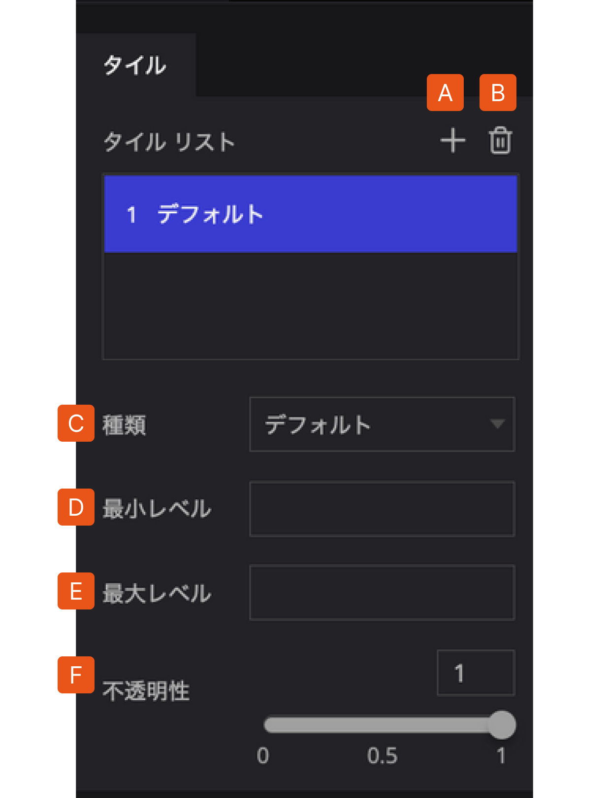
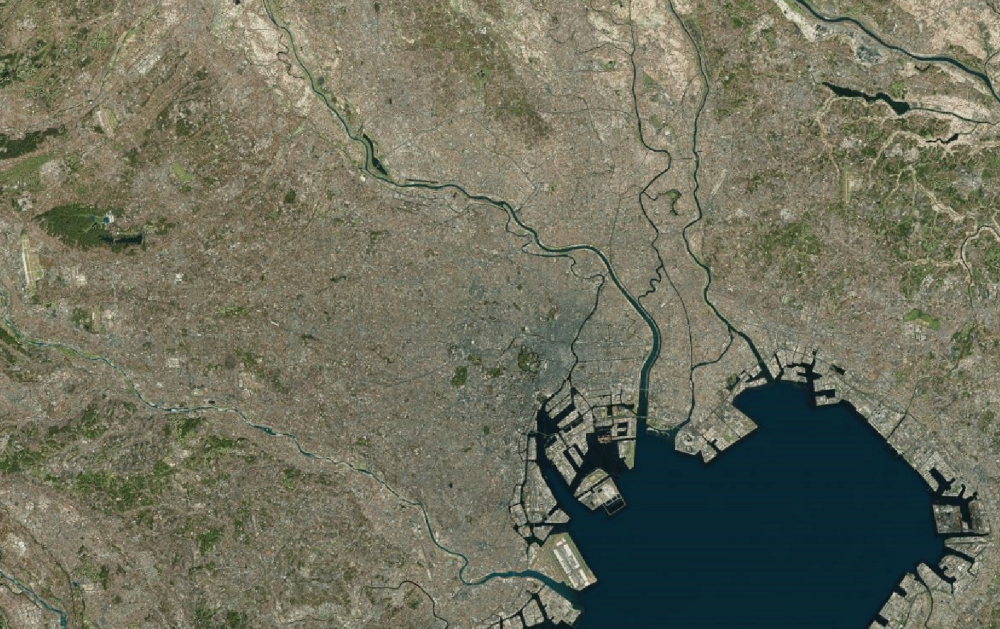
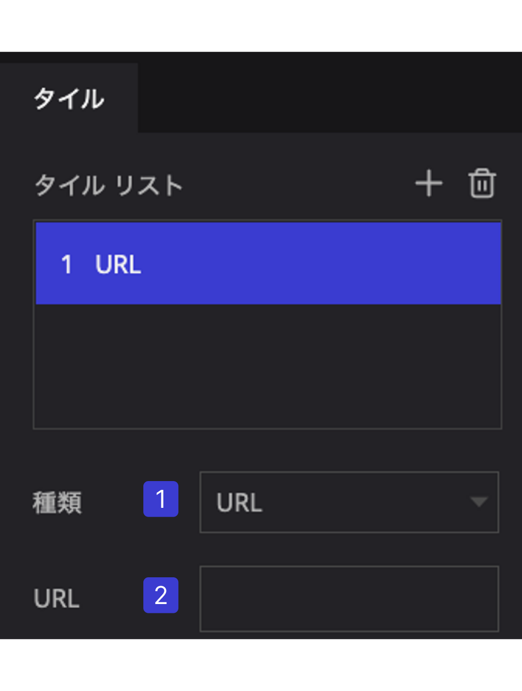
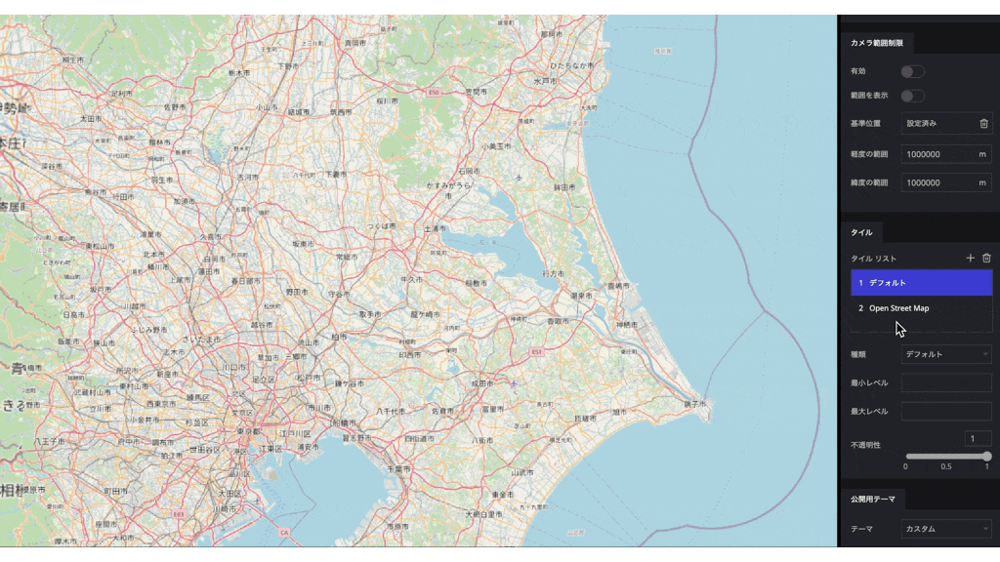

# タイル

## タイルグループ

タイルグループでは、デジタルアースに表示される地図タイルを設定します。いくつかの既存のタイルセットから選択するか、URLを指定することにより、外部配信の地図タイルを適用することもできます。

タイルリストから、任意のタイルをクリックすると詳細が展開されます。

A.   **プラスアイコン**：タイルを追加します。

B.   **ゴミ箱**：タイルを削除します。

C.   **種類**：タイルの種類を選択します。※下記参照

D.   **最小レベル**：タイルデータ表示の最小ズームレベルを設定します。

E.   **最大レベル**：タイルデータ表示の最大ズームレベルを設定します。

F.   **不透明性**：不透明性のスライダーを操作することで、マップの透過度を変更することができます。

- **タイルの種類**

デフォルト　　　　　　　　　　　　　　　　　　ラベル付き地図

道路地図　　　　　　　　　　　　　　　　　　　Stamen Watercolor

Stamen Toner　　　　　　　　　　　　　　　　　OpenStreetMap

ESRI Topography　　　　　　　　　　　　　　　　Black Marble

地理院地図　標準地図

### その他のタイル地図の設定

他のタイル地図や、自身で作成したタイル地図を使用したい場合はURLを指定します。

1. 種類をURLにするとURLの入力欄が表示されます。
2. URLにタイルが公開されているURLを入力すると使用することができます。
    - 国土地理院にもいくつかタイル地図が公開されています。
    
    　　[https://maps.gsi.go.jp/development/ichiran.html](https://maps.gsi.go.jp/development/ichiran.html)
    

他ソフトで作成したタイル地図をインターネット上にアップして使うことも可能です。

（QGISの場合）

### タイルの表示順序

タイルリストで下にあるタイルほど地図では上のレイヤーとして表示されます。

タイルリストの順番はドラッグで入れ替えることができます。

### ズームレベルによるベースマップの切り替え

- web地図では、地図の縮尺をズームレベルで表示します。
- 地図を引いた状態では低ズームレベルで、拡大するほどズームレベルが上がります。
- **最小レベル**：地図を表示させる最小のズームレベルを指定します。
- **最大レベル**：地図を表示させる最大のズームレベルを指定します。

