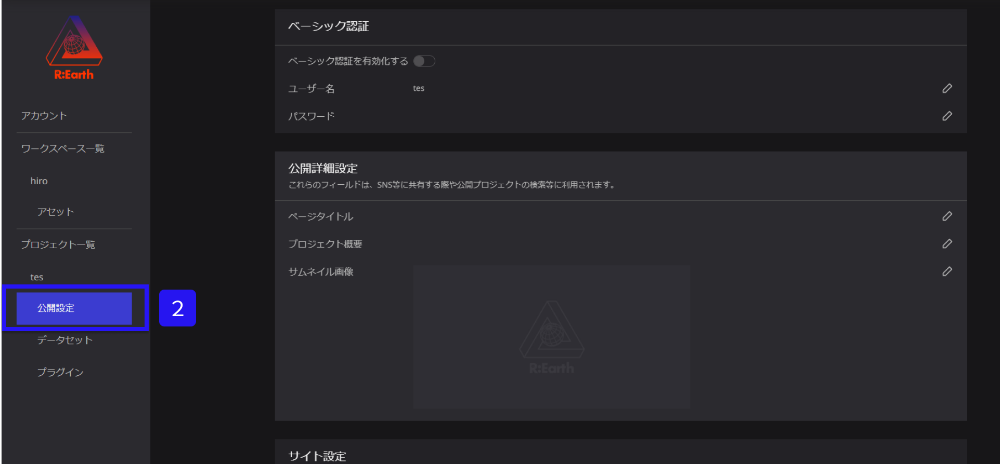
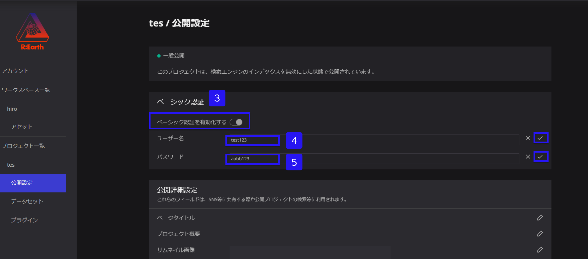

# Basic認証

ベーシック認証は、HTTPプロトコルによって保護されたウェブページへのアクセスを制限するための方法の一つです。

ベーシック認証を有効にすると、特定の**ユーザー名とパスワード**が必要なため、その情報を持たないユーザーはウェブページを閲覧できません。

一方、ベーシック認証を無効にすると、誰でもウェブページにアクセスできるようになります。

**※ベーシック認証のデフォルト設定は無効になっております。**

**必要に応じて有効にしたい場合にかぎり、下記手順にそって、設定をお願いします。**

①ワークスペースの該当プロジェクトの設定ボタンをクリックします。

.png)

②公開設定をクリックします。

③ベーシック認証をONにします。

④ユーザー名を半角英数字で入力し、右にある✓マークをクリックします。

⑤パスワードを半角英数字で入力します。右にある✓マークをクリックします。

