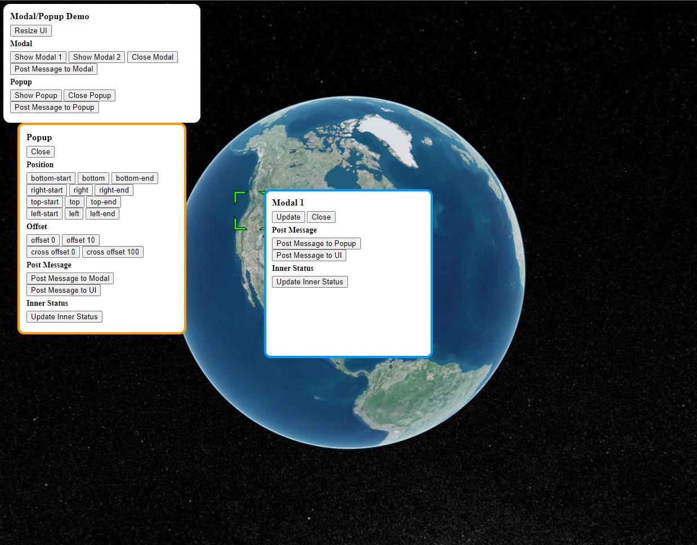

Re:Earth plugin system supports modal and popup with ``reearth.modal``, ``reearth.popup``(similar to ``reearth.ui``).

:::note

- There will be only one active modal and one active popup at the same time.
- Modal will always locate in the center of the visualizer.
- Popup will locate base on the plugin UI widget with the ``position`` option.
- Popup will have a higher z-index then modals.
- Support both plugin extension type widget & block.

:::

Here is an example:

```js title="modal_and_popup.js"
reearth.ui.show(`
  <style>
    html,
    body {
      margin: 0;
      width: 350px;
      font-size: 14px;
    }
    button {
      margin: 0;
    }
    #wrapper {
      height: 100%;
      box-sizing: border-box;
      border-radius: 12px;
      padding: 12px;
      background: white;
    }
    .extendedh {
      width: 400px;
    }
    .extendedv {
      height: 400px;
    }
    #wrapper {
      box-sizing: border-box;
      border-radius: 12px;
      background: white;
      height: 100%;
    }
    .extendedh body,
    .extendedh #wrapper {
      width: 100%;
    }
    .extendedv body,
    .extendedv #wrapper {
      height: 100%;
    }
    h3{
      margin: 0 0 5px;
    }
    h4{
      margin: 5px 0;
    }
  </style>

  <div id="wrapper">
    <h3>Modal/Popup Demo</h3>
    <button id="resizeUI">Resize UI</button>
    <h4>Modal<h4>
    <button id="showModal1">Show Modal 1</button>
    <button id="showModal2">Show Modal 2</button>
    <button id="closeModal">Close Modal</button>
    <br />
    <button id="postMsgToModal">Post Message to Modal</button>
    <h4>Popup<h4>
    <button id="showPopup">Show Popup</button>
    <button id="closePopup">Close Popup</button>
    <br />
    <button id="postMsgToPopup">Post Message to Popup</button>
    <h4 id="msg"></h4>
  </div>

  <script>
    let expanded = false;
    document.getElementById("resizeUI").addEventListener("click", (e) => {
      if (!expanded) {
        document.documentElement.classList.add("extendedh", "extendedv");
      } else {
        document.documentElement.classList.remove("extendedh", "extendedv");
      }
      expanded = !expanded;
    });
    document.getElementById("showModal1").addEventListener("click", (e) => {
      parent.postMessage({ type: "showModal1" }, "*");
    });
    document.getElementById("closeModal").addEventListener("click", (e) => {
      parent.postMessage({ type: "closeModal" }, "*");
    });
    document.getElementById("showModal2").addEventListener("click", (e) => {
      parent.postMessage({ type: "showModal2" }, "*");
    });
    document.getElementById("postMsgToModal").addEventListener("click", (e) => {
      parent.postMessage({ type: "postMsgToModal", msg: 'Msg from UI: ' + Math.random() }, "*");
    });
    document.getElementById("showPopup").addEventListener("click", (e) => {
      parent.postMessage({ type: "showPopup" }, "*");
    });
    document.getElementById("closePopup").addEventListener("click", (e) => {
      parent.postMessage({ type: "closePopup" }, "*");
    });
    document.getElementById("postMsgToPopup").addEventListener("click", (e) => {
      parent.postMessage({ type: "postMsgToPopup", msg: 'Msg from UI: ' + Math.random() }, "*");
    });
    addEventListener("message", (e) => {
      if (e.source !== parent) return;
      if (e.data.message) {
        document.getElementById("msg").innerHTML = e.data.message;
      }
    });
  </script>
`);

const modal1 = `
  <style>
    html,
    body {
      margin: 0;
      width: 300px;
      height: 300px;
      font-size: 14px;
    }
    #wrapper {
      box-sizing: border-box;
      border-radius: 12px;
      background: #fff;
      border: 4px solid #09f;
      height: 100%;
    }
    .extendedh {
      width: 500px;
    }
    .extendedv {
      height: 400px;
    }
    .extendedh body,
    .extendedh #wrapper {
      width: 100%;
    }
    .extendedv body,
    .extendedv #wrapper {
      height: 100%;
    }
    h3{
      margin: 0 0 5px;
    }
    h4{
      margin: 5px 0;
    }
  </style>
  <div id="wrapper">
    <div style="padding: 10px">
      <h3>Modal 1</h3>
      <button id="update">Update</button>
      <button id="close">Close</button>
      <h4>Post Message<h4>
      <button id="postMsgToPopup">Post Message to Popup</button>
      <button id="postMsgToUI">Post Message to UI</button>
      <h4>Inner Status<h4>
      <button id="updateInnerStatus">Update Inner Status</button>&nbsp;<span id="innerStatus"></span>
      <h4 id="msg"></h4>
    </div>
  </div>
  <script>
    // update inner status 
    let innerStatus = 0;
    document.getElementById("updateInnerStatus").addEventListener("click", (e) => {
      innerStatus += 1;
      document.getElementById("innerStatus").innerHTML = innerStatus;
    });

    let expanded = false;
    document.getElementById("update").addEventListener("click", (e) => {
      if (!expanded) {
        document.documentElement.classList.add("extendedh", "extendedv");
      } else {
        document.documentElement.classList.remove("extendedh", "extendedv");
      }
      expanded = !expanded;
      parent.postMessage({ type: "updateModal" }, "*");
    });

    document.getElementById("close").addEventListener("click", (e) => {
      parent.postMessage({ type: "closeModal" }, "*");
    });

    document.getElementById("postMsgToPopup").addEventListener("click", (e) => {
      parent.postMessage({ type: "postMsgToPopup", msg: 'Msg from Modal: ' + Math.random() }, "*");
    });
    document.getElementById("postMsgToUI").addEventListener("click", (e) => {
      parent.postMessage({ type: "postMsgToUI", msg: 'Msg from Modal: ' + Math.random() }, "*");
    });

    addEventListener("message", (e) => {
      if (e.source !== parent) return;
      if (e.data.message) {
        document.getElementById("msg").innerHTML = e.data.message;
      }
    });
  </script>
`;

const modal2 = `
  <style>
    html,
    body {
      margin: 0;
      width: 100%;
      height: 100%;
      font-size: 14px;
    }
    button {
      margin: 0;
    }
    #wrapper {
      height: 100%;
      box-sizing: border-box;
      border-radius: 12px;
      padding: 12px;
      background: #fff;
      border: 4px solid #09f;
    }
    h3{
      margin: 0 0 5px;
    }
    h4{
      margin: 5px 0;
    }
  </style>

  <div id="wrapper">
    <h3>Modal 2</h3>
    <button id="update">Update</button>
    <button id="close">Close</button>
  </div>

  <script>
    let expanded = false;
    document.getElementById("update").addEventListener("click", (e) => {
      expanded = !expanded;
      parent.postMessage({ type: "updateModal2", expanded }, "*");
    });

    document.getElementById("close").addEventListener("click", (e) => {
      parent.postMessage({ type: "closeModal" }, "*");
    });
  </script>
`;

const popup = `
  <style>
    html,
    body {
      margin: 0;
      width: 300px;
      font-size: 14px;
    }
    button {
      margin: 0;
    }
    #wrapper {
      height: 100%;
      box-sizing: border-box;
      border-radius: 12px;
      padding: 12px;
      background: #fff;
      border: 4px solid #f90;
    }
    h3{
      margin: 0 0 5px;
    }
    h4{
      margin: 5px 0;
    }
  </style>

  <div id="wrapper">
    <h3>Popup</h3>
    <button id="close">Close</button>
    <h4>Position<h4>
    <button onClick="updatePosition('bottom-start')">bottom-start</button>
    <button onClick="updatePosition('bottom')">bottom</button>
    <button onClick="updatePosition('bottom-end')">bottom-end</button>
    <br />
    <button onClick="updatePosition('right-start')">right-start</button>
    <button onClick="updatePosition('right')">right</button>
    <button onClick="updatePosition('right-end')">right-end</button>
    <br />
    <button onClick="updatePosition('top-start')">top-start</button>
    <button onClick="updatePosition('top')">top</button>
    <button onClick="updatePosition('top-end')">top-end</button>
    <br />
    <button onClick="updatePosition('left-start')">left-start</button>
    <button onClick="updatePosition('left')">left</button>
    <button onClick="updatePosition('left-end')">left-end</button>
    <h4>Offset<h4>
    <button onClick="updateOffset(0)">offset 0</button>
    <button onClick="updateOffset(10)">offset 10</button>
    <br />
    <button onClick="updateCrossOffset(0)">cross offset 0</button>
    <button onClick="updateCrossOffset(100)">cross offset 100</button>
    <h4>Post Message<h4>
    <button id="postMsgToModal">Post Message to Modal</button>
    <button id="postMsgToUI">Post Message to UI</button>
    <h4>Inner Status<h4>
    <button id="updateInnerStatus">Update Inner Status</button>&nbsp;<span id="innerStatus"></span>
    <h4 id="msg"></h4>
  </div>

  <script>
    // update inner status 
    let innerStatus = 0;
    document.getElementById("updateInnerStatus").addEventListener("click", (e) => {
      innerStatus += 1;
      document.getElementById("innerStatus").innerHTML = innerStatus;
    });

    // position & offset
    let position = 'bottom';
    const offset = {
      mainAxis: 0,
      crossAxis: 0
    };
    const updatePosition = (positionValue) => {
      position = positionValue;
      parent.postMessage({ type: "updatePopup", position, offset }, "*");
    };
    const updateOffset = (offsetValue) => {
      offset.mainAxis = offsetValue;
      parent.postMessage({ type: "updatePopup", position, offset }, "*");
    };
    const updateCrossOffset = (offsetValue) => {
      offset.crossAxis = offsetValue;
      parent.postMessage({ type: "updatePopup", position, offset }, "*");
    };

    document.getElementById("close").addEventListener("click", (e) => {
      parent.postMessage({ type: "closePopup" }, "*");
    });

    document.getElementById("postMsgToModal").addEventListener("click", (e) => {
      parent.postMessage({ type: "postMsgToModal", msg: 'Msg from Popup: ' + Math.random() }, "*");
    });
    document.getElementById("postMsgToUI").addEventListener("click", (e) => {
      parent.postMessage({ type: "postMsgToUI", msg: 'Msg from Popup: ' + Math.random() }, "*");
    });

    addEventListener("message", (e) => {
      if (e.source !== parent) return;
      if (e.data.message) {
        document.getElementById("msg").innerHTML = e.data.message;
      }
    });
  </script>
`;

reearth.on("message", (msg) => {
  if (msg.type === "showModal1") {
    reearth.modal.show(modal1);
  }
  if (msg.type === "showModal2") {
    reearth.modal.show(modal2, {
      width: 350,
      height: 103,
      background: "#00000066",
    });
  }
  if (msg.type === "closeModal") {
    reearth.modal.close();
  }
  if (msg.type === "updateModal2") {
    reearth.modal.update({
      width: msg.expanded ? 400 : 350,
      height: msg.expanded ? 200 : 103,
      background: `rgba(${Math.random() * 255},${Math.random() * 255},${
        Math.random() * 255
      },.5)`,
    });
  }
  if (msg.type === "postMsgToModal") {
    reearth.modal.postMessage({ message: msg.msg }, "*");
  }

  if (msg.type === "showPopup") {
    reearth.popup.show(popup, { position: "bottom" });
  }
  if (msg.type === "closePopup") {
    reearth.popup.close();
  }
  if (msg.type === "updatePopup") {
    reearth.popup.update({ position: msg.position, offset: msg.offset });
  }
  if (msg.type === "postMsgToPopup") {
    reearth.popup.postMessage({ message: msg.msg }, "*");
  }

  if (msg.type === "postMsgToUI") {
    reearth.ui.postMessage({ message: msg.msg }, "*");
  }
});

```

