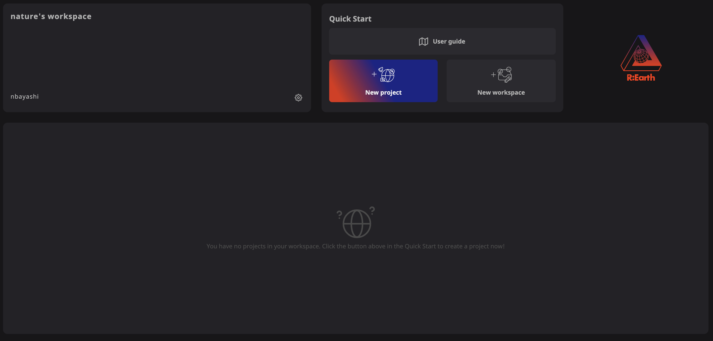
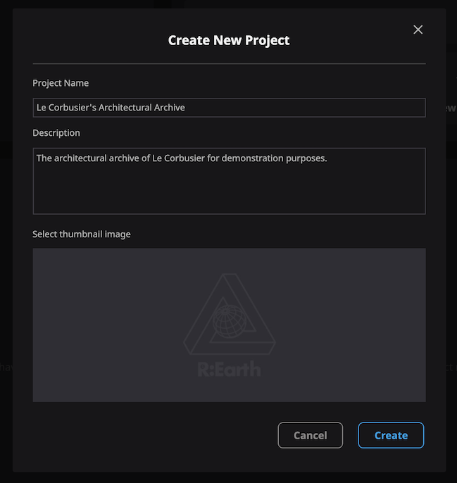
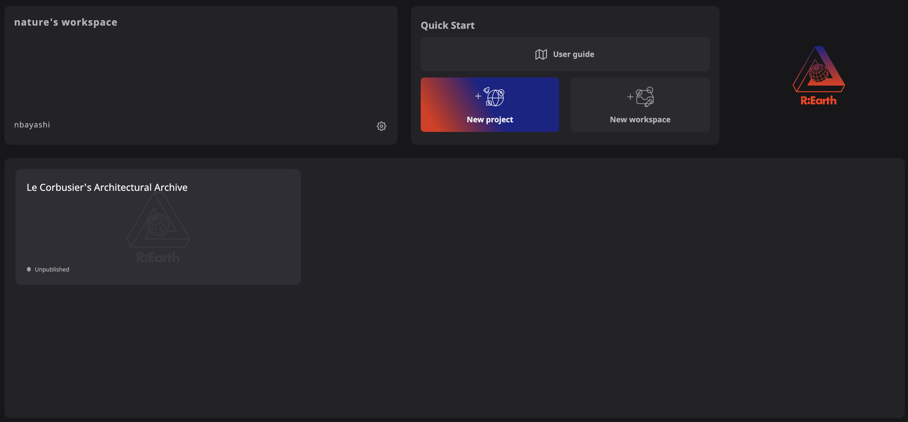
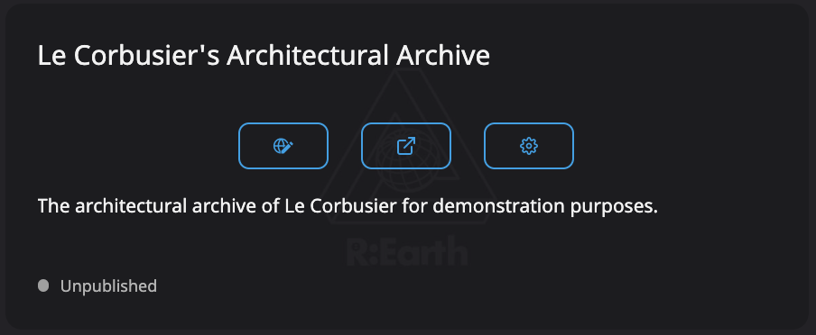
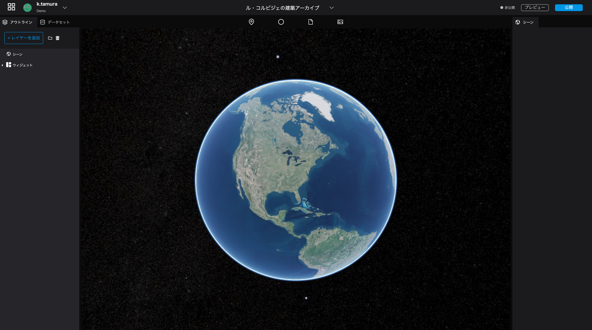

# Create a new project
---

## Open the top page
Go to https://app.reearth.io/ and click on "New Project" button.image

## Create a new project
Enter a project name and a project description.

Project Name: Le Corbusier's Architectural Archive

Project description: The architectural archive of Le Corbusier for demonstration purposes.

When you are done, click the Create button.

The created new project will be added to the project list.

## Let's open the application.
Click on the leftmost icon of the card of the new project you just created.

This will open the editing screen. From this screen, you can create and edit the data.

