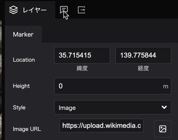
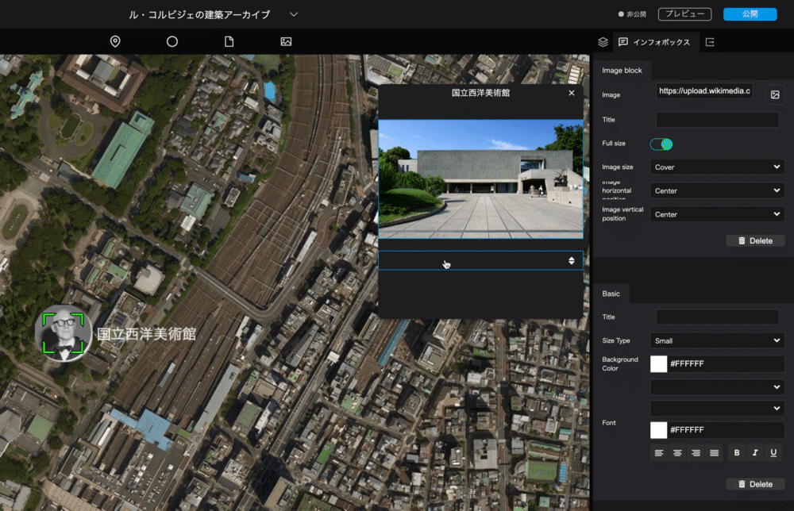
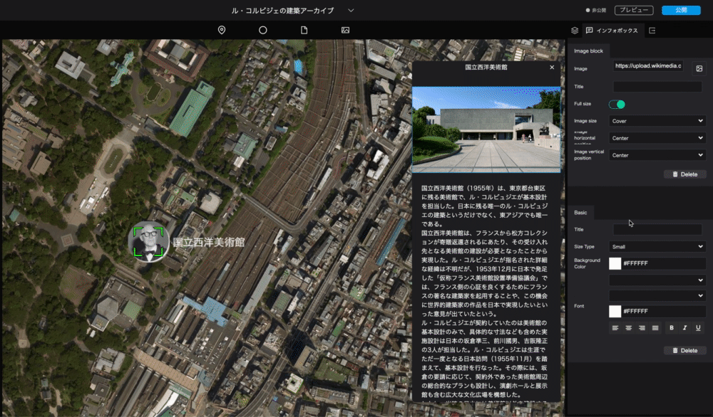

# Create an infobox
------

## 3.1 
Switch the tab at the top of the right panel from `Layer` to `Infobox` in the middle.



## 3.2 Create a new infobox
Click on the `Create Infobox` button to add an infobox to the selected marker.


## 3.3 Set the content of the infobox
From the `+` button on the displayed infobox (on hover), you can select the type of content you would like to add to the infobox.


You can choose from the following five content types:

- Text: Text
- Image: Image
- Video: Video
- Location: Map
- Table: Table

This time, let's choose `Image` -> `Text` -> `Text`.

## 3.4 Setting up the image content
After selecting the image block, click on the image icon in the right panel to open a window for uploading images, etc.
Paste the URL of the image you want to display.


Corbusier's image URL: [https://upload.wikimedia.org/wikipedia/commons/9/9d/National_museum_of_western_art05s3200.jpg](https://upload.wikimedia.org/wikipedia/commons/9/9d/National_museum_of_western_art05s3200.jpg)  


- Full size: Enlarge the image to its maximum width.
- Image Size: Sets the size of the image. `Cover` will crop the image to fit the frame. `Contain` will scale the image to fit the frame without changing its proportions.
- Image Horizontal Position: Allows you to set the horizontal alignment of the image. You can select `Left`, `Center`, or `Right`.
- Image Vertical Position: Allows you to set the vertical position of the image. You can select `Top`, `Center`, or `Bottom` alignments.

## 3.5 Text Content Settings
Clicking on the text block in the infobox, you can configure the text settings from the right panel. 
In this case, let's enter the following text:


- Overview    

>The National Museum of Western Art (1955) is the remaining art museum in Taito-ku, Tokyo, and was designed by Le Corbusier.
It is not only the only Le Corbusier building left in Japan, but also the only one in East Asia.
The National Museum of Western Art was realized when the Matsukata Collection was donated and returned from France, and it was necessary to build a museum to receive it.
The details of Le Corbusier's appointment are unknown, but it is said that the "The Tentative Name, preparatory Council for the Establishment of the Museum of French Art," which was established in Japan in December 1953, suggested that a famous French architect be appointed to impress the French side, and that they would like to take this opportunity to realize the work of a world-famous architect in Japan.
Le Corbusier was only contracted to do the basic design of the museum, while three Japanese architects, Junzo Sakakura, Kunio Maekawa, and Takamasa Yoshizaka, were in charge of the implementation design, including the specific dimensions. Le Corbusier conducted the basic design based on his only visit to Japan in November 1955.

```
Source: Wikipedia
```

## 3.6 Infobox design
If you click on a range other than the text or image block in the `infobox`, you can set the infobox itself, the size, background color and etc, in the right panel.
