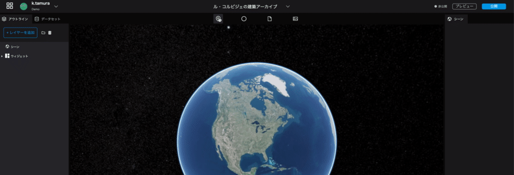
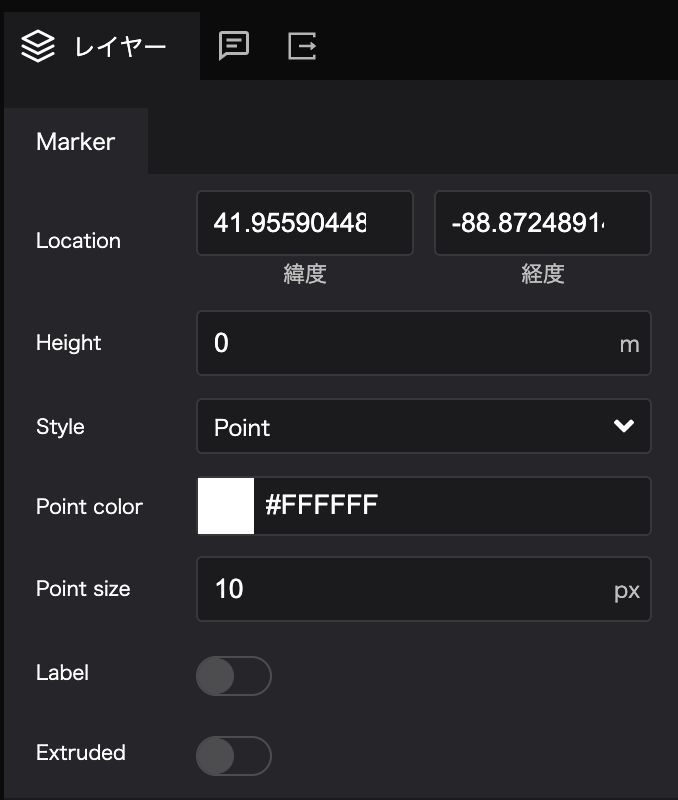
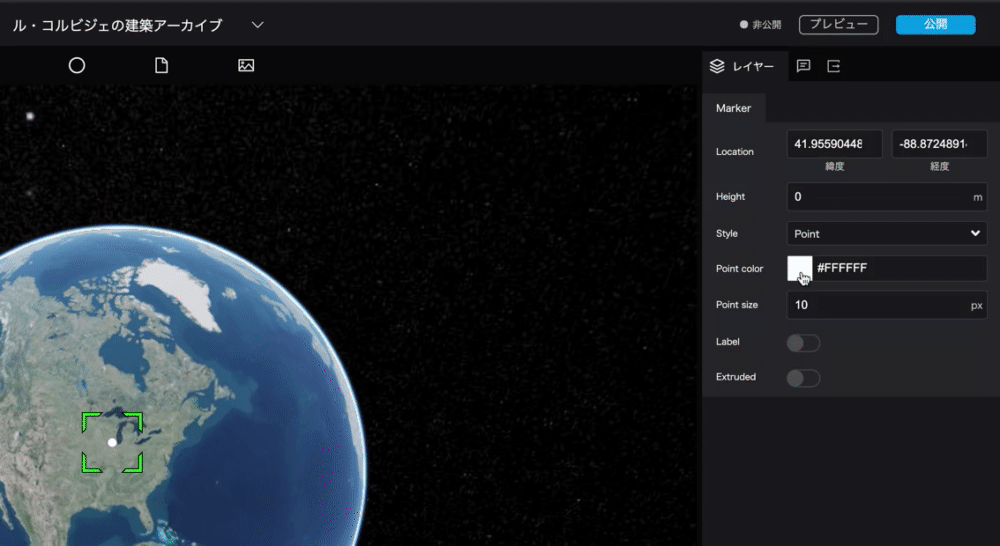

# Marker design
------

## 2.1 Put the marker on the map
Drag and drop the icon of the `marker` on the left side of the top bar onto the map.

 
  

## 2.2 Edit the marker
 
You can edit the settings of the marker from the `marker` in the `layer` tab on the left side of the right panel.

- Location: You can set the location of the marker in latitude and longitude.
- Height: You can set the height of the marker.
- Style: You can switch between point mark and image icon.
- Point Color: Allows you to set the color of the point mark.
- Point Size: Allows you to set the size of the point mark.
- Label: Allows you to set a label for the point mark.
- Extruded: If you have set the altitude, you can display a line from the ground surface to the point mark.

You can change the color and size of the point.

## 2.3 Turn the marker into an image icon
Set the marker to an image of Le Corbusier. 

Image URL: [https://upload.wikimedia.org/wikipedia/commons/thumb/c/c8/Le_Corbusier_%281964%29.jpg/480px-Le_Corbusier_%281964%29.jpg](https://upload.wikimedia.org/wikipedia/commons/thumb/c/c8/Le_Corbusier_%281964%29.jpg/480px-Le_Corbusier_%281964%29.jpg)

`Style`: When you select the `Image`, the following items will be displayed.

- Image URL: Allows you to upload the image.
- Image Size: Allows you to set the size of the image.
- Image crop: You can choose to display the image as it is or crop it into a circle.
- Image shadow: Allows you to add a shadow to the image icon; if turned on, the shadow setting will appear.
- Shadow color: Allows you to set the color of the shadow.
- Shadow radius: Set the size of the shadow.
- Shadow X: Allows you to set the vertical position of the shadow.
- Shadow Y: Allows you to set the horizontal position of the shadow.

## 2.4 Moving the position of the marker
By setting the `Location`, let's move the marker to the location of the National Museum of Western Art.

Latitude and longitude of the National Museum of Western Art
>Latitude: 35.715415
>Longitude: 139.775844

## 2.5 Setting the Name of the Marker
In Re:Earth, data created by markers, photo overlays, sphere tools, etc. are collectively called "layers". 
The left panel is divided into two parts: one to manage these layers, and the other to manage scene settings and widgets. 

Let's change the display name, which is `Marker` by default, to "The National Museum of Western Art".

> Marker → National Museum of Western Art

## 2.6 Adding a Label
Add a label to the marker of the National Museum of Western Art, which has just been renamed.
The marker name set in the left panel is the name when editing, but the label will be the name that viewers can see when publishing. 

When the `label` is turned on, the label setting item will be displayed.
Enter "The National Museum of Western Art" in the `Label text` field.

 
- Label: Allows you to give a label to the marker; when turned on, the label setting item will be displayed.
- Label text: Allows you to set the label name.
- Label font: You can set the font, line alignment, bold, italic, and underline. 