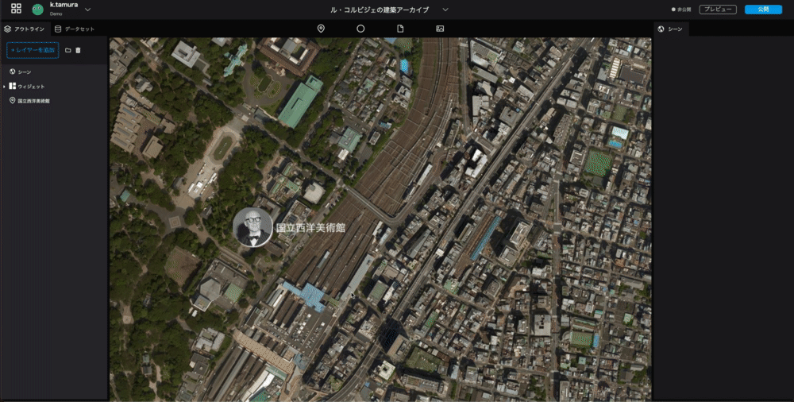

# Setting up and Publishing
------

## 4.1 Setting of elevation data
Selecting a `Scene` in the upper part of the left panel allows you to configure settings related to digital earth.
Let's turn on the elevation data, and reflect the undulations of the terrain in the digital earth.

  

1. You can change the tilt of the digital earth by holding down the Control key on the keyboard and using the mouse or trackpad.
2. Select a `Scene` at the top of the left panel.
3. From the `Scene` displayed in the right panel, you will be able to configure the digital earth's settings.
4. Enable `Terrain` by clicking its switch. The elevation data will be loaded and the undulations of the terrain will be shown.

## 4.2 Camera Settings
Set the position of the camera that will be displayed first when the project is opened.
     

1. Click the input or icon of the `Initial camera position` in the right panel.
2. Move around the globe to find the position of the camera you want to display first.
3. Once the camera position is to your liking, click the `Capture` button. That position will be the initial camera position when the project is opened.

## 4.3 Publish Settings
Now it's time to publish.
Click on the `Publish` button in the upper right corner, and then click the `Publish` button in the modal that appears.
You should be shown a success message with two URLs. Ignore the embed code for now. With the URL you can now view the completed project.
  

  

## 4.4 Adding data
The architecture list file in the following spreadsheet contains data for other buildings by Le Corbusier.
Please try to add other data as well.
Spreadsheet URL: [https://docs.google.com/spreadsheets/d/1p3JKhLPQ-Vjnqb5NVsVcp7sDCUybnUEbBBnf76IbJYo/edit?usp=sharing](https://docs.google.com/spreadsheets/d/1p3JKhLPQ-Vjnqb5NVsVcp7sDCUybnUEbBBnf76IbJYo/edit?usp=sharing)

## Future notice
At this time, we have completed the placement and representation of markers, but Re:Earth has various other functions.
In the articles to come, we will go through `photo overlay`, `storytelling`, and `loading and editing of CSV data.`