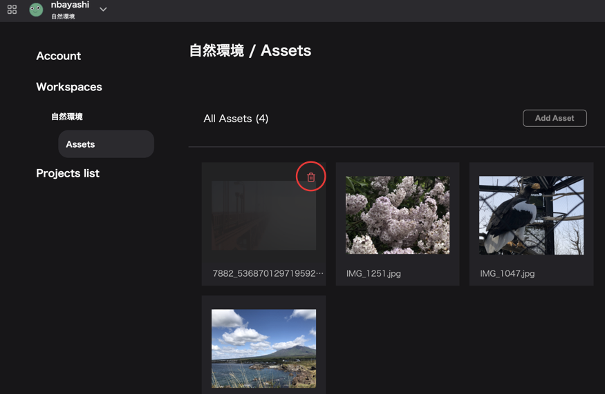
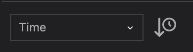
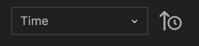
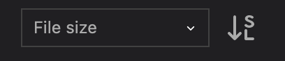
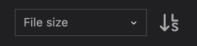
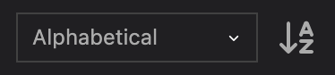
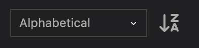
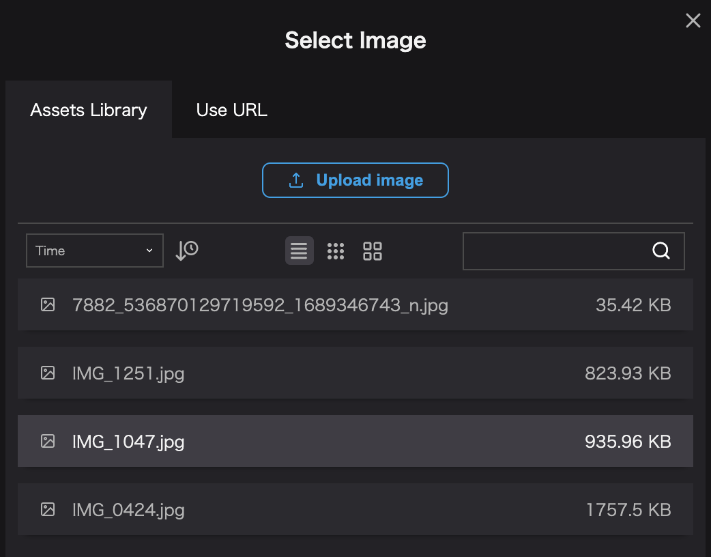
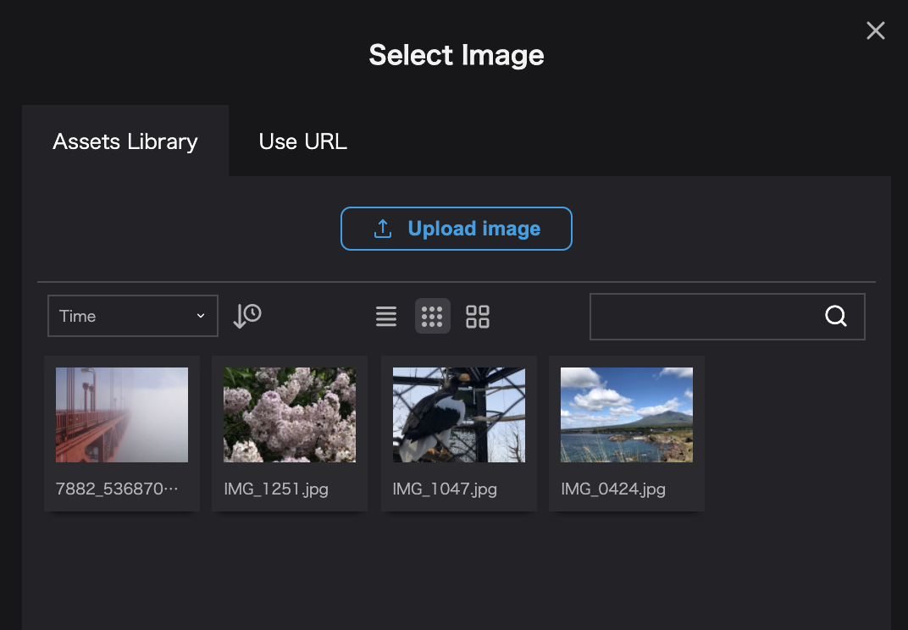
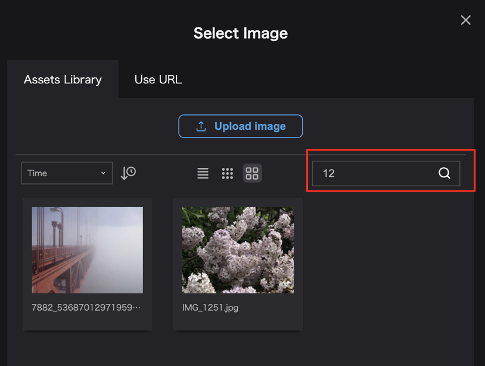

## Delete  assets

Open `Account Settings` -> `Workspace` -> `Assets`.

You can delete an image by clicking on the `trash icon` that appears in the upper right corner when you mouse over the image.

## Change the order of assets

You can change the order of the assets from the sort menu in the modal.

You can choose from the following three orderings.

- `Time`: Sort by date added.
- `File size`: Sort by file size
- `Alphabetical`: Sort by file name

You can change the ascending/descending order by clicking the clock icon next to the pull-down menu.

- `Time`

`↓`：Sort by newest date.

`↑`：Sort by oldest date.

- `File size`

`SL`：Sort by small file size.

`LS`：Sort by large file size.

- `Alphabetical`

`AZ`：ascending order

`ZA`：descending order

## Change display format

The icon in the center of the modal allows you to change the display format of the assets.

You can select one of the following three display formats for assets.

- List

- Icon (small)

- Icon (large)

## Search

The search bar on the right side of the modal allows you to search for assets by file name.

## Change file name

It is not possible to change the file name of an asset on Re:Earth.

If you need to change the file name, please edit the file name of the data before uploading, and upload it again as an asset.