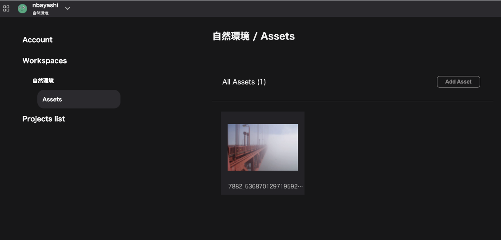

## What is an asset?

Images and files used in Re:Earth are considered assets.

Assets are tied to workspaces so they can be shared and used across projects.

You can use image assets as:

- Project thumbnails
- Infobox's image block images
- Photo overlay images
- Layer icons (where applicable)
- Profile image

## アセットへのアクセス方法
You can access the assets from `Account Settings` -> `Workspace` -> `Assets` as well as through the asset modal where it is used.
